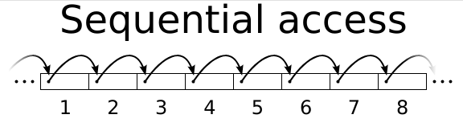
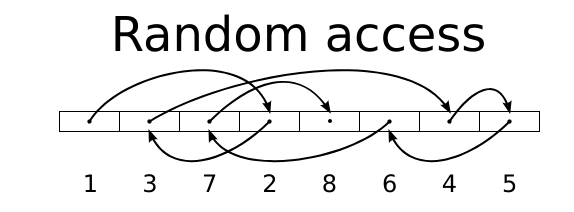
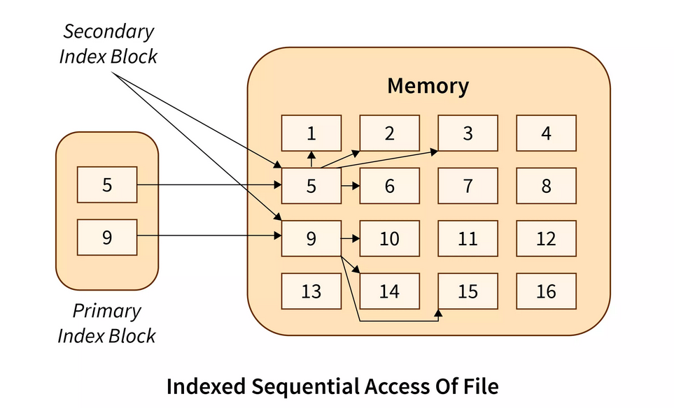
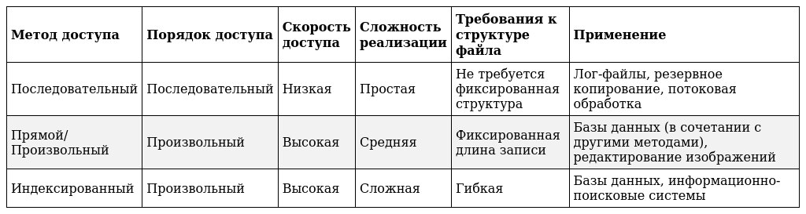

---
## Front matter
lang: ru-RU
title: Обзор методов доступа к файлам
subtitle: дисциплина Операционные системы
author:
  - Баранова А. А.
institute:
  - Российский университет дружбы народов, Москва, Россия
  - Кулябов Д. С. - д.ф.-м.н., профессор
date: 20 февраля 2025

## i18n babel
babel-lang: russian
babel-otherlangs: english

## Formatting pdf
toc: false
toc-title: Содержание
slide_level: 2
aspectratio: 169
section-titles: true
theme: metropolis
header-includes:
 - \metroset{progressbar=frametitle,sectionpage=progressbar,numbering=fraction}
---

# Информация

## Докладчик

:::::::::::::: {.columns align=center}
::: {.column width="70%"}

  * Баранова Анна Андреевна
  * Студент группы НММбд-01-24
  * Российский университет дружбы народов
  * [1132246811@pfur.ru](mailto:132246811@pfur.ru)

:::
::: {.column width="30%"}

:::
::::::::::::::

# Вводная часть

## Цели и задачи

- Изучить основные методы доступа к файлам
- Сравнить методы доступа
- Изучить современные тенденции

## Почему важно понимать методы доступа?

:::::::::::::: {.columns align=center}
::: {.column width="60%"}

- Оптимизация производительности и эффективное использование ресурсов
- Безопасность данных
- Лучшая читаемость и поддерживаемость кода

:::
::: {.column width="40%"}

:::
::::::::::::::

# Методы доступа к файлу

## Последовательный доступ (Sequential Access)

:::::::::::::: {.columns align=center}
::: {.column width="45%"}

- Данные читаются/записываются последовательно, начиная с начала файла
* **Преимущества:** Простота, эффективен для больших файлов при последовательной обработке
* **Недостатки:** Низкая скорость доступа к конкретной записи, не подходит для произвольного доступа

:::
::: {.column width="55%"}

:::
::::::::::::::

## Прямой/Произвольный доступ (Direct/Random Access)

:::::::::::::: {.columns align=center}
::: {.column width="35%"}

- Программа может получить доступ к любой записи напрямую, зная её положение
* **Преимущества:** Высокая скорость доступа к любой записи
* **Недостатки:** Требует знания положения записи, записи должны быть одинаковой длины, сложнее в реализации

:::
::: {.column width="65%"}

:::
::::::::::::::

## Индексированный доступ (Indexed Access)

:::::::::::::: {.columns align=center}
::: {.column width="40%"}

- Использует индекс для быстрого поиска записей в файле
* **Преимущества:** Высокая скорость поиска по ключу, обеспечивает произвольный доступ, гибкость
* **Недостатки:** Требует дополнительного места для хранения индекса, более сложный в реализации и управлении

:::
::: {.column width="60%"}

:::
::::::::::::::

## Сравнение методов доступа

:::::::::::::: {.columns align=center}
::: {.column width="5%"}

:::
::: {.column width="95%"}

:::
::::::::::::::

## Факторы, влияющие на выбор

- Размер файла
- Необходимость произвольного доступа и его скорость
- Сложность реализации
- Требования к обновлению данных

## Современные тенденции

:::::::::::::: {.columns align=center}
::: {.column width="60%"}

- Объектно-ориентированный доступ к файлам
- Использование баз данных
- Облачные хранилища данных

:::
::: {.column width="40%"}

:::
::::::::::::::

# Заключение

## Краткие выводы

- Правильный выбор метода доступа – важный аспект разработки ПО
- Понимание преимуществ и недостатков – залог эффективных и производительных приложений
- Оптимальный выбор зависит от требований проекта и компромисса между скоростью, сложностью и гибкостью

