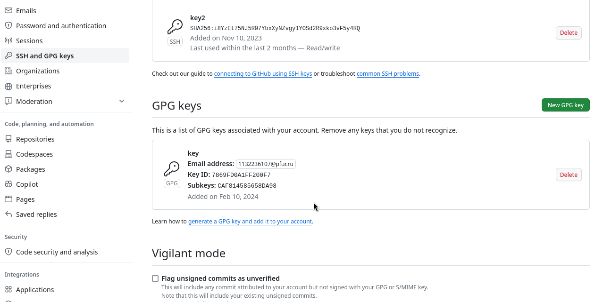

---
## Front matter
lang: ru-RU
title: Управление версиями
subtitle: дисциплина Операционные системы
author:
  - Баранова А. А.
institute:
  - Российский университет дружбы народов, Москва, Россия
  - Кулябов Д. С. - д.ф.-м.н., профессор
date: 7 марта 2025

## i18n babel
babel-lang: russian
babel-otherlangs: english

## Formatting pdf
toc: false
toc-title: Содержание
slide_level: 2
aspectratio: 169
section-titles: true
theme: metropolis
header-includes:
 - \metroset{progressbar=frametitle,sectionpage=progressbar,numbering=fraction}
---

# Информация

## Докладчик

:::::::::::::: {.columns align=center}
::: {.column width="70%"}

  * Баранова Анна Андреевна
  * Студент группы НММбд-01-24
  * Российский университет дружбы народов
  * 1132246811@pfur.ru

:::
::: {.column width="30%"}

:::
::::::::::::::

# Вводная часть

## Цели и задачи

- Изучить идеологию и применение средств контроля версий.
- Освоить умения по работе с git.

# Процесс выполнения лабораторной работы

## Глобальные параметры репозитория

:::::::::::::: {.columns align=center}
::: {.column width="5%"}

:::
::: {.column width="95%"}

:::
::::::::::::::

## Добавляем GPG ключ в аккаунт

:::::::::::::: {.columns align=center}
::: {.column width="5%"}

:::
::: {.column width="95%"}

:::
::::::::::::::

## Настройка gh

:::::::::::::: {.columns align=center}
::: {.column width="5%"}

:::
::: {.column width="95%"}

:::
::::::::::::::

## Подготовка репозитория

:::::::::::::: {.columns align=center}
::: {.column width="5%"}

:::
::: {.column width="95%"}

:::
::::::::::::::

# Выводы по проделанной работе

## Вывод

Мы изучили идеологию и применение средств контроля версий, освоили умения по работе с git.

