---
## Front matter
title: "Отчёт по лабораторной работе №2"
subtitle: "дисциплина: Операционные системы"
author: "Баранова Анна Андреевна"

## Generic otions
lang: ru-RU
toc-title: "Содержание"

## Bibliography
bibliography: bib/cite.bib
csl: pandoc/csl/gost-r-7-0-5-2008-numeric.csl

## Pdf output format
toc: true # Table of contents
toc-depth: 2
lof: true # List of figures
fontsize: 12pt
linestretch: 1.5
papersize: a4
documentclass: scrreprt
## I18n polyglossia
polyglossia-lang:
  name: russian
  options:
	- spelling=modern
	- babelshorthands=true
polyglossia-otherlangs:
  name: english
## I18n babel
babel-lang: russian
babel-otherlangs: english
## Fonts
mainfont: IBM Plex Serif
romanfont: IBM Plex Serif
sansfont: IBM Plex Sans
monofont: IBM Plex Mono
mathfont: STIX Two Math
mainfontoptions: Ligatures=Common,Ligatures=TeX,Scale=0.94
romanfontoptions: Ligatures=Common,Ligatures=TeX,Scale=0.94
sansfontoptions: Ligatures=Common,Ligatures=TeX,Scale=MatchLowercase,Scale=0.94
monofontoptions: Scale=MatchLowercase,Scale=0.94,FakeStretch=0.9
mathfontoptions:
## Biblatex
biblatex: true
biblio-style: "gost-numeric"
biblatexoptions:
  - parentracker=true
  - backend=biber
  - hyperref=auto
  - language=auto
  - autolang=other*
  - citestyle=gost-numeric
## Pandoc-crossref LaTeX customization
figureTitle: "Рис."

## Misc options
indent: true
header-includes:
  - \usepackage{indentfirst}
  - \usepackage{float} # keep figures where there are in the text
  - \floatplacement{figure}{H} # keep figures where there are in the text
---

# Цель работы

Цель работы – изучение идеологии и применение средств контроля версий и получение практических навыков по работе с системой git.

# Задание

В ходе выполнения данной лабораторной работы необходимо научиться:

*Настраивать GitHub;

*настраивать git;

*создавать SSH ключи;

*создавать рабочие пространства и репозитории;

*настраивать каталоги.

Выполнив эту работу, мы получим практические навыки работы с GitHub и с системой git.

# Выполнение лабораторной работы

Создадим учётную запись на сайте https://github.com/ и заполним основные данные (рис. [-@fig:001]).

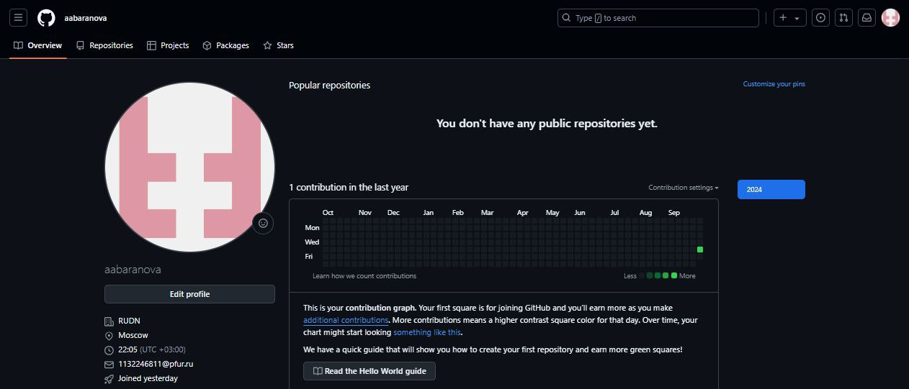{#fig:001 width=70%}

Сначала сделаем предварительную конфигурацию git. Откроем терминал и введём команды, указав имя и email владельца репозитория (рис. [-@fig:002]).

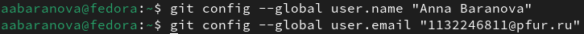{#fig:002 width=70%}

Настроим utf-8 в выводе сообщений git (рис. [-@fig:003]).

{#fig:003 width=70%}

Зададим имя начальной ветки (будем называть её master) (рис. [-@fig:004]).

{#fig:004 width=70%}

Параметр autocrlf (рис. [-@fig:005]).

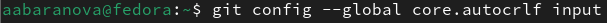{#fig:005 width=70%}

Параметр safecrlf (рис. [-@fig:006]).

{#fig:006 width=70%}

Для последующей идентификации пользователя на сервере репозиториев необходимо сгенерировать пару ключей (приватный и открытый): Для последующей идентификации пользователя на сервере репозиториев необходимо сгенерировать пару ключей (приватный и открытый) (рис. [-@fig:007]).

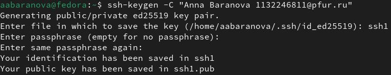{#fig:007 width=70%}

Далее необходимо загрузить сгенерённый открытый ключ. Для этого зайдём на сайт http://github.org/ под своей учётной записью и перейдём в меню Setting. После этого выберем в боковом меню SSH and GPG keys и нажмём кнопку New SSH key. Скопировав из локальной консоли ключ в буфер обмена (рис. [-@fig:008]).

{#fig:008 width=70%}

вставляем ключ в появившееся на сайте поле и указываем для ключа имя (Title) (рис. [-@fig:009]).

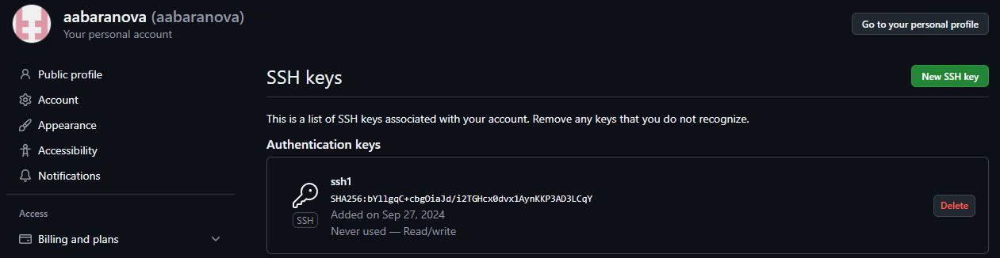{#fig:009 width=70%}

Откроем терминал и создадим каталог для предмета «Архитектура компьютера» (рис. [-@fig:010]).

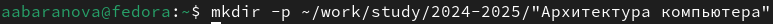{#fig:010 width=70%}

Перейдём на станицу репозитория с шаблоном курса https://github.com/yamadharma/course-directory-student-template. Далее выберем Use this template (рис. [-@fig:011]).

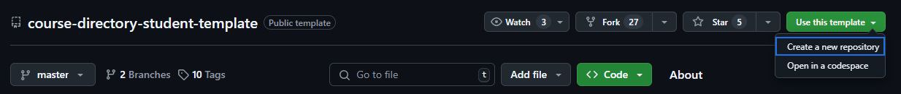{#fig:011 width=70%}

В открывшемся окне зададим имя репозитория (Repository name) study_2023–2024_arhpc и создадим репозиторий (кнопка Create repository from template) (рис. [-@fig:012]).

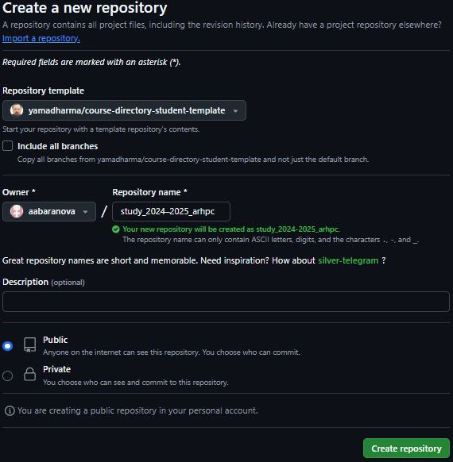{#fig:012 width=70%}

Откроем терминал и перейдём в каталог курса (рис. [-@fig:013]).

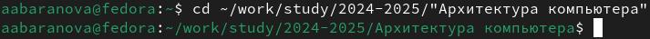{#fig:013 width=70%}

Клонируем созданный репозиторий (рис. [-@fig:014]).

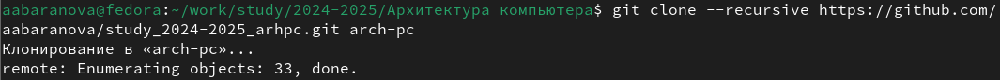{#fig:014 width=70%}

Удалим лишние файлы (рис. [-@fig:015]).

{#fig:015 width=70%}

Создадим необходимые каталоги (рис. [-@fig:016]).

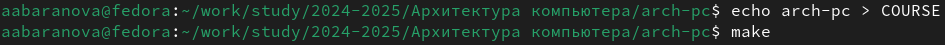{#fig:016 width=70%}

Для подтверждения команды push необходимо в поле пароля ввести Personal access tokens, создаваемый в настройках разработчика (рис. [-@fig:017]).

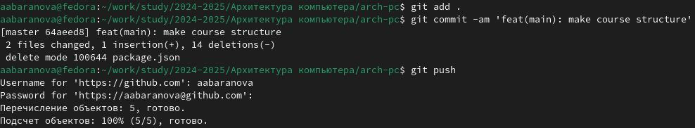{#fig:017 width=70%}

Проверим правильность создания иерархии рабочего пространства в локальном репозитории  (рис. [-@fig:018]) и на странице github (рис. [-@fig:019]).

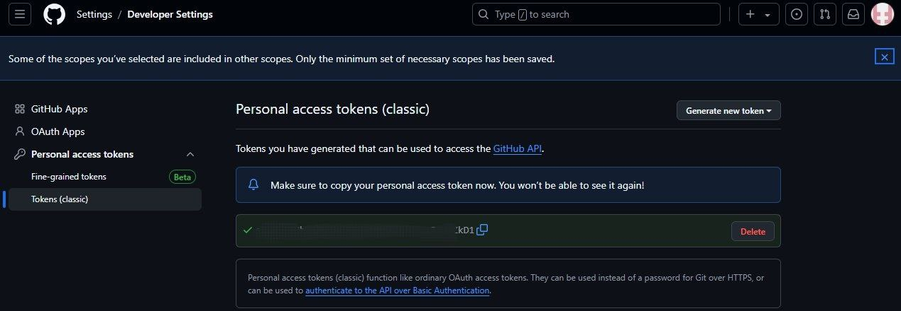{#fig:018 width=70%}

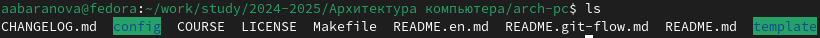{#fig:019 width=70%}

# Задание для самостоятельной работы

Создадим отчёт по выполнению лабораторной работы в соответствующем каталоге рабочего пространства (labs>lab01>report и labs>lab02>report) (рис. [-@fig:020]).

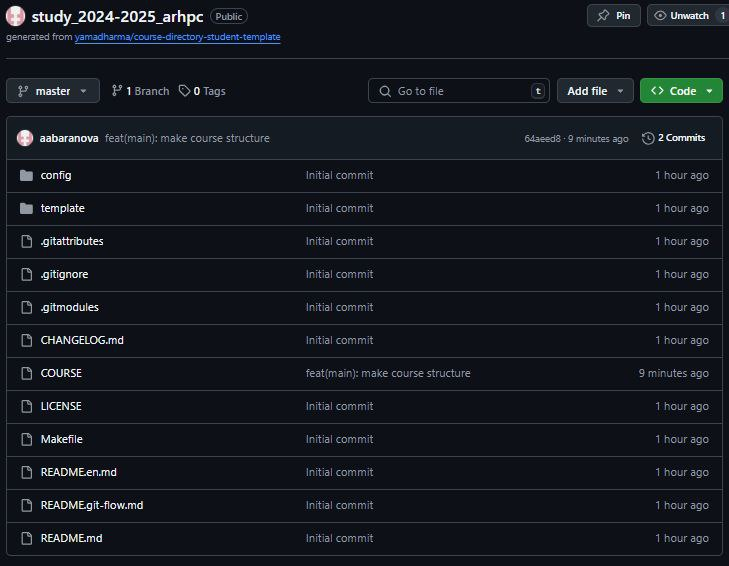{#fig:020 width=70%}

Скопируем отчёты по выполнению предыдущих лабораторных работ в соответствующие каталоги созданного рабочего пространства (рис. [-@fig:021]), (рис. [-@fig:022]).

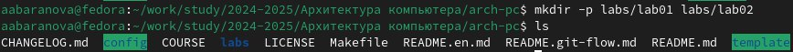{#fig:021 width=70%}

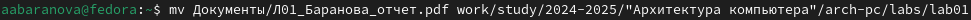{#fig:022 width=70%}

Загрузим файлы на github (рис. [-@fig:023]).

{#fig:023 width=70%}

# Выводы

В ходе выполнения данной лабораторной работы были изучены идеологии и применение средств контроля версий, а также приобретены практические навыки работы с системой git.

