---
## Front matter
lang: ru-RU
title: Продвинутое использование git
subtitle: дисциплина Операционные системы
author:
  - Баранова А. А.
institute:
  - Российский университет дружбы народов, Москва, Россия
  - Кулябов Д. С. - д.ф.-м.н., профессор
date: 7 марта 2025

## i18n babel
babel-lang: russian
babel-otherlangs: english

## Formatting pdf
toc: false
toc-title: Содержание
slide_level: 2
aspectratio: 169
section-titles: true
theme: metropolis
header-includes:
 - \metroset{progressbar=frametitle,sectionpage=progressbar,numbering=fraction}
---

# Информация

## Докладчик

:::::::::::::: {.columns align=center}
::: {.column width="70%"}

  * Баранова Анна Андреевна
  * Студент группы НММбд-01-24
  * Российский университет дружбы народов
  * 1132246811@pfur.ru

:::
::: {.column width="30%"}

:::
::::::::::::::

# Вводная часть

## Цели и задачи

- Получение навыков правильной работы с репозиториями git.

## Задачи лабораторной работы

1 Выполнить работу для тестового репозитория.

2 Преобразовать рабочий репозиторий в репозиторий с git-flow и conventional commits.

# Процесс выполнения лабораторной работы

## Node.js

:::::::::::::: {.columns align=center}
::: {.column width="5%"}

:::
::: {.column width="95%"}

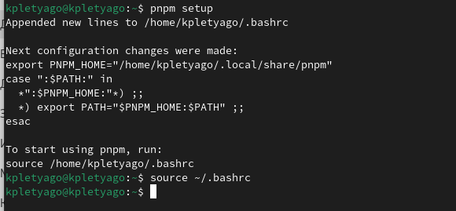

:::
::::::::::::::

## commitizen

:::::::::::::: {.columns align=center}
::: {.column width="5%"}

:::
::: {.column width="95%"}

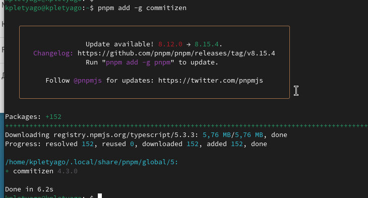

:::
::::::::::::::

## standard-changelog

:::::::::::::: {.columns align=center}
::: {.column width="5%"}

:::
::: {.column width="95%"}

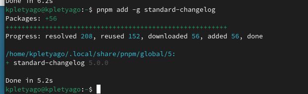

:::
::::::::::::::

## package.json

:::::::::::::: {.columns align=center}
::: {.column width="5%"}

:::
::: {.column width="95%"}

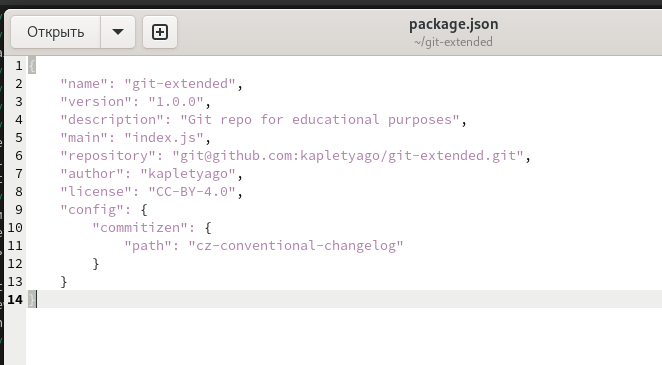

:::
::::::::::::::

## Использование commitizen

:::::::::::::: {.columns align=center}
::: {.column width="5%"}

:::
::: {.column width="95%"}

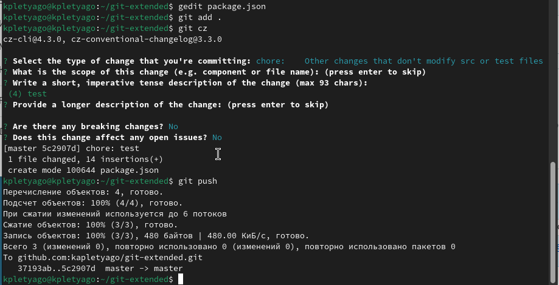

:::
::::::::::::::

## git-flow

:::::::::::::: {.columns align=center}
::: {.column width="5%"}

:::
::: {.column width="95%"}

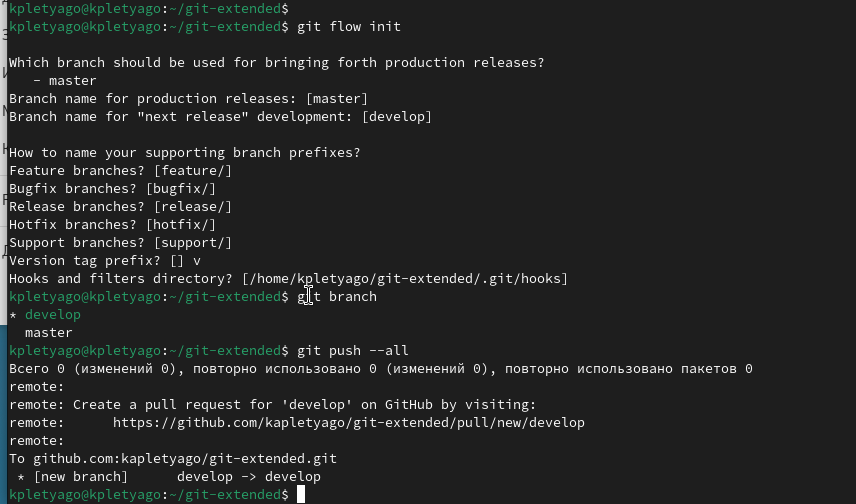

:::
::::::::::::::

## git-flow

:::::::::::::: {.columns align=center}
::: {.column width="5%"}

:::
::: {.column width="95%"}

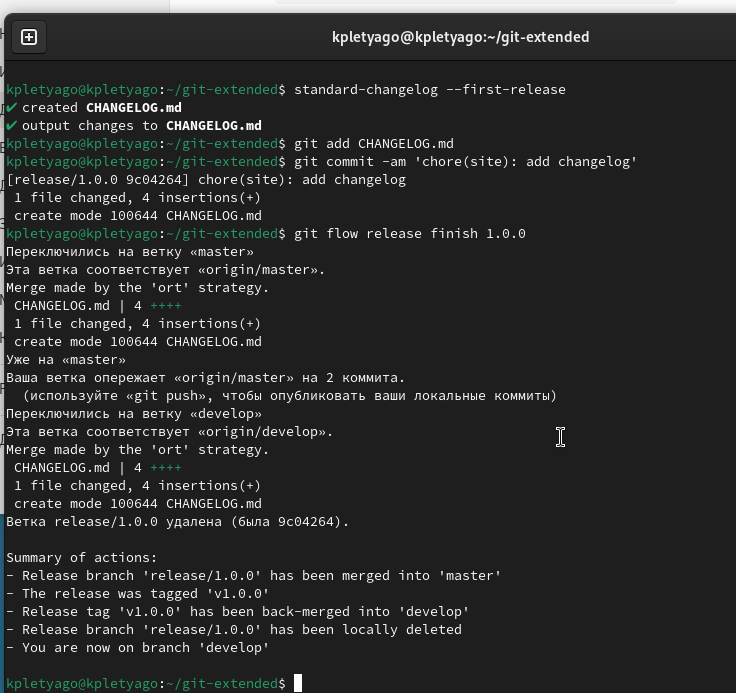

:::
::::::::::::::

## Отправим данные на github

:::::::::::::: {.columns align=center}
::: {.column width="5%"}

:::
::: {.column width="95%"}

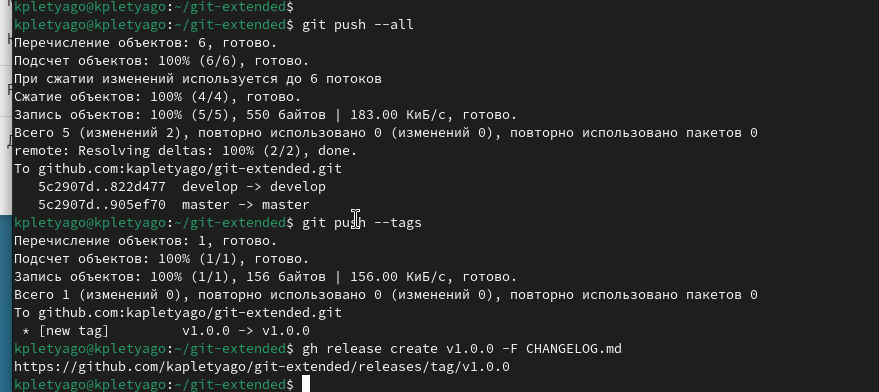

:::
::::::::::::::

## Объединение веток

:::::::::::::: {.columns align=center}
::: {.column width="5%"}

:::
::: {.column width="95%"}

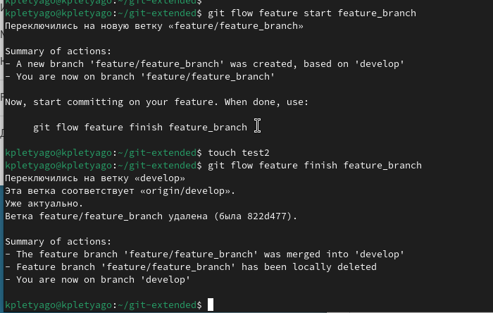

:::
::::::::::::::

## git-flow

:::::::::::::: {.columns align=center}
::: {.column width="5%"}

:::
::: {.column width="95%"}

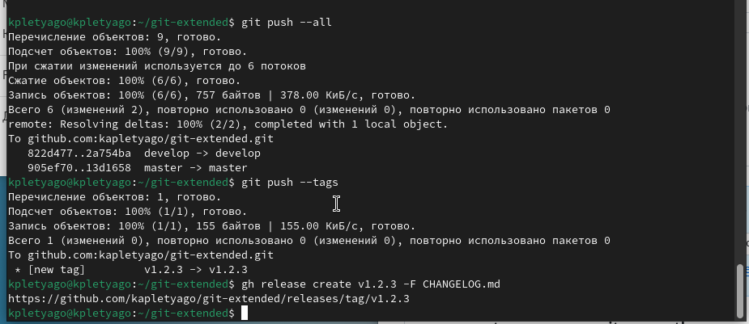

:::
::::::::::::::

## Подготовка рабочего репозитория

:::::::::::::: {.columns align=center}
::: {.column width="5%"}

:::
::: {.column width="95%"}

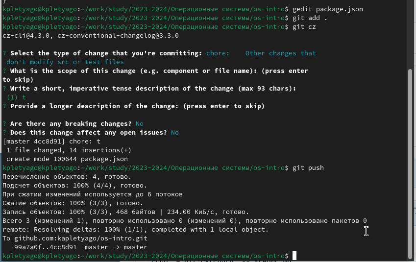

:::
::::::::::::::

## Подготовка рабочего репозитория

:::::::::::::: {.columns align=center}
::: {.column width="5%"}

:::
::: {.column width="95%"}

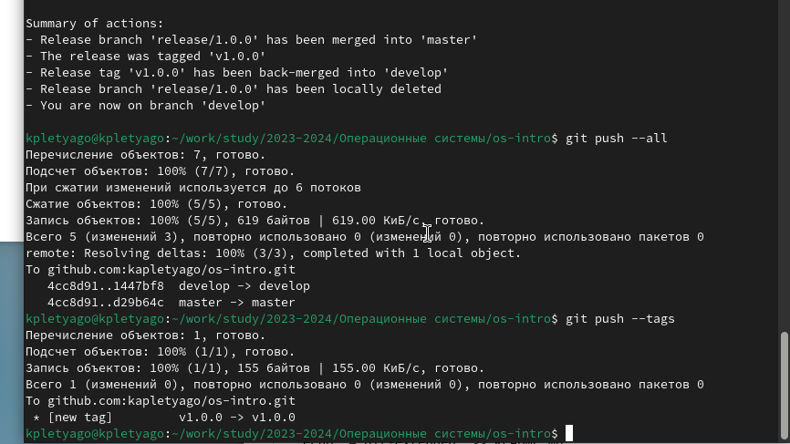

:::
::::::::::::::

# Выводы по проделанной работе

## Вывод

Мы приобрели практические навыки правильной работы с репозиториями git.
