---
## Front matter
title: "Отчёт по лабораторной работе №4"
subtitle: "дисциплина: Архитектура компьютера"
author: "Баранова Анна Андреевна"

## Generic otions
lang: ru-RU
toc-title: "Содержание"

## Bibliography
bibliography: bib/cite.bib
csl: pandoc/csl/gost-r-7-0-5-2008-numeric.csl

## Pdf output format
toc: true # Table of contents
toc-depth: 2
lof: true # List of figures
fontsize: 12pt
linestretch: 1.5
papersize: a4
documentclass: scrreprt
## I18n polyglossia
polyglossia-lang:
  name: russian
  options:
	- spelling=modern
	- babelshorthands=true
polyglossia-otherlangs:
  name: english
## I18n babel
babel-lang: russian
babel-otherlangs: english
## Fonts
mainfont: IBM Plex Serif
romanfont: IBM Plex Serif
sansfont: IBM Plex Sans
monofont: IBM Plex Mono
mathfont: STIX Two Math
mainfontoptions: Ligatures=Common,Ligatures=TeX,Scale=0.94
romanfontoptions: Ligatures=Common,Ligatures=TeX,Scale=0.94
sansfontoptions: Ligatures=Common,Ligatures=TeX,Scale=MatchLowercase,Scale=0.94
monofontoptions: Scale=MatchLowercase,Scale=0.94,FakeStretch=0.9
mathfontoptions:
## Biblatex
biblatex: true
biblio-style: "gost-numeric"
biblatexoptions:
  - parentracker=true
  - backend=biber
  - hyperref=auto
  - language=auto
  - autolang=other*
  - citestyle=gost-numeric
## Pandoc-crossref LaTeX customization
figureTitle: "Рис."

## Misc options
indent: true
header-includes:
  - \usepackage{indentfirst}
  - \usepackage{float} # keep figures where there are in the text
  - \floatplacement{figure}{H} # keep figures where there are in the text
---

# Цель работы

Цель работы - освоить процедуры компиляции и сборки программ, которые написаны на ассемблере NASM.

# Задание

В ходе выполнения данной лабораторной работы необходимо изучить:

* Что такое ассемблер и язык ассемблера;

* как создавать и обрабатывать программы на языке ассемблера;

* как оформлять изображения в Markdown.

Выполнив эту работу, мы приобретём навыки работы процедуру оформления отётов с помощью легковесного языка разметки Markdown.

# Теоретическое введение

Язык ассемблера (assembly language, сокращённо asm) — машинно-ориентированный язык низкого уровня. Можно считать, что он больше любых других языков приближен к архитектуре ЭВМ и её аппаратным возможностям, что позволяет получить к ним более полный доступ, нежели в языках высокого уровня, таких как C/C++, Perl, Python и пр. Заметим, что получить полный доступ к ресурсам компьютера в современных архитектурах нельзя, самым низким уровнем работы прикладной программы является обращение напрямую к ядру операционной системы. Именно на этом уровне и работают программы, написанные на ассемблере. Но в отличие от языков высокого уровня ассемблерная программа содержит только тот код, который ввёл программист. Таким образом язык ассемблера — это язык, с помощью которого понятным для человека образом пишутся команды для процессора.

Следует отметить, что процессор понимает не команды ассемблера, а последовательности из нулей и единиц — машинные коды. До появления языков ассемблера программистам приходилось писать программы, используя только лишь машинные коды, которые были крайне сложны для запоминания, так как представляли собой числа, записанные в двоичной или шестнадцатеричной системе счисления. Преобразование или трансляция команд с языка ассемблера в исполняемый машинный код осуществляется специальной программой транслятором — Ассемблер.

В процессе создания ассемблерной программы можно выделить четыре шага:

* Набор текста программы в текстовом редакторе и сохранение её в отдельном файле. Каждый файл имеет свой тип (или расширение), который определяет назначение файла. Файлы с исходным текстом программ на языке ассемблера имеют тип asm.

* Трансляция — преобразование с помощью транслятора, например nasm, текста про- граммы в машинный код, называемый объектным. На данном этапе также может быть получен листинг программы, содержащий кроме текста программы различную допол- нительную информацию, созданную транслятором. Тип объектного файла — o, файла листинга — lst.

* Компоновка или линковка — этап обработки объектного кода компоновщиком (ld), который принимает на вход объектные файлы и собирает по ним исполняемый файл. Исполняемый файл обычно не имеет расширения. Кроме того, можно получить файл карты загрузки программы в ОЗУ, имеющий расширение map.

* Запуск программы. Конечной целью является работоспособный исполняемый файл. Ошибки на предыдущих этапах могут привести к некорректной работе программы, поэтому может присутствовать этап отладки программы при помощи специальной программы — отладчика. При нахождении ошибки необходимо провести коррекцию программы, начиная с первого шага.

# Выполнение лабораторной работы

## Программа Hello world!

Создадим каталог для работы с программами на языке ассемблера NASM (рис. [-@fig:001]).

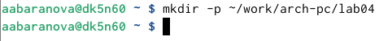{#fig:001 width=70%}

Перейдём в созданный каталог (рис. [-@fig:002]).

{#fig:002 width=70%}

Создадим текстовый файл с именем hello.asm (рис. [-@fig:003]).

{#fig:003 width=70%}

Откроем этот файл с помощью текстового редактора gedit (рис. [-@fig:004]).

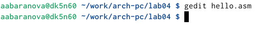{#fig:004 width=70%}

Введём в него следующий текст (рис. [-@fig:005]).

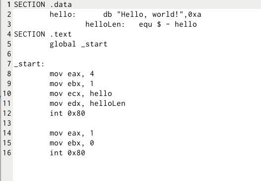{#fig:005 width=70%}

## Транслятор NASM

Скомпилируем приведённый выше текст программы «Hello World» (рис. [-@fig:006]).

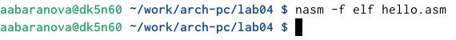{#fig:006 width=70%}

С помощью команды ls проверим, что объектный файл был создан (рис. [-@fig:007]).

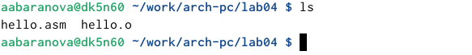{#fig:007 width=70%}

## Расширенный синтаксис командной строки NASM

Скомпилируем исходный файл hello.asm в obj.o, при этом формат выходного файла будет elf, и в него будут включены символы для отладки, кроме того, будет создан файл листинга list.lst (рис. [-@fig:008]).

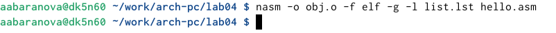{#fig:008 width=70%}

С помощью команды ls проверим, что файлы были созданы (рис. [-@fig:009]).

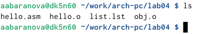{#fig:009 width=70%}

Для более подробной информации используем man nasm (рис. [-@fig:010]), (рис. [-@fig:011]).

{#fig:010 width=70%}

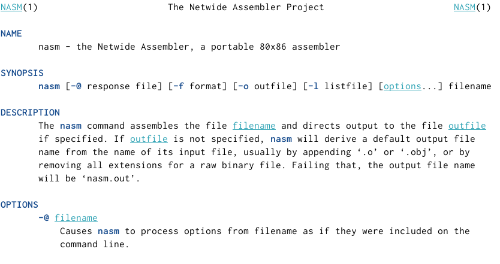{#fig:011 width=70%}

Для получения списка форматов объектного файла используем nasm -hf (рис. [-@fig:012]).

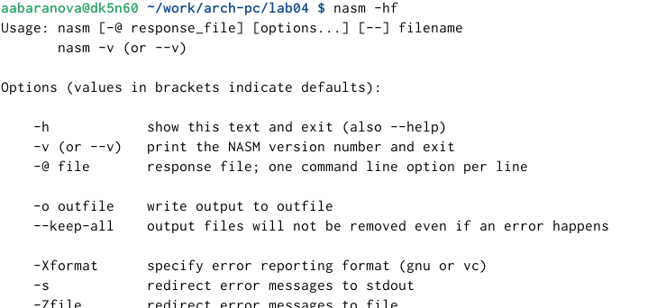{#fig:012 width=70%}

## Компоновщик LD

Передадим объектный файл на обработку компоновщику (рис. [-@fig:013]).

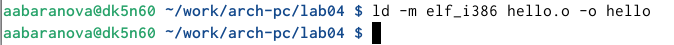{#fig:013 width=70%}

С помощью команды ls проверим, что исполняемый файл hello был создан (рис. [-@fig:014]).

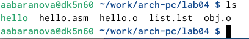{#fig:014 width=70%}

Зададим имя создаваемого исполняемого файла (рис. [-@fig:015]).

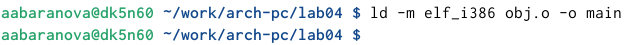{#fig:015 width=70%}

Для получения более подробной информации используем man ld (рис. [-@fig:016]), (рис. [-@fig:017]).

{#fig:016 width=70%}

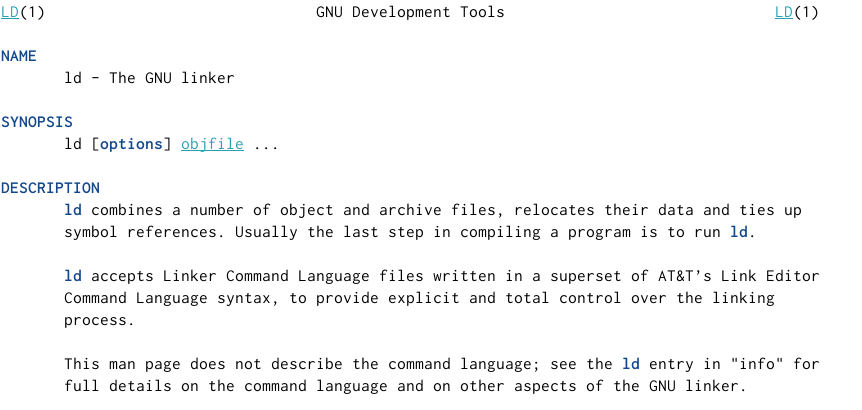{#fig:017 width=70%}

## Запуск исполняемого файла

Запустим на выполнение созданный исполняемый файл, находящийся в текущем каталоге (рис. [-@fig:018]).

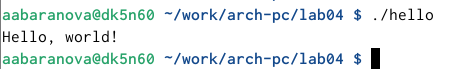{#fig:018 width=70%}

## Задание для самостоятельной работы

В каталоге ~/work/arch-pc/lab04 с помощью команды cp создадим копию файла hello.asm с именем lab4.asm (рис. [-@fig:019]).

{#fig:019 width=70%}

С помощью команды ls проверим, что файл lab4.asm был создан (рис. [-@fig:020]).

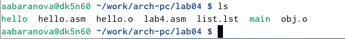{#fig:020 width=70%}

С помощью текстового редактора gedit внесём изменения в текст программы в файле lab4.asm так, чтобы вместо Hello world! на экран выводилась строка с моими фамилией и именем (рис. [-@fig:021]), (рис. [-@fig:022]).

{#fig:021 width=70%}

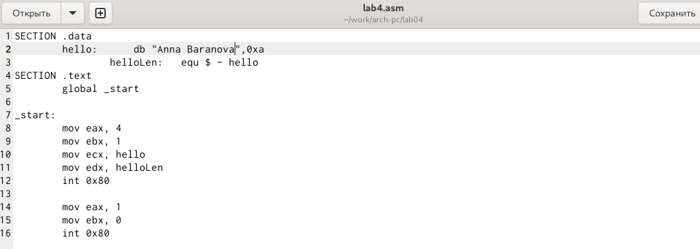{#fig:022 width=70%}

Скомпилируем текст файла lab4.asm (рис. [-@fig:023]).

{#fig:023 width=70%}

Скомпилируем исходный файл lab4.asm в obj.o, при этом формат выходного файла будет elf, и в него будут включены символы для отладки, кроме того, будет создан файл листинга list1.lst (рис. [-@fig:024]).

{#fig:024 width=70%}

Передадим объектный файл на обработку компоновщику (рис. [-@fig:025]).

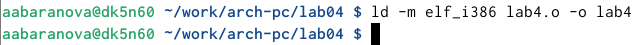{#fig:025 width=70%}

Зададим имя создаваемого исполняемого файла (рис. [-@fig:026]).

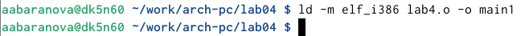{#fig:026 width=70%}

С помощью команды ls проверим, что нужные файлы были создан (рис. [-@fig:027]).

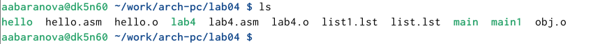{#fig:027 width=70%}

Запустим получившийся исполняемый файл (рис. [-@fig:028]).

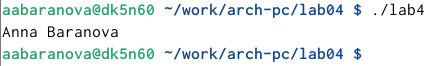{#fig:028 width=70%}

Скопируем файлы hello.asm и lab4.asm в мой локальный репозиторий в каталог ~/work/study/2024-2025/"Архитектура компьютера"/arch-pc/labs/lab04/ (рис. [-@fig:029]), (рис. [-@fig:030]).

{#fig:029 width=70%}

{#fig:030 width=70%}

Загрузим файлы на Github (рис. [-@fig:031]).

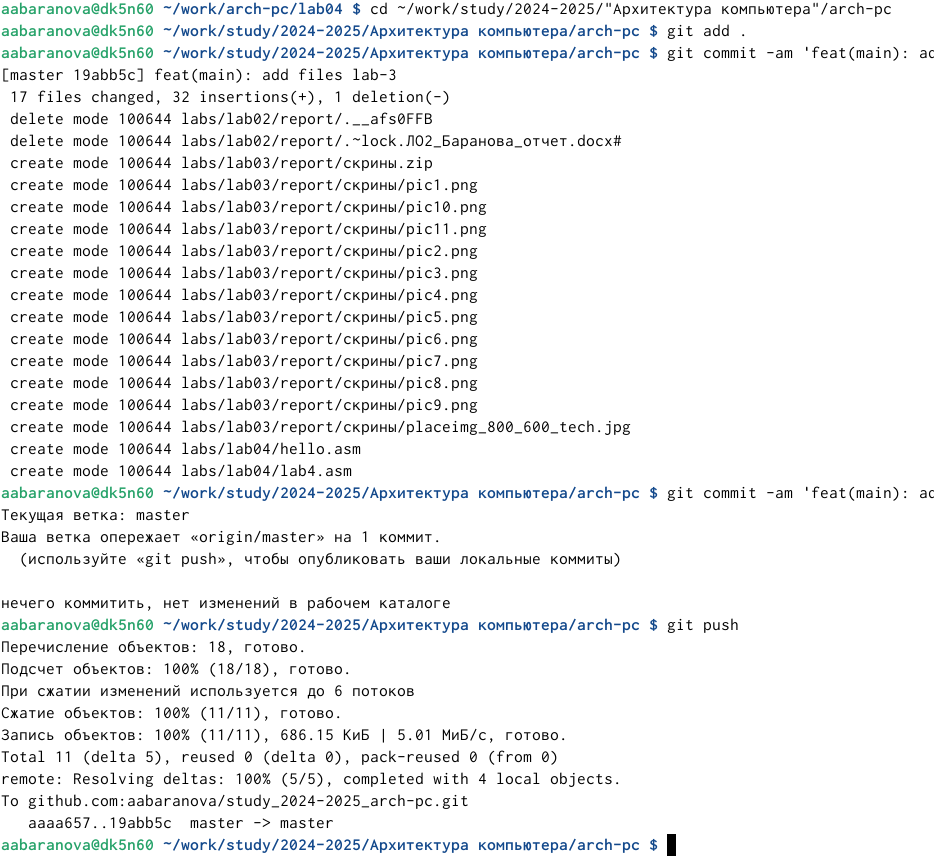{#fig:031 width=70%}

# Выводы

В ходе выполнения данной лабораторной работы были освоены процедуры компиляции и сборки программ, которые написаны на ассемблере NASM.

