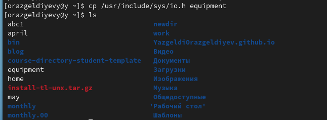
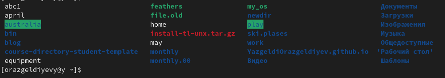
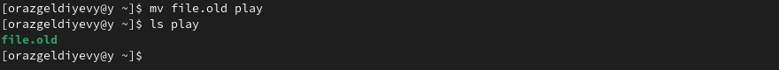

---
## Front matter
title: "Лабораторная работа № 5"
subtitle: "Операционные системы"
author: "Анна Баранова"

## Generic otions
lang: ru-RU
toc-title: "Содержание"

## Bibliography
bibliography: bib/cite.bib
csl: pandoc/csl/gost-r-7-0-5-2008-numeric.csl

## Pdf output format
toc: true # Table of contents
toc-depth: 2
lof: true # List of figures
lot: true # List of tables
fontsize: 12pt
linestretch: 1.5
papersize: a4
documentclass: scrreprt
## I18n polyglossia
polyglossia-lang:
  name: russian
  options:
	- spelling=modern
	- babelshorthands=true
polyglossia-otherlangs:
  name: english
## I18n babel
babel-lang: russian
babel-otherlangs: english
## Fonts
mainfont: PT Serif
romanfont: PT Serif
sansfont: PT Sans
monofont: PT Mono
mainfontoptions: Ligatures=TeX
romanfontoptions: Ligatures=TeX
sansfontoptions: Ligatures=TeX,Scale=MatchLowercase
monofontoptions: Scale=MatchLowercase,Scale=0.9
## Biblatex
biblatex: true
biblio-style: "gost-numeric"
biblatexoptions:
  - parentracker=true
  - backend=biber
  - hyperref=auto
  - language=auto
  - autolang=other*
  - citestyle=gost-numeric
## Pandoc-crossref LaTeX customization
figureTitle: "Рис."
tableTitle: "Таблица"
listingTitle: "Листинг"
lofTitle: "Список иллюстраций"
lotTitle: "Список таблиц"
lolTitle: "Листинги"
## Misc options
indent: true
header-includes:
  - \usepackage{indentfirst}
  - \usepackage{float} # keep figures where there are in the text
  - \floatplacement{figure}{H} # keep figures where there are in the text
---

# Цель работы

Ознакомление с файловой системой Linux, её структурой, именами и содержанием
каталогов. Приобретение практических навыков по применению команд для работы
с файлами и каталогами, по управлению процессами (и работами), по проверке использования диска и обслуживанию файловой системы.

# Задание

1. Выполнили все примеры, приведенные в первой части лабораторной работы

{#fig:001 width=70%}

2. Скопировали файл /usr/include/sys/io.h в домашний каталог и назвали его equipment.

{#fig:002 width=70%}

3. В домашнем каталоге создали директорию ~/ski.plases.

{#fig:003 width=70%}

4. Переместили файл equipment в каталог ~/ski.plases

{#fig:004 width=70%}

5. Переименовали файл equipment в equiplist

{#fig:005 width=70%}

6. Создали в домашнем каталоге файл abc1 и скопировали его в каталог ~/ski.plases, назвали его equiplist2.

{#fig:006 width=70%}

7. Создали каталог с именем equipment в каталоге ~/ski.plases. Потом переместили файлы ~ski.plases/equiplist и equiplist2 в каталог ~/ski.plases/equipment.

{#fig:007 width=70%}

8. Создали и переместили каталог ~/newdir в каталог ~/ski.plases и переименовали его plans.

{#fig:008 width=70%}

9. Присвоили файлам и каталогам права доступа

{#fig:009 width=70%}

{#fig:010 width=70%}

{#fig:011 width=70%}

{#fig:012 width=70%}

10. Просмотрели содержимое password

{#fig:013 width=70%}

11. Скопировали файл ~/feathers в файл ~/file.old.

{#fig:014 width=70%}

12. Переместили файл ~/file.old в каталог ~/play

{#fig:015 width=70%}

13. Скопировали каталог ~/play в каталог ~/fun

{#fig:016 width=70%}

14. Переместили каталог ~/fun в каталог ~/play и назвали его games

{#fig:017 width=70%}

15. Изменили права доступа файлов feathers, play и проверили команды

{#fig:018 width=70%}

{#fig:019 width=70%}

16. Проработали команды man mount, fsck, mkfs, kill

{#fig:020 width=70%}

{#fig:021 width=70%}

# Выводы

Ознакомились с файловой системой Linux, её структурой, именами и содержанием
каталогов. Приобрели практические навыки по применению команд для работы
с файлами и каталогами, по управлению процессами (и работами), по проверке использования диска и обслуживанию файловой системы.
