---
## Front matter
title: "Отчёт по лабораторной работе №5"
subtitle: "дисциплина: Архитектура компьютера"
author: "Баранова Анна Андреевна"

## Generic otions
lang: ru-RU
toc-title: "Содержание"

## Bibliography
bibliography: bib/cite.bib
csl: pandoc/csl/gost-r-7-0-5-2008-numeric.csl

## Pdf output format
toc: true # Table of contents
toc-depth: 2
lof: true # List of figures
fontsize: 12pt
linestretch: 1.5
papersize: a4
documentclass: scrreprt
## I18n polyglossia
polyglossia-lang:
  name: russian
  options:
	- spelling=modern
	- babelshorthands=true
polyglossia-otherlangs:
  name: english
## I18n babel
babel-lang: russian
babel-otherlangs: english
## Fonts
mainfont: IBM Plex Serif
romanfont: IBM Plex Serif
sansfont: IBM Plex Sans
monofont: IBM Plex Mono
mathfont: STIX Two Math
mainfontoptions: Ligatures=Common,Ligatures=TeX,Scale=0.94
romanfontoptions: Ligatures=Common,Ligatures=TeX,Scale=0.94
sansfontoptions: Ligatures=Common,Ligatures=TeX,Scale=MatchLowercase,Scale=0.94
monofontoptions: Scale=MatchLowercase,Scale=0.94,FakeStretch=0.9
mathfontoptions:
## Biblatex
biblatex: true
biblio-style: "gost-numeric"
biblatexoptions:
  - parentracker=true
  - backend=biber
  - hyperref=auto
  - language=auto
  - autolang=other*
  - citestyle=gost-numeric
## Pandoc-crossref LaTeX customization
figureTitle: "Рис."

## Misc options
indent: true
header-includes:
  - \usepackage{indentfirst}
  - \usepackage{float} # keep figures where there are in the text
  - \floatplacement{figure}{H} # keep figures where there are in the text
---

# Цель работы

Цель работы - приобрести практические навыки работы в Midnight Commander и освоить инструкции
языка ассемблера mov и int.

# Задание

В ходе выполнения данной лабораторной работы необходимо изучить:

* Основы работы с Midnight Commander;

* структуру программы на языке ассемблера NASM;

* инструкции mov и int;

* системные вызовы для обеспечения диалога с пользователем.

Выполнив эту работу, мы приобретём практические навыки работы в Midnight Commander и освоим инструкции языка ассемблера mov и int.

# Теоретическое введение

Midnight Commander (или просто mc) — это программа, которая позволяет просматривать структуру каталогов и выполнять основные операции по управлению файловой системой, т.е. mc является файловым менеджером. Midnight Commander позволяет сделать работу с файлами более удобной и наглядной.

Программа на языке ассемблера NASM, как правило, состоит из трёх секций: секция кода программы (SECTION .text), секция инициированных (известных во время компиляции) данных (SECTION .data) и секция неинициализированных данных (тех, под которые во время компиляции только отводится память, а значение присваивается в ходе выполнения программы) (SECTION .bss).

Инструкция языка ассемблера mov предназначена для дублирования данных источника в приёмнике.

Инструкция языка ассемблера intпредназначена для вызова прерывания с указанным номером.

# Выполнение лабораторной работы

Откроем Midnight Commander (рис. [-@fig:001]), (рис. [-@fig:002]).

{#fig:001 width=70%}

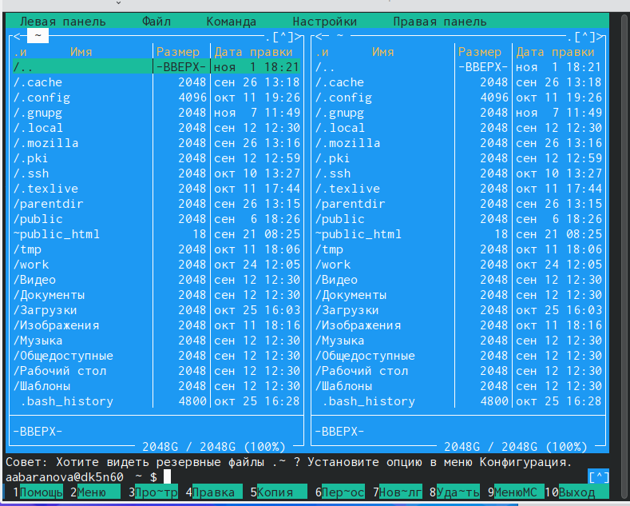{#fig:002 width=70%}

Перейдём в каталог ~/work/arch-pc созданный при выполнении лабораторной работы №4, с помощью функциональной клавиши F7 создадим папку lab05 и перейдём в созданный каталог (рис. [-@fig:003]), (рис. [-@fig:004]).

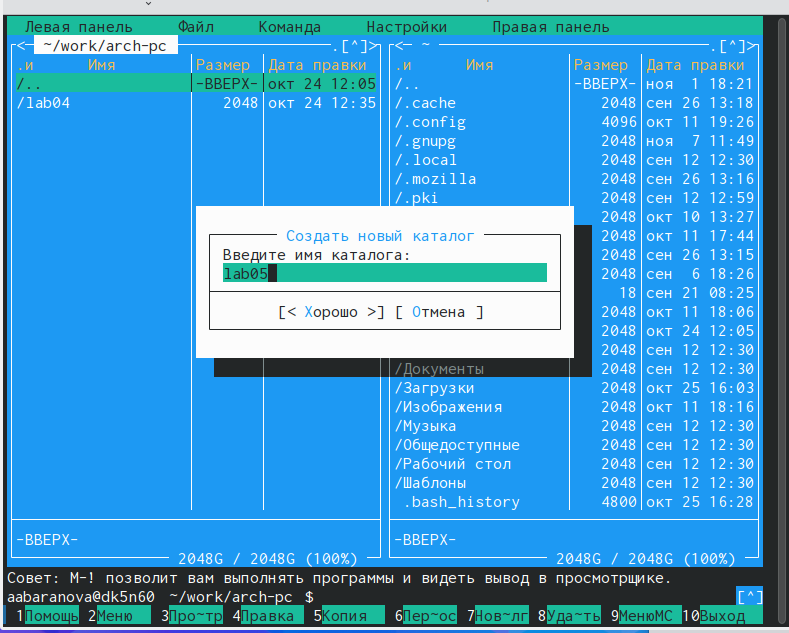{#fig:003 width=70%}

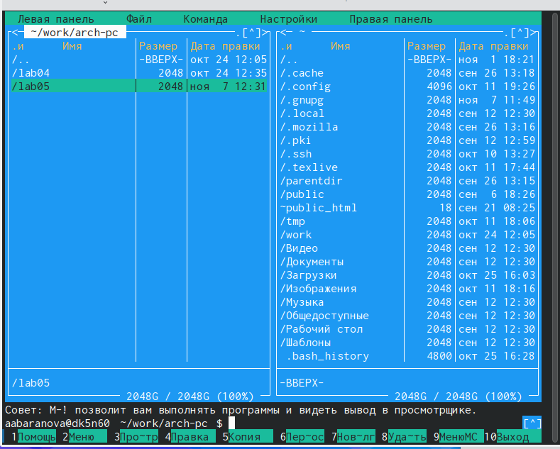{#fig:004 width=70%}

Пользуясь строкой ввода и командой touch создадим файл lab5-1.asm (рис. [-@fig:005]), (рис. [-@fig:006]).

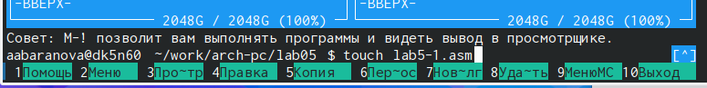{#fig:005 width=70%}

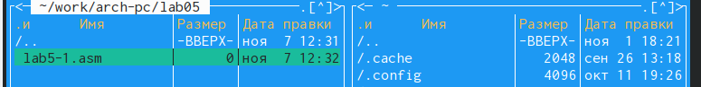{#fig:006 width=70%}

С помощью функциональной клавиши F4 откроем файл lab5-1.asm для редактирования во встроенном редакторе (рис. [-@fig:007]).

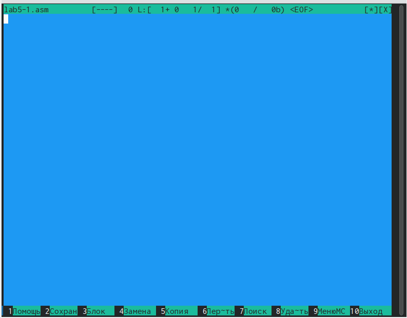{#fig:007 width=70%}

Введём текст программы в файл, сохраним изменения и закроем файл. (рис. [-@fig:008]).

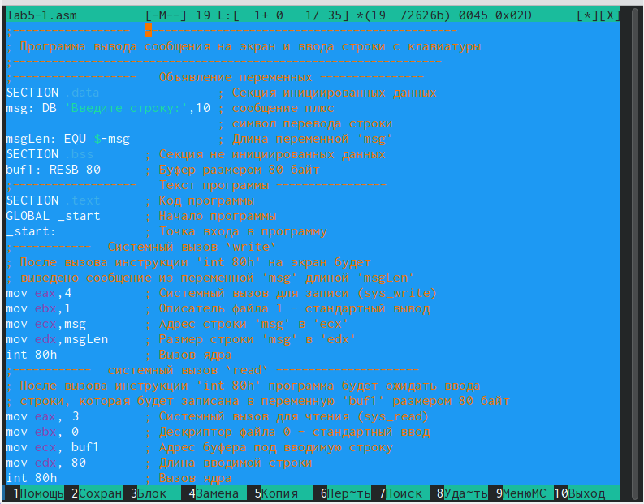{#fig:008 width=70%}

С помощью функциональной клавиши F3 откроем файл lab5-1.asm для просмотра. Убедимся, что файл содержит текст программы (рис. [-@fig:009]).

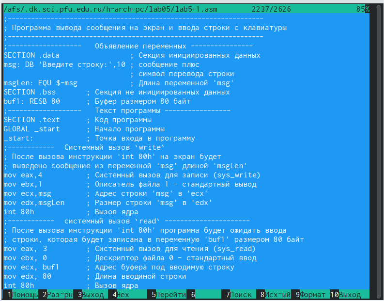{#fig:009 width=70%}

Оттранслируем текст программы lab5-1.asm в объектный файл. Выполним компоновку объектного файла и запустим получившийся исполняемый файл. (рис. [-@fig:010]), (рис. [-@fig:011]), (рис. [-@fig:012]), (рис. [-@fig:013]), (рис. [-@fig:014]), (рис. [-@fig:015]).

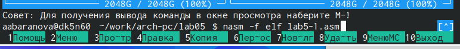{#fig:010 width=70%}

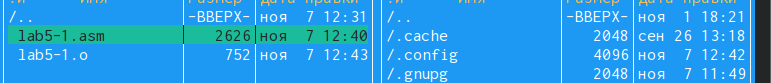{#fig:011 width=70%}

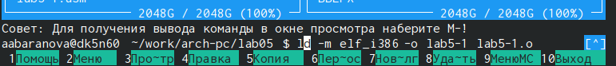{#fig:012 width=70%}

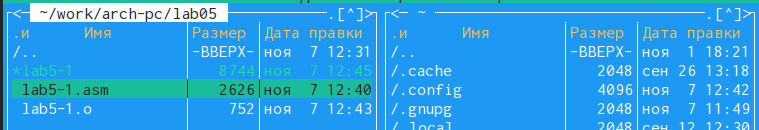{#fig:013 width=70%}

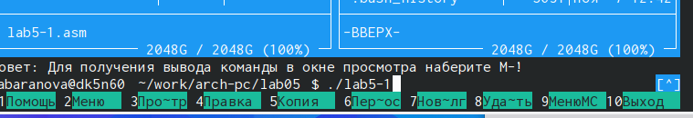{#fig:014 width=70%}

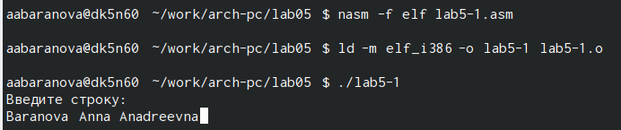{#fig:015 width=70%}

## Подключение внешнего файла in_out.asm

В одной из панелей mc откроем каталог с файлом lab5-1.asm. В другой панели каталог со скаченным файлом in_out.asm. Скопируйте файл in_out.asm в каталог с файлом lab5-1.asm с помощью функциональной клавиши F5 (рис. [-@fig:016]), (рис. [-@fig:017]), (рис. [-@fig:018]).

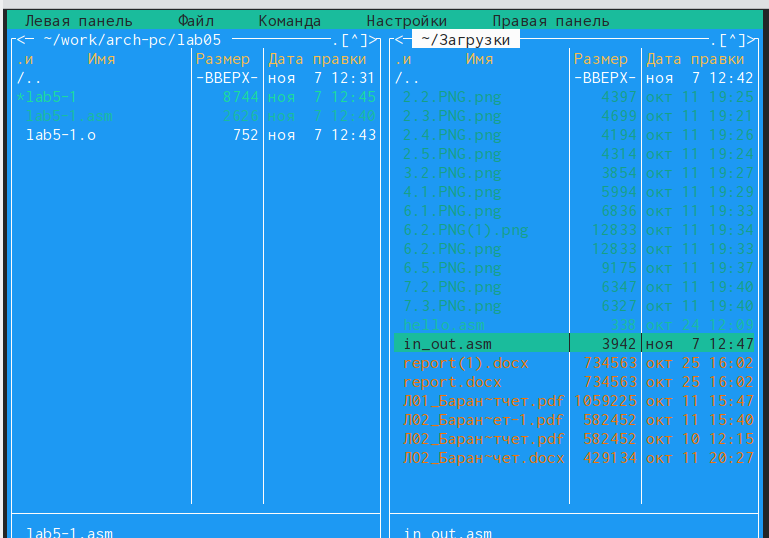{#fig:016 width=70%}

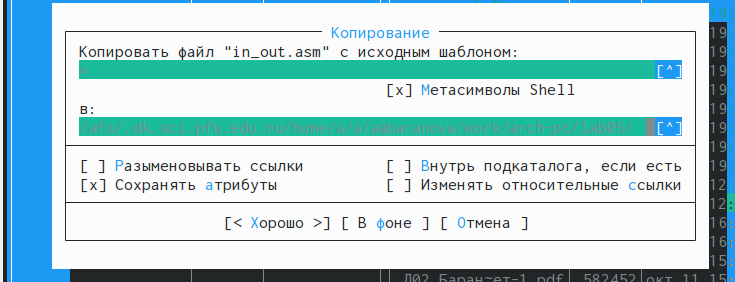{#fig:017 width=70%}

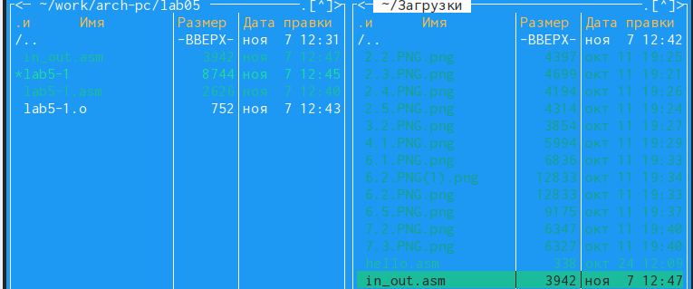{#fig:018 width=70%}

С помощью функциональной клавиши F6 создадим копию файла lab5-1.asm с именем lab5-2.asm (рис. [-@fig:019]), (рис. [-@fig:020]).

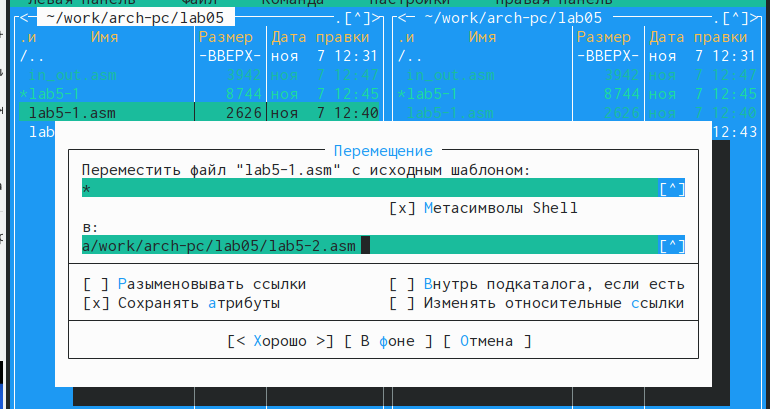{#fig:019 width=70%}

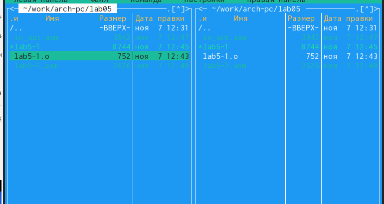{#fig:020 width=70%}

Исправим текст программы в файле lab5-2.asm с использование подпрограмм из внешнего файла in_out.asm  (рис. [-@fig:021]), (рис. [-@fig:022]).

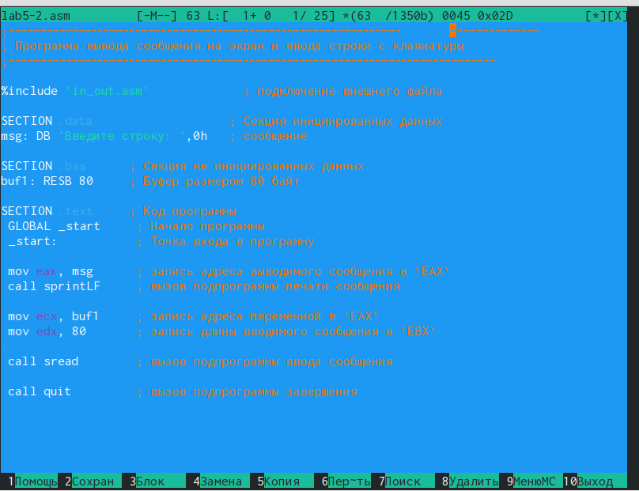{#fig:021 width=70%}

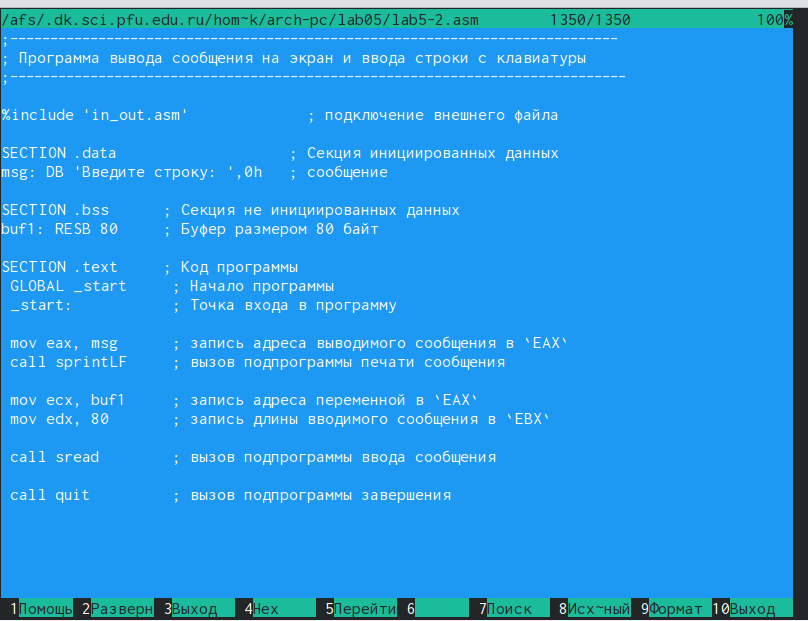{#fig:022 width=70%}

Создадим исполняемый файл и проверим его работу (рис. [-@fig:023]), (рис. [-@fig:024]), (рис. [-@fig:025]), (рис. [-@fig:026]), (рис. [-@fig:027]).

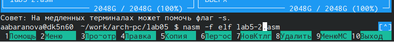{#fig:023 width=70%}

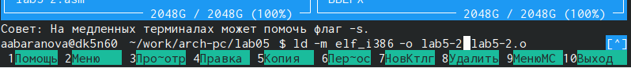{#fig:024 width=70%}

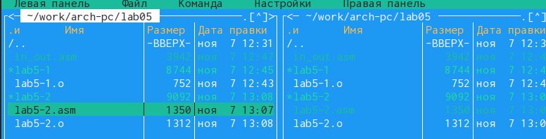{#fig:025 width=70%}

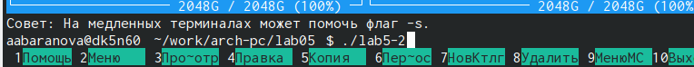{#fig:026 width=70%}

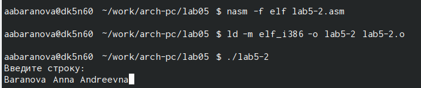{#fig:027 width=70%}

В файле lab5-2.asm заменим подпрограмму sprintLF на sprint (рис. [-@fig:028]).

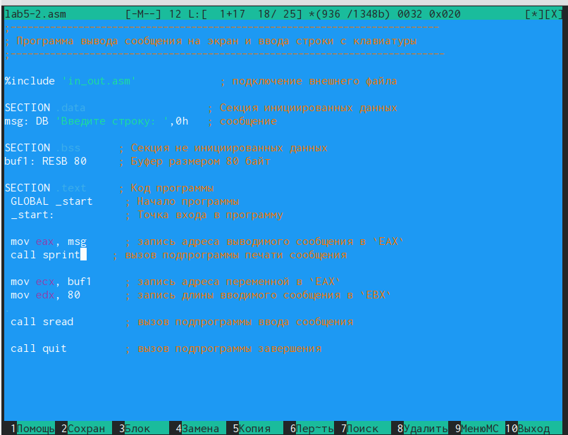{#fig:028 width=70%}

Создадим исполняемый файл и проверим его работу (рис. [-@fig:029]).

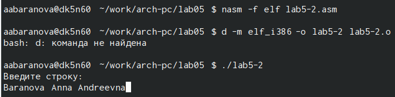{#fig:029 width=70%}

## Задание для самостоятельной работы

Создадим копию файла lab5-1.asm. Внесём изменения в программу (без использования внешнего файла in_out.asm), так чтобы она работала по следующему алгоритму:

* вывести приглашение типа “Введите строку:”;

* ввести строку с клавиатуры;

* вывести введённую строку на экран. (рис. [-@fig:030]), (рис. [-@fig:031]).

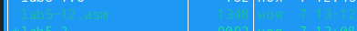{#fig:030 width=70%}

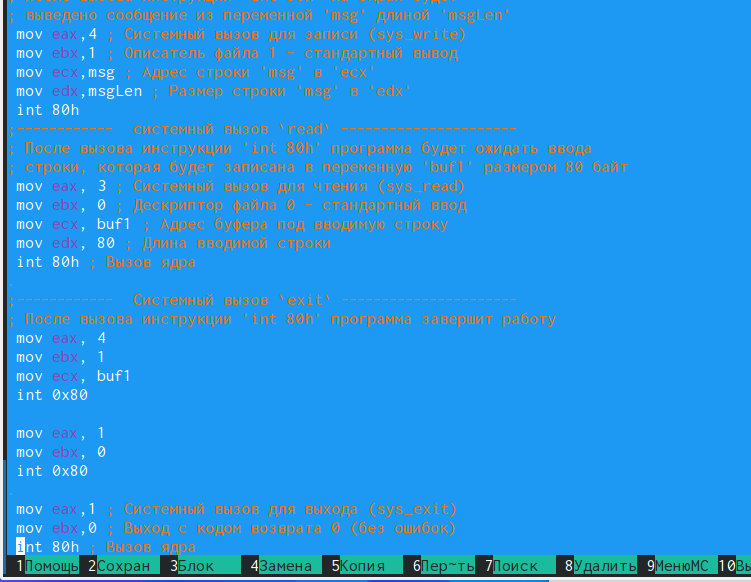{#fig:031 width=70%}

Получим исполняемый файл и проверим его работу (рис. [-@fig:032]), (рис. [-@fig:033]).

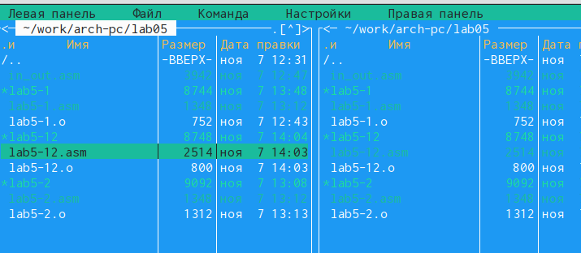{#fig:032 width=70%}

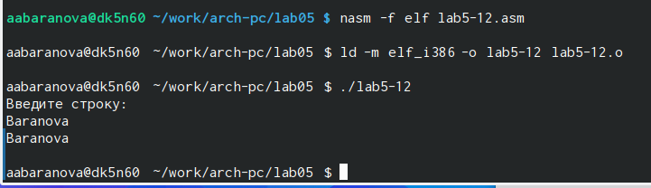{#fig:033 width=70%}

Создадим копию файла lab5-2.asm. Исправим текст программы с использование подпрограмм из внешнего файла in_out.asm, так чтобы она работала по следующему алгоритму:

* вывести приглашение типа “Введите строку:”;

* ввести строку с клавиатуры;

* вывести введённую строку на экран (рис. [-@fig:034]).

{#fig:034 width=70%}

Создадим исполняемый файл и проверим его работу (рис. [-@fig:035]), (рис. [-@fig:036]).

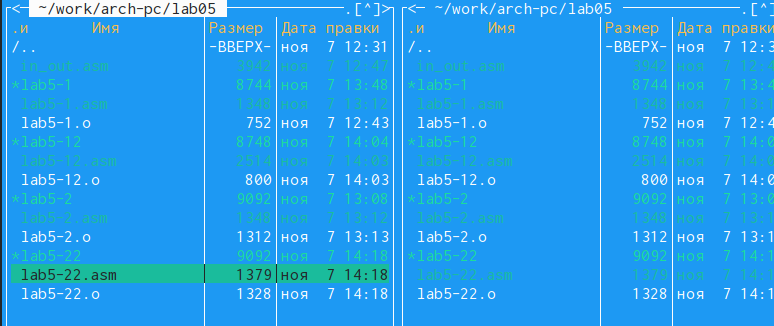{#fig:035 width=70%}

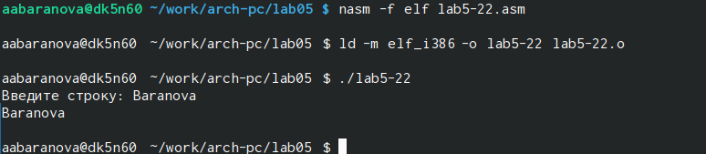{#fig:036 width=70%}

# Выводы

В ходе выполнения данной лабораторной работы были приобретены практические навыки работы в Midnight Commander и освоены инструкции языка ассемблера mov и int.

