---
## Front matter
lang: ru-RU
title:  Основы интерфейса взаимодействия пользователя с системой Unix на уровне командной строки
subtitle: "дисциплина: Операционные системы"
author:
  - Баранова А. А.
institute:
  - Российский университет дружбы народов, Москва, Россия
  - Кулябов Д. С. - д.ф.-м.н., профессор
date: 21 марта 2025

## i18n babel
babel-lang: russian
babel-otherlangs: english

## Formatting pdf
toc: false
toc-title: Содержание
slide_level: 2
aspectratio: 169
section-titles: true
theme: metropolis
header-includes:
 - \metroset{progressbar=frametitle,sectionpage=progressbar,numbering=fraction}
---

# Информация

## Докладчик

:::::::::::::: {.columns align=center}
::: {.column width="70%"}

  * Баранова Анна Андреевна
  * Студент группы НММбд-01-24
  * Российский университет дружбы народов
  * 1132246811@pfur.ru

:::
::: {.column width="30%"}

:::
::::::::::::::

# Вводная часть

## Цель лабораторной работы

Приобретение практических навыков взаимодействия пользователя с системой посредством командной строки.

## Задачи лабораторной работы

* Определить имя и путь домашнего каталога

* Изучить команду ls.

* Выполнить действия с каталогами.

* Получить дополнительные сведения при помощи справки по командам.

* Изучить команду history.

# Процесс выполнения лабораторной работы

## Имя и путь к домашнему каталогу 

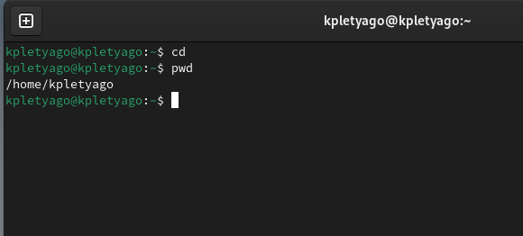{ #fig:001 width=70% height=70% }

## Опции команды ls

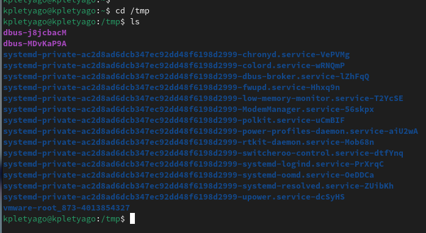{ #fig:002 width=70% height=70% }

## Опции команды ls

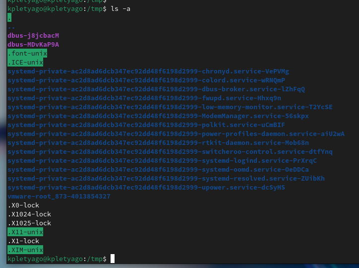{ #fig:003 width=70% height=70% }

## Опции команды ls

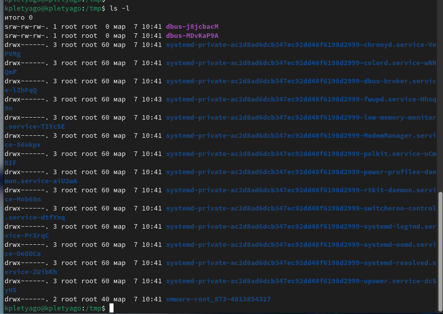{ #fig:004 width=70% height=70% }

## Опции команды ls

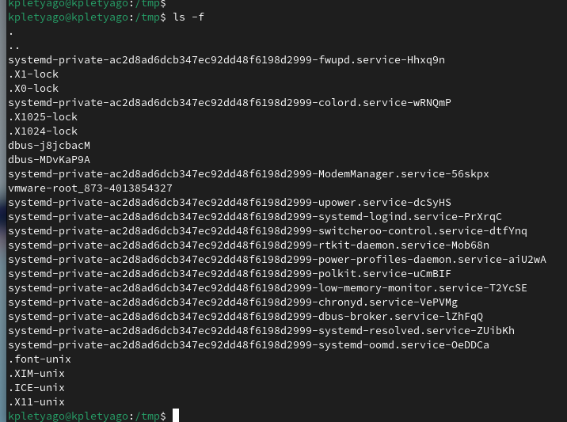{ #fig:005 width=70% height=70% }

## Каталог /var/spool

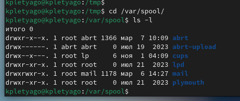{ #fig:006 width=70% height=70% }

## Домашний каталог

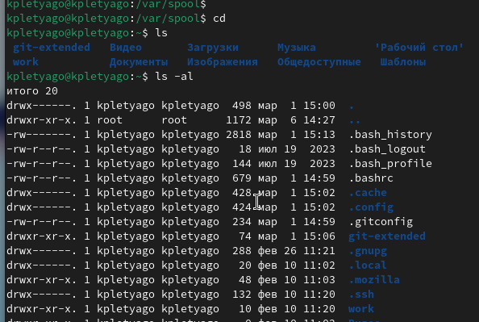{ #fig:007 width=70% height=70% }

## Работа с каталогами

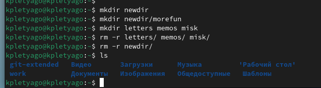{ #fig:008 width=70% height=70% }

## Опции команды ls

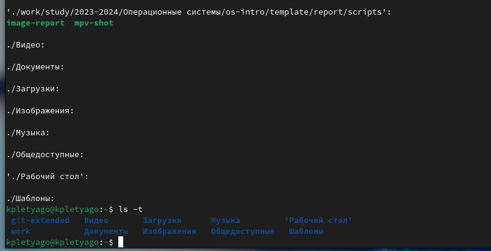{ #fig:009 width=70% height=70% }

## Справка по командам

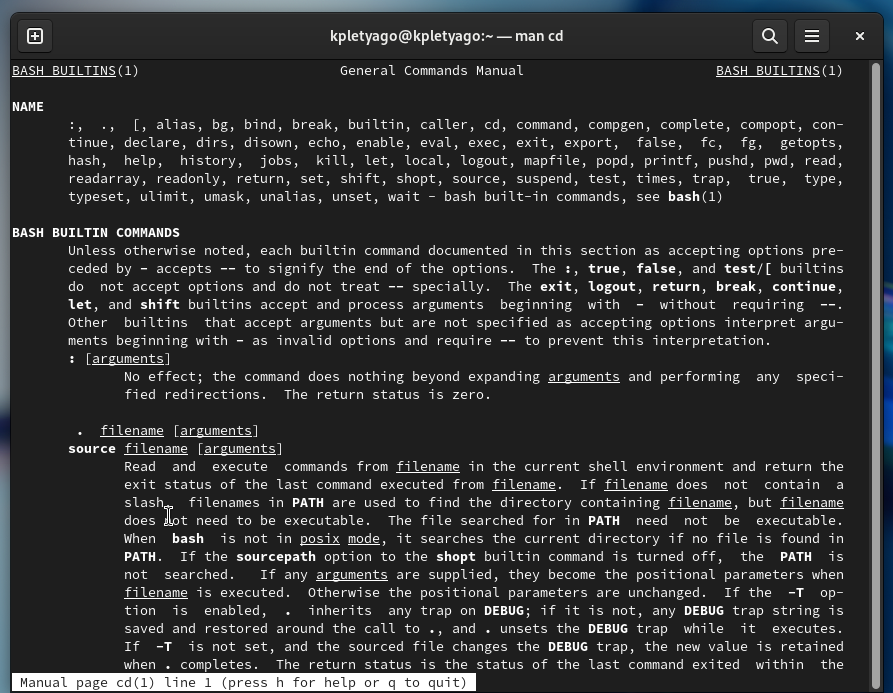{ #fig:010 width=70% height=70% }

## Справка по командам

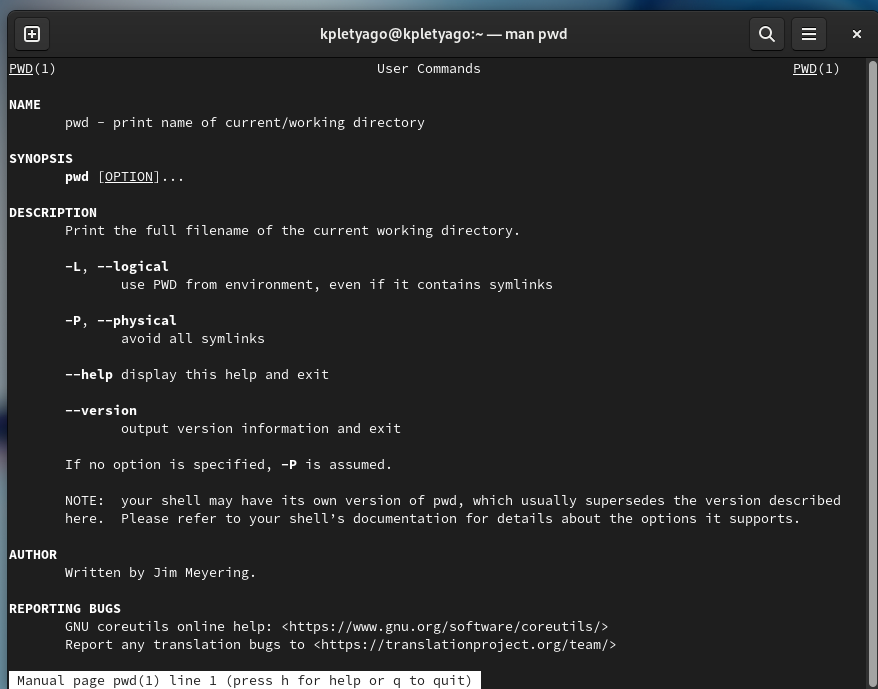{ #fig:011 width=70% height=70% }

## Справка по командам

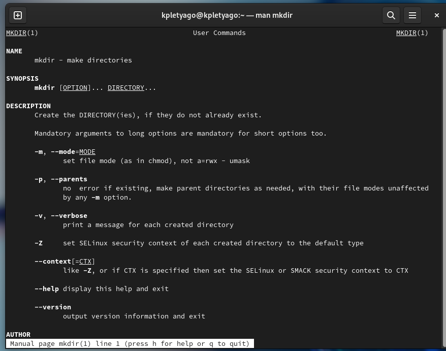{ #fig:012 width=70% height=70% }

## Справка по командам

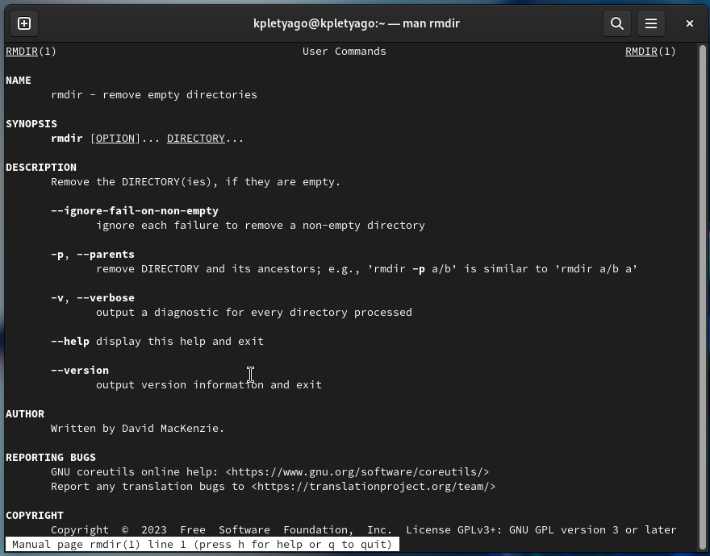{ #fig:013 width=70% height=70% }

## Справка по командам

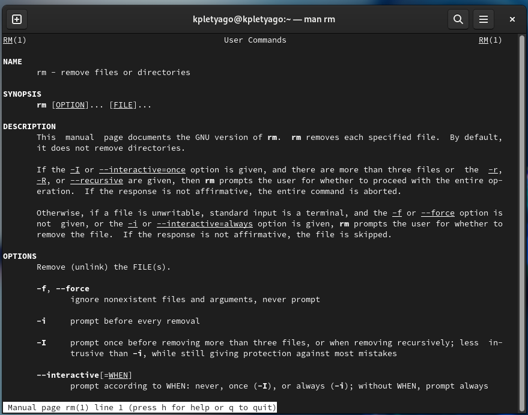{ #fig:014 width=70% height=70% }

## История командной строки

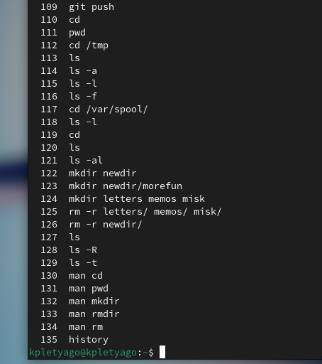{ #fig:015 width=70% height=70% }

# Выводы по проделанной работе

## Вывод

Мы приобрели практические навыки взаимодействия пользователя с системой посредством командной строки.
