---
## Front matter
title: "Отчёт по лабораторной работе №6"
subtitle: "дисциплина: Архитектура компьютера"
author: "Баранова Анна Андреевна"

## Generic otions
lang: ru-RU
toc-title: "Содержание"

## Bibliography
bibliography: bib/cite.bib
csl: pandoc/csl/gost-r-7-0-5-2008-numeric.csl

## Pdf output format
toc: true # Table of contents
toc-depth: 2
lof: true # List of figures
fontsize: 12pt
linestretch: 1.5
papersize: a4
documentclass: scrreprt
## I18n polyglossia
polyglossia-lang:
  name: russian
  options:
	- spelling=modern
	- babelshorthands=true
polyglossia-otherlangs:
  name: english
## I18n babel
babel-lang: russian
babel-otherlangs: english
## Fonts
mainfont: IBM Plex Serif
romanfont: IBM Plex Serif
sansfont: IBM Plex Sans
monofont: IBM Plex Mono
mathfont: STIX Two Math
mainfontoptions: Ligatures=Common,Ligatures=TeX,Scale=0.94
romanfontoptions: Ligatures=Common,Ligatures=TeX,Scale=0.94
sansfontoptions: Ligatures=Common,Ligatures=TeX,Scale=MatchLowercase,Scale=0.94
monofontoptions: Scale=MatchLowercase,Scale=0.94,FakeStretch=0.9
mathfontoptions:
## Biblatex
biblatex: true
biblio-style: "gost-numeric"
biblatexoptions:
  - parentracker=true
  - backend=biber
  - hyperref=auto
  - language=auto
  - autolang=other*
  - citestyle=gost-numeric
## Pandoc-crossref LaTeX customization
figureTitle: "Рис."

## Misc options
indent: true
header-includes:
  - \usepackage{indentfirst}
  - \usepackage{float} # keep figures where there are in the text
  - \floatplacement{figure}{H} # keep figures where there are in the text
---

# Цель работы

Освоить арифметические инструкции языка ассемблера NASM.

# Задание

В ходе выполнения данной лабораторной работы необходимо изучить:

* Символьные и численные данные в NASM;

* как выполненять арифметические операции в NASM;

* адресация в NASM.

Выполнив эту работу, мы освоим арифметические инструкции языка ассемблера NASM.

# Теоретическое введение

Большинство инструкций на языке ассемблера требуют обработки операндов. Адрес операнда предоставляет место, где хранятся данные, подлежащие обработке. Это могут быть данные хранящиеся в регистре или в ячейке памяти. Далее рассмотрены все существующие способы задания адреса хранения операндов – способы адресации.

Существует три основных способа адресации:

* Регистровая адресация – операнды хранятся в регистрах и в команде используются имена этих регистров, например: mov ax,bx.
* Непосредственная адресация – значение операнда задается непосредственно в команде, Например: mov ax,2.
* Адресация памяти – операнд задает адрес в памяти. В команде указывается символическое обозначение ячейки памяти, над содержимым которой требуется выполнить операцию.

Схема команды целочисленного сложения add (от англ. addition - добавление) выполняет сложение двух операндов и записывает результат по адресу первого операнда. Команда add работает как с числами со знаком, так и без знака.

Команда целочисленного вычитания sub (от англ. subtraction – вычитание) работает аналогично команде add.

Довольно часто при написании программ встречается операция прибавления или вычитания единицы. Прибавление единицы называется инкрементом, а вычитание — декрементом. Для этих операций существуют специальные команды: inc (от англ. increment) и dec (от англ. decrement), которые увеличивают и уменьшают на 1 свой операнд.

Еще одна команда, которую можно отнести к арифметическим командам это команда изменения знака neg. Команда neg рассматривает свой операнд как число со знаком и меняет знак операнда на противоположный. Операндом может быть регистр или ячейка памяти любого размера.

Умножение и деление, в отличии от сложения и вычитания, для знаковых и беззнаковых чисел производиться по-разному, поэтому существуют различные команды. Для беззнакового умножения используется команда mul (от англ. multiply – умножение). Для знакового умножения используется команда imul.

Для деления, как и для умножения, существует 2 команды div (от англ. divide - деление) и idiv.

Ввод информации с клавиатуры и вывод её на экран осуществляется в символьном виде. Кодирование этой информации производится согласно кодовой таблице символов ASCII. ASCII – сокращение от American Standard Code for Information Interchange (Американский стандартный код для обмена информацией). Согласно стандарту ASCII каждый символ кодируется одним байтом.

Расширенная таблица ASCII состоит из двух частей. Первая (символы с кодами 0-127) является универсальной (см. Приложение.), а вторая (коды 128-255) предназначена для специальных символов и букв национальных алфавитов и на компьютерах разных типов может меняться.

Среди инструкций NASM нет такой, которая выводит числа (не в символьном виде). Поэтому, например, чтобы вывести число, надо предварительно преобразовать его цифры в ASCII-коды этих цифр и выводить на экран эти коды, а не само число. Если же выводить число на экран непосредственно, то экран воспримет его не как число, а как последовательность ASCII-символов – каждый байт числа будет воспринят как один ASCII-символ – и выведет на экран эти символы.

Аналогичная ситуация происходит и при вводе данных с клавиатуры. Введенные данные будут представлять собой символы, что сделает невозможным получение корректного результата при выполнении над ними арифметических операций.

Для решения этой проблемы необходимо проводить преобразование ASCII символов в числа и обратно.

Для выполнения лабораторных работ в файле in_out.asm реализованы подпрограммы для преобразования ASCII символов в числа и обратно.

# Выполнение лабораторной работы

## Символьные и численные данные в NASM

Создадим каталог для программ лабораторной работы № 6, перейдём в него и создадим файл lab6-1.asm (рис. [-@fig:001]).

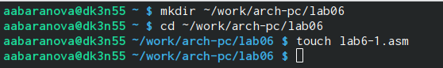{#fig:001 width=70%}

Введём в файл lab6-1.asm текст программы (рис. [-@fig:002]).

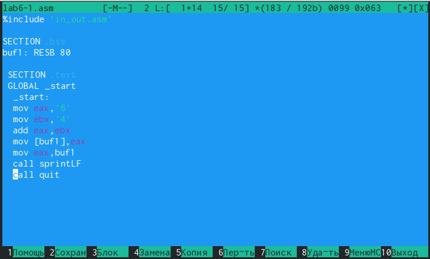{#fig:002 width=70%}

Перед созданием исполняемого файла создадим копию файла in_out.asm в каталоге ~/work/arch-pc/lab06. (рис. [-@fig:003]), (рис. [-@fig:004]).

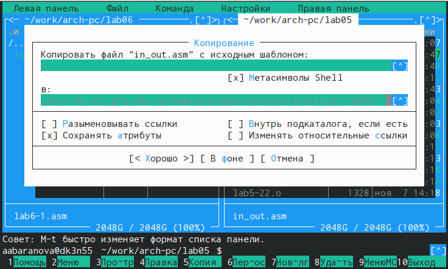{#fig:003 width=70%}

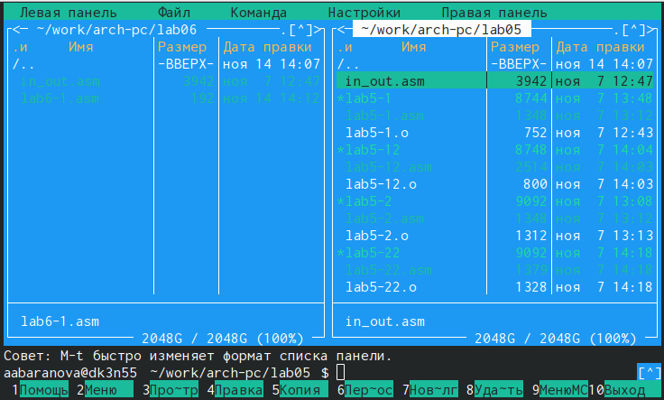{#fig:004 width=70%}

Создадим исполняемый файл и запустим его (рис. [-@fig:005]), (рис. [-@fig:006]).

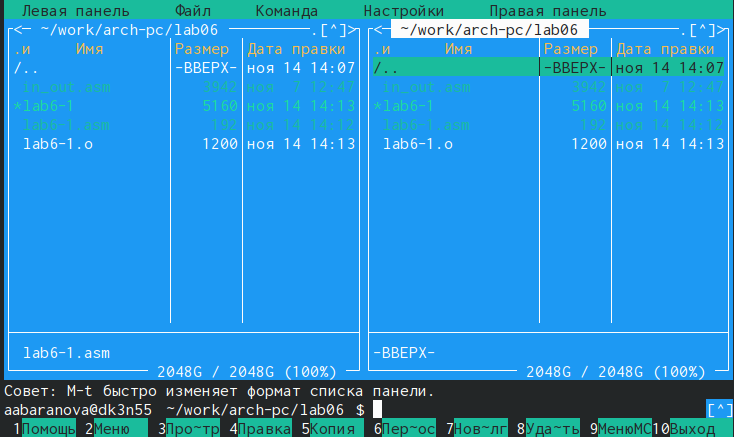{#fig:005 width=70%}

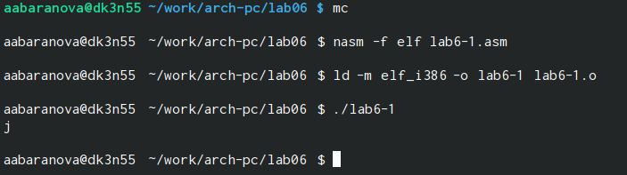{#fig:006 width=70%}

Изменим текст программы и вместо символов, запишем в регистры числа (рис. [-@fig:007]).

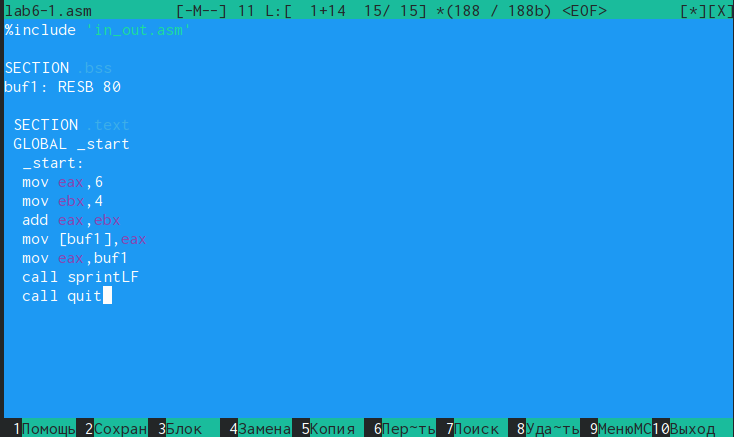{#fig:007 width=70%}

Создадим исполняемый файл и запустим его (рис. [-@fig:008]).

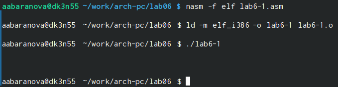{#fig:008 width=70%}

Создадим файл lab6-2.asm в каталоге ~/work/arch-pc/lab06 и введём в него текст программы (рис. [-@fig:009]), (рис. [-@fig:010]), (рис. [-@fig:011]).

{#fig:009 width=70%}

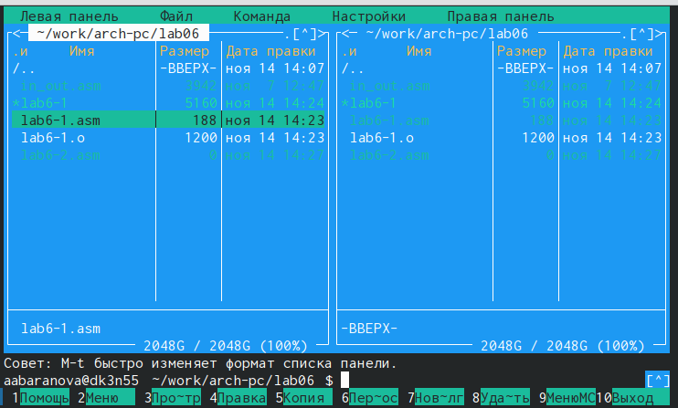{#fig:010 width=70%}

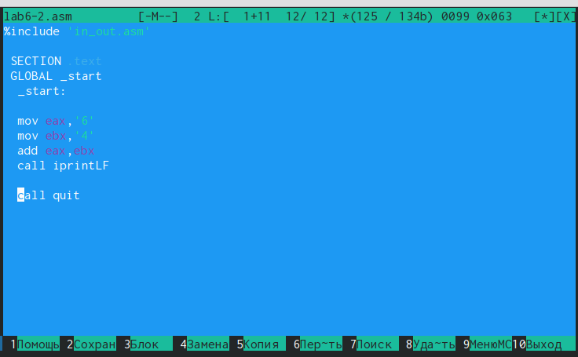{#fig:011 width=70%}

Создадим исполняемый файл и запустим его (рис. [-@fig:012]), (рис. [-@fig:013]).

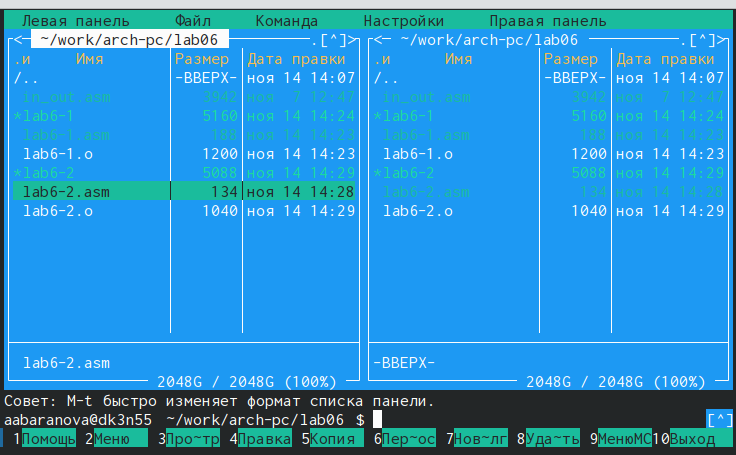{#fig:012 width=70%}

{#fig:013 width=70%}

Изменим текст программы и вместо символов, запишем в регистры числа (рис. [-@fig:014]).

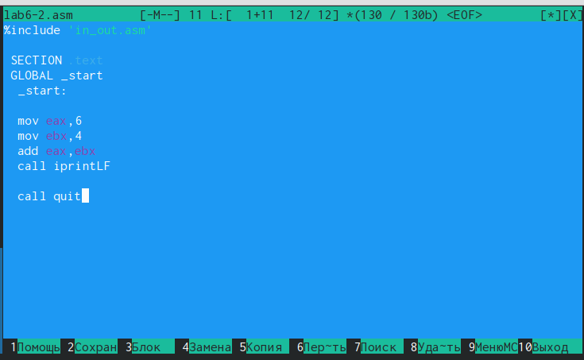{#fig:014 width=70%}

Создадим исполняемый файл и запустим его (рис. [-@fig:015]).

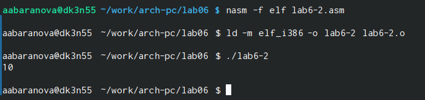{#fig:015 width=70%}

Заменим функцию iprintLF на iprint. Создадим исполняемый файл и запустим его (рис. [-@fig:016]), (рис. [-@fig:017]).

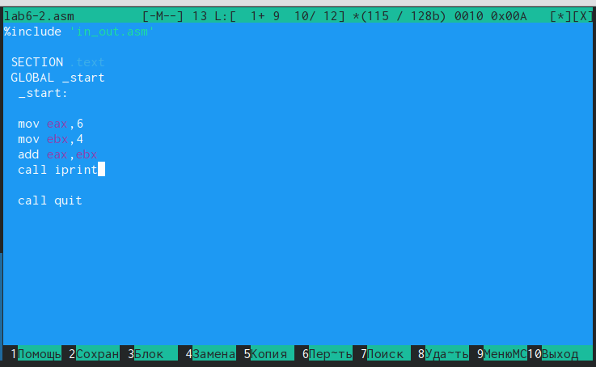{#fig:016 width=70%}

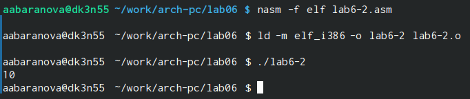{#fig:017 width=70%}

## Выполнение арифметических операций в NASM

Создадим файл lab6-3.asm в каталоге ~/work/arch-pc/lab06 (рис. [-@fig:018]), (рис. [-@fig:019]).

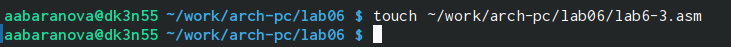{#fig:018 width=70%}

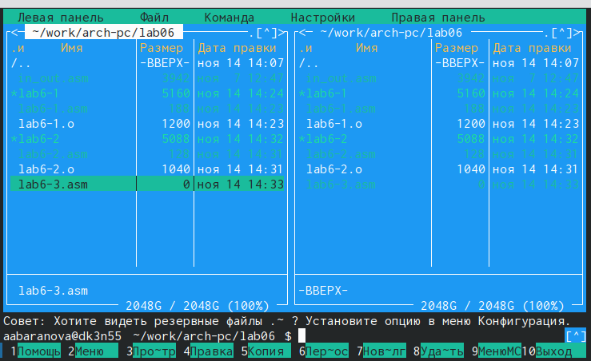{#fig:019 width=70%}

Введём в файл lab6-3.asm текст программы (рис. [-@fig:020]).

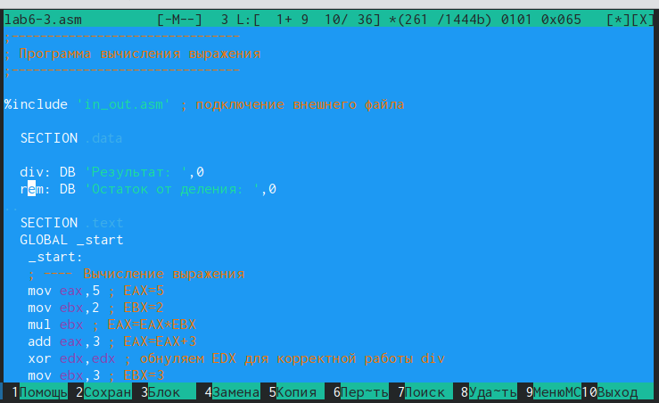{#fig:020 width=70%}

Создадим исполняемый файл и запустим его (рис. [-@fig:021]), (рис. [-@fig:022]).

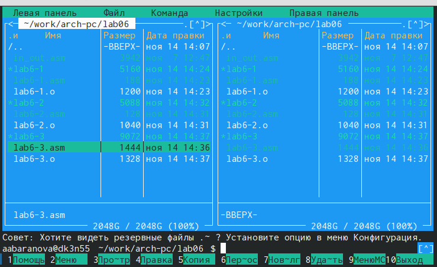{#fig:021 width=70%}

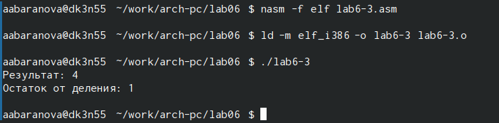{#fig:022 width=70%}

Изменим текст программы для вычисления выражения 𝑓(𝑥) = (4 ∗ 6 + 2)/5 (рис. [-@fig:023]).

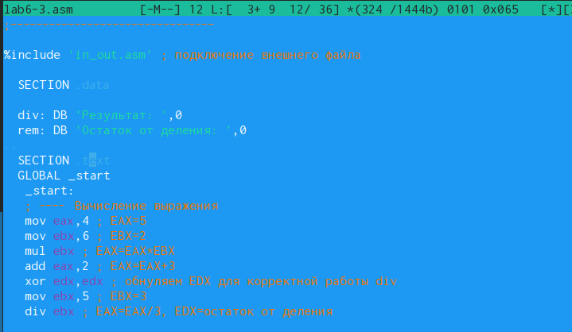{#fig:023 width=70%}

Создадим исполняемый файл и запустим его (рис. [-@fig:024]).

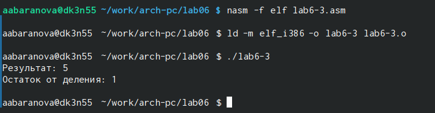{#fig:024 width=70%}

Создадим файл variant.asm в каталоге ~/work/arch-pc/lab06 (рис. [-@fig:025]), (рис. [-@fig:026]).

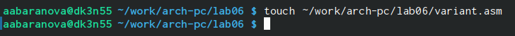{#fig:025 width=70%}

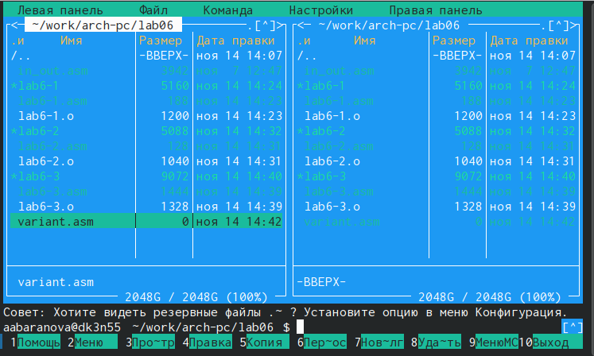{#fig:026 width=70%}

Введём в файл lab6-3.asm текст программы (рис. [-@fig:027]).

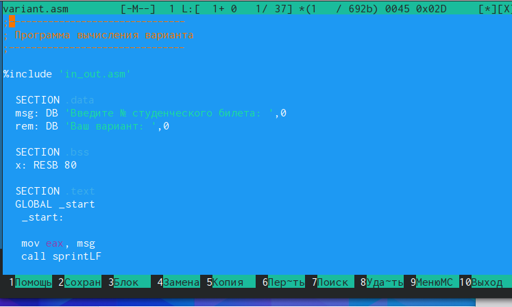{#fig:027 width=70%}

Создадим исполняемый файл и запустим его (рис. [-@fig:028]), (рис. [-@fig:029]).

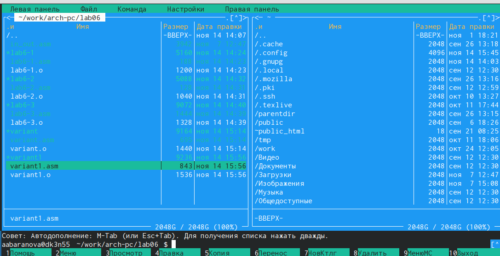{#fig:028 width=70%}

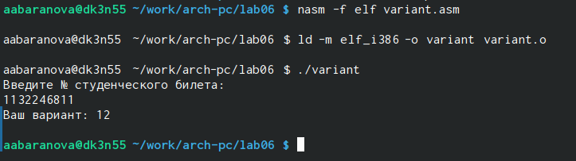{#fig:029 width=70%}

1. За вывод сообщения "Ваш вариант" отвечают строки кода:

```

mov eax,rem
call sprint
```

2. Инструкция mov ecx, x используется, чтобы положить адрес вводимой строки x в регистр ecx mov edx, 80 - запись в регистр edx длины вводимой строки call sread - вызов подпрограммы из внешнего файла, обеспечивающей ввод сообщения с клавиатуры

3. call atoi используется для вызова подпрограммы из внешнего файла, которая преобразует ascii-код символа в целое число и записывает результат в регистр eax

4. За вычисления варианта отвечают строки:

```

xor edx,edx ; обнуление edx для корректной работы div
mov ebx,20 ; ebx = 20
div ebx ; eax = eax/20, edx - остаток от деления
inc edx ; edx = edx + 1
```

5. При выполнении инструкции div ebx остаток от деления записывается в регистр edx

6. Инструкция inc edx увеличивает значение регистра edx на 1

7. За вывод на экран результатов вычислений отвечают строки:

```

mov eax,edx
call iprintLF
```

## Задание для самостоятельной работы

Напишем программу вычисления выражения 𝑦 = 𝑓(𝑥), которая должна выводить выражение для вычисления, выводить запрос на ввод значения 𝑥, вычислять заданное выражение в зависимости от введенного 𝑥, выводить результат вычислений (рис. [-@fig:030]), (рис. [-@fig:031]).

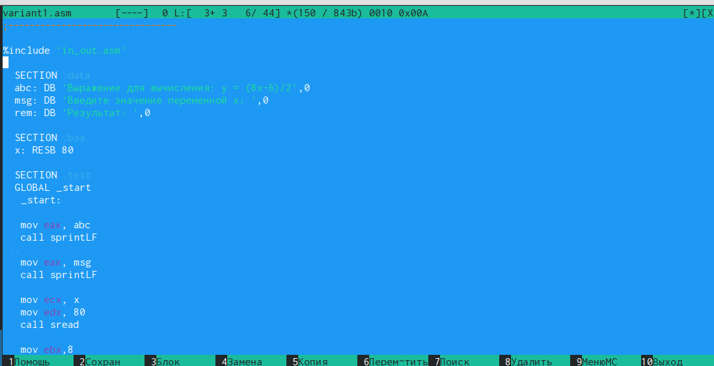{#fig:030 width=70%}

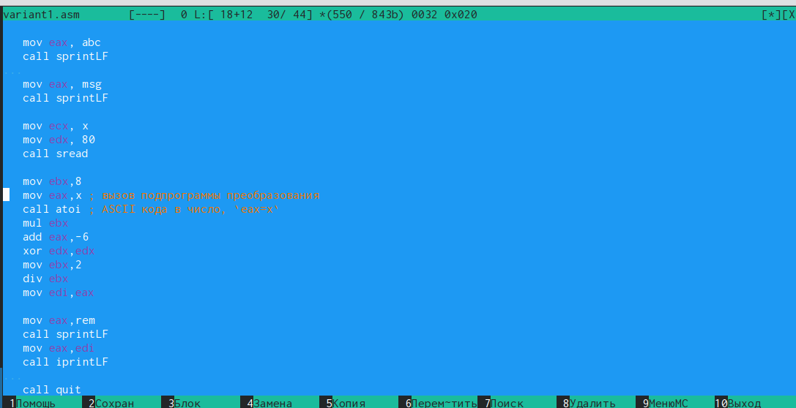{#fig:031 width=70%}

Создадим исполняемый файл и проверим его работу для значений 𝑥1 и 𝑥2 (рис. [-@fig:032]), (рис. [-@fig:033]).

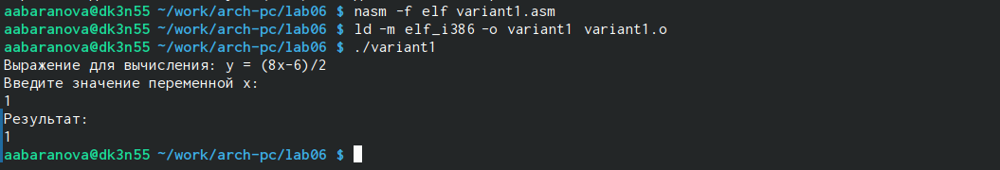{#fig:032 width=70%}

{#fig:033 width=70%}

# Выводы

В ходе выполнения данной лабораторной работы были освоены арифметические инструкции языка ассемблера NASM.


