---
## Front matter
title: "Отчёт по лабораторной работе №7"
subtitle: "дисциплина: Архитектура компьютера"
author: "Баранова Анна Андреевна"

## Generic otions
lang: ru-RU
toc-title: "Содержание"

## Bibliography
bibliography: bib/cite.bib
csl: pandoc/csl/gost-r-7-0-5-2008-numeric.csl

## Pdf output format
toc: true # Table of contents
toc-depth: 2
lof: true # List of figures
fontsize: 12pt
linestretch: 1.5
papersize: a4
documentclass: scrreprt
## I18n polyglossia
polyglossia-lang:
  name: russian
  options:
	- spelling=modern
	- babelshorthands=true
polyglossia-otherlangs:
  name: english
## I18n babel
babel-lang: russian
babel-otherlangs: english
## Fonts
mainfont: IBM Plex Serif
romanfont: IBM Plex Serif
sansfont: IBM Plex Sans
monofont: IBM Plex Mono
mathfont: STIX Two Math
mainfontoptions: Ligatures=Common,Ligatures=TeX,Scale=0.94
romanfontoptions: Ligatures=Common,Ligatures=TeX,Scale=0.94
sansfontoptions: Ligatures=Common,Ligatures=TeX,Scale=MatchLowercase,Scale=0.94
monofontoptions: Scale=MatchLowercase,Scale=0.94,FakeStretch=0.9
mathfontoptions:
## Biblatex
biblatex: true
biblio-style: "gost-numeric"
biblatexoptions:
  - parentracker=true
  - backend=biber
  - hyperref=auto
  - language=auto
  - autolang=other*
  - citestyle=gost-numeric
## Pandoc-crossref LaTeX customization
figureTitle: "Рис."

## Misc options
indent: true
header-includes:
  - \usepackage{indentfirst}
  - \usepackage{float} # keep figures where there are in the text
  - \floatplacement{figure}{H} # keep figures where there are in the text
---

# Цель работы

Изучить команды условного и безусловного переходов. Приобрести навыки написания программ с использованием переходов. Познакомиться с назначением и структурой файла листинга.

# Задание

В ходе выполнения данной лабораторной работы необходимо изучить:

* Команды условного и безусловного переходов;

* файл листинга и его структуру.

Выполнив эту работу, мы изучим команды условного и безусловного переходов, приобретём навыки написания программ с использованием переходов и познакомимся с назначением и структурой файла листинга.

# Теоретическое введение

Для реализации ветвлений в ассемблере используются так называемые команды передачи управления или команды перехода. Можно выделить 2 типа переходов:

* условный переход – выполнение или не выполнение перехода в определенную точку программы в зависимости от проверки условия.

* безусловный переход – выполнение передачи управления в определенную точку программы без каких-либо условий.

Листинг (в рамках понятийного аппарата NASM) — это один из выходных файлов, создаваемых транслятором. Он имеет текстовый вид и нужен при отладке программы, так как кроме строк самой программы он содержит дополнительную информацию.

# Выполнение лабораторной работы

## Реализация переходов в NASM

Создадим каталог для программам лабораторной работы № 7, перейдём в него и создадим файл lab7-1.asm (рис. [-@fig:001]), (рис. [-@fig:002]).

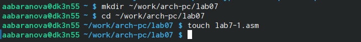{#fig:001 width=70%}

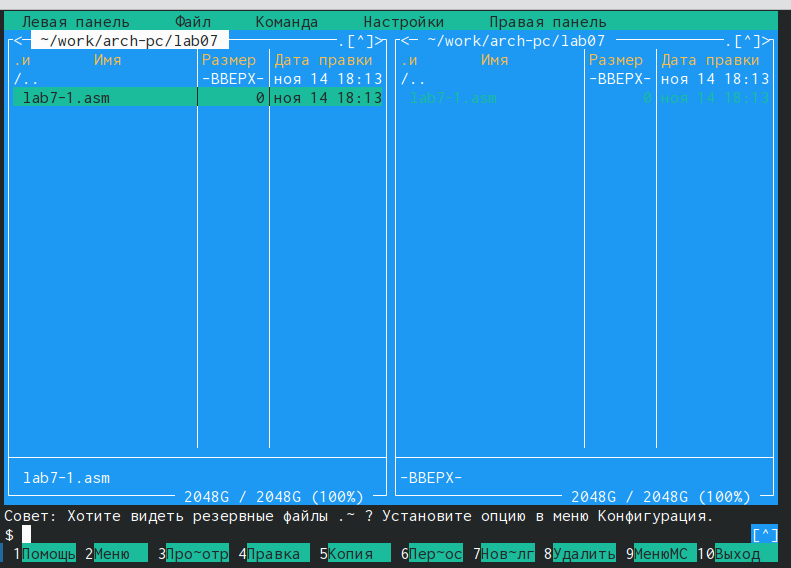{#fig:002 width=70%}

Введём в файл lab7-1.asm текст программы (рис. [-@fig:003]).

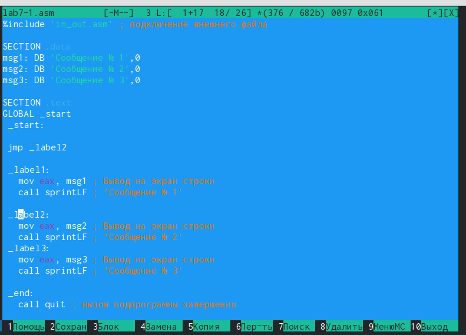{#fig:003 width=70%}

Перед созданием исполняемого файла создадим копию файла in_out.asm в каталоге ~/work/arch-pc/lab07. (рис. [-@fig:004]), (рис. [-@fig:005]).

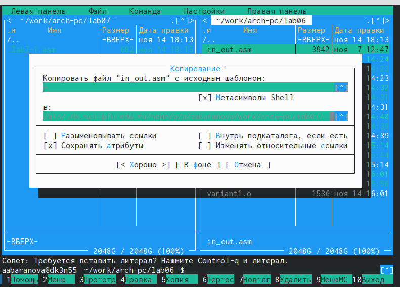{#fig:004 width=70%}

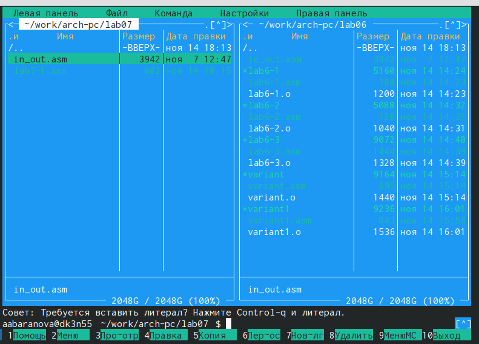{#fig:005 width=70%}

Создадим исполняемый файл и запустим его (рис. [-@fig:006]), (рис. [-@fig:007]).

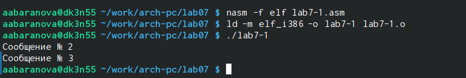{#fig:006 width=70%}

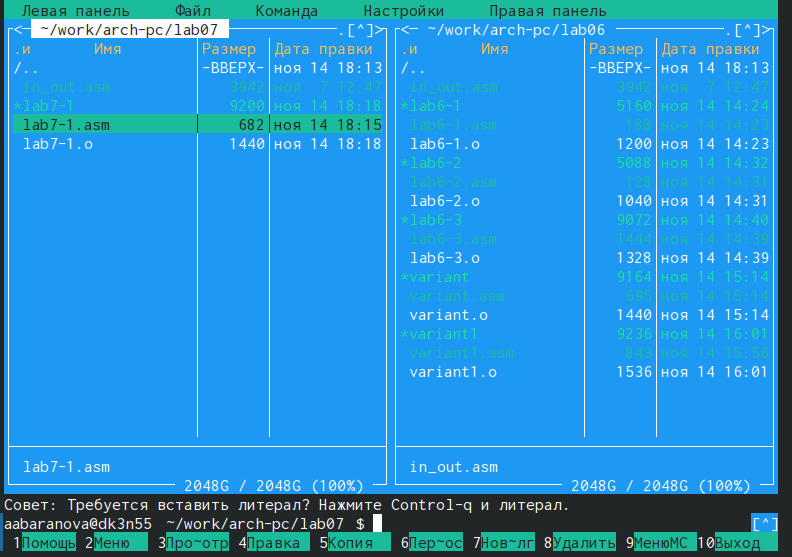{#fig:007 width=70%}

Изменим текст программы файла lab7-1.asm (рис. [-@fig:008]).

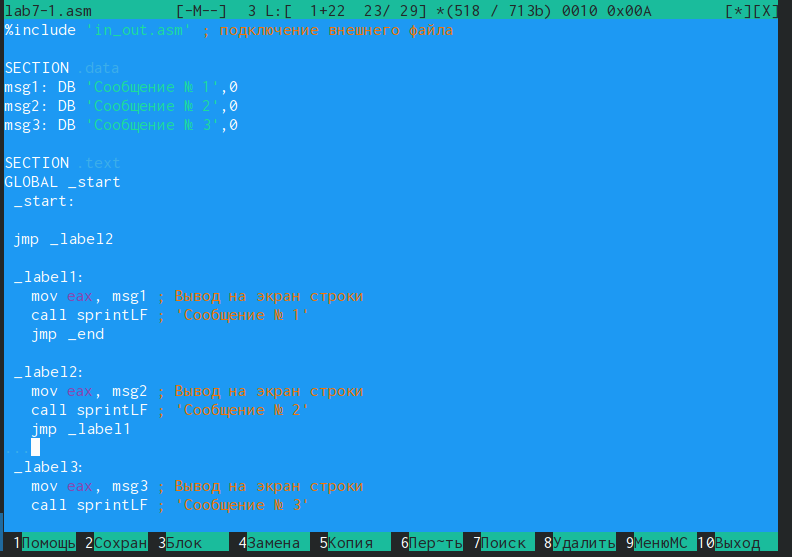{#fig:008 width=70%}

Создадим исполняемый файл и запустим его (рис. [-@fig:009]).

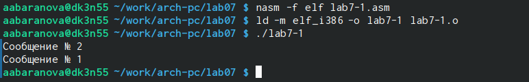{#fig:009 width=70%}

Снова изменим текст программы файла lab7-1.asm, создадим исполняемый файл и запустим его (рис. [-@fig:010]), (рис. [-@fig:011]).

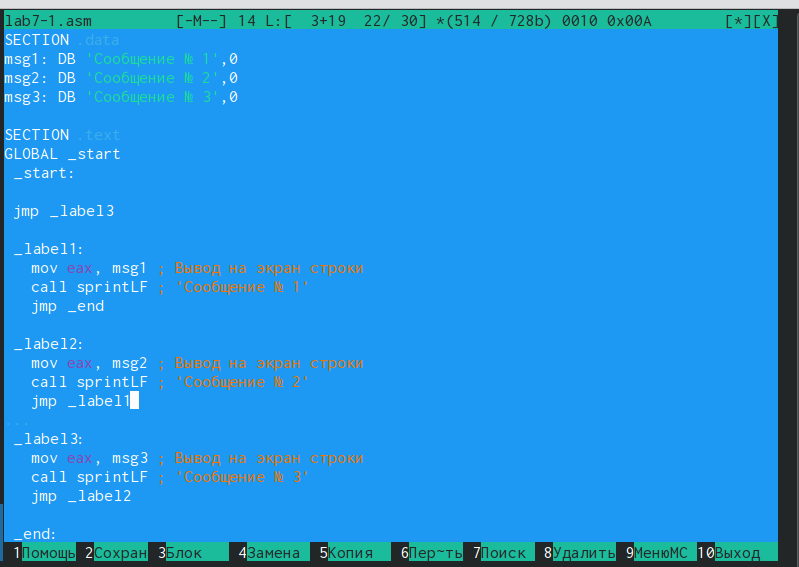{#fig:010 width=70%}

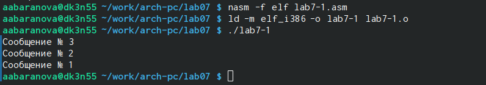{#fig:011 width=70%}

Создадим файл lab7-2.asm в каталоге ~/work/arch-pc/lab07 (рис. [-@fig:012]), (рис. [-@fig:013]).

{#fig:012 width=70%}

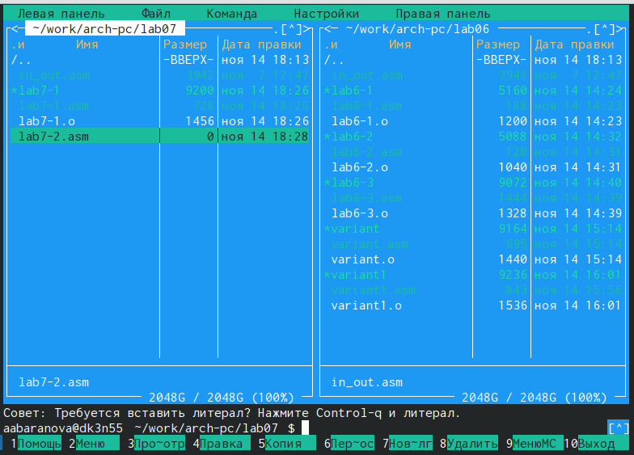{#fig:013 width=70%}

Введём в файл lab7-2.asm текст программы (рис. [-@fig:014]).

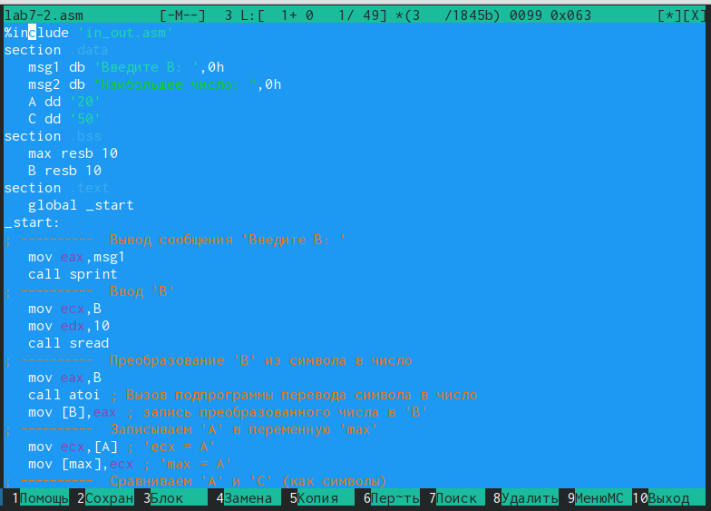{#fig:014 width=70%}

Создадим исполняемый файл и запустим его и  проверим его работу для разных значений B (рис. [-@fig:015]), (рис. [-@fig:016]), (рис. [-@fig:017]), (рис. [-@fig:018]).

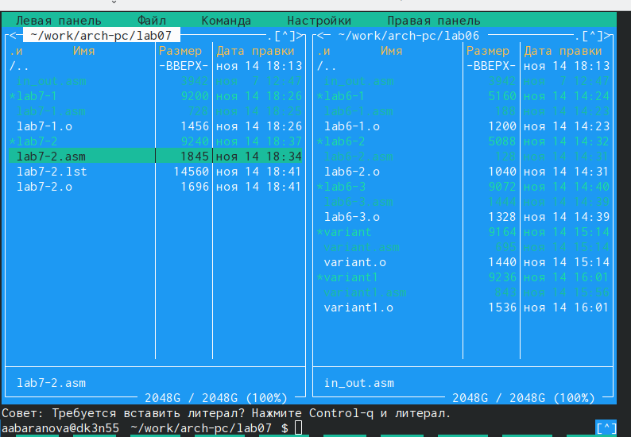{#fig:015 width=70%}

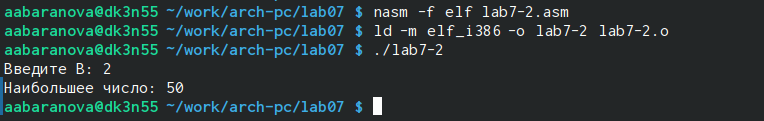{#fig:016 width=70%}

{#fig:017 width=70%}

{#fig:018 width=70%}

## Изучение структуры файла листинга

Создадим файл листинга для программы из файла lab7-2.asm (рис. [-@fig:019]).

{#fig:019 width=70%}

Откроем файл листинга lab7-2.lst с помощью текстового редактора mcedit (рис. [-@fig:020]), (рис. [-@fig:021]).

{#fig:020 width=70%}

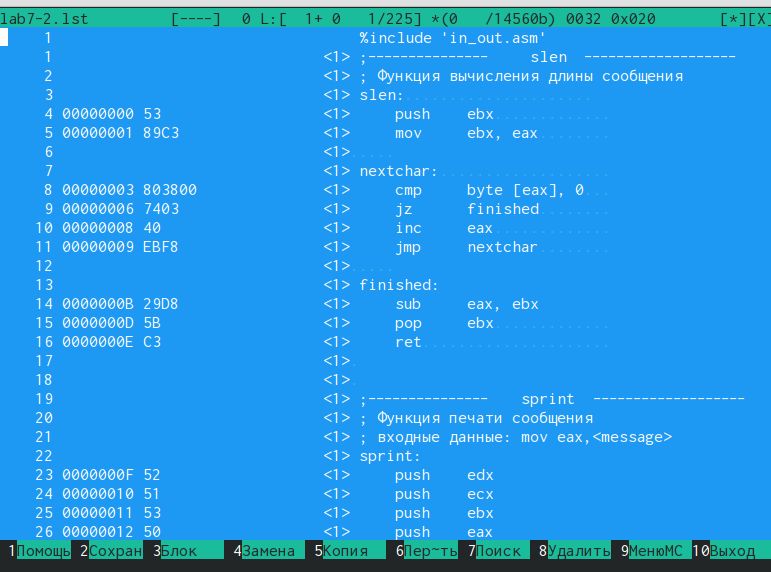{#fig:021 width=70%}

Эта строка находится на 34 месте, ее адрес "00000022", машинный код - 'В804000000', а 'mov eax,4' - исходный текст программы, означающий что в регистр eax запишется 4 (рис. [-@fig:022]).

{#fig:022 width=70%}

Эта строка находится на 33 месте, ее адрес "0000001D", машинный код - 'ВB01000000', а 'mov ebx,1' - исходный текст программы, означающий что в регистр ebx запишется 1 (рис. [-@fig:023]).

{#fig:023 width=70%}

Эта строка находится на 32 месте, ее адрес "0000001B", машинный код - '89C1', а 'mov ecx,eax' - исходный текст программы, означающий что в регистр ecx запишется значение eax (рис. [-@fig:024]).

{#fig:024 width=70%}

Откроем файл с программой lab7-2.asm и в строке 'mov ecx,[min]' удалим '[min]', выполним трансляцию с получением файла листинга (рис. [-@fig:025]).

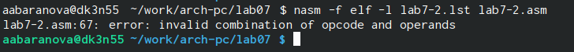{#fig:025 width=70%}

## Задание для самостоятельной работы

1. Напишем программу нахождения наименьшей из 3 целочисленных переменных a, b, c. Создадим исполняемый файл и проверим его работу (рис. [-@fig:026]), (рис. [-@fig:027]).

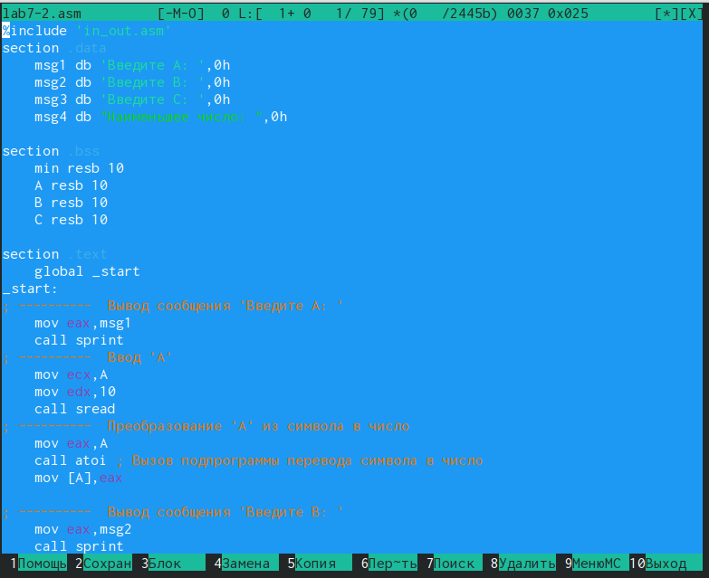{#fig:026 width=70%}

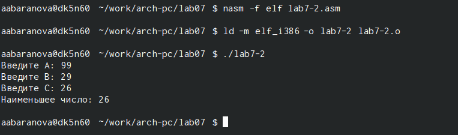{#fig:027 width=70%}

2. Напишем программу, которая для введенных с клавиатуры значений x и a вычисляет значение заданной функции f(x) и выводит результат вычислений. Создадим исполняемый файл и проверим
его работу для значений x и a (рис. [-@fig:028]), (рис. [-@fig:029]), (рис. [-@fig:030]).

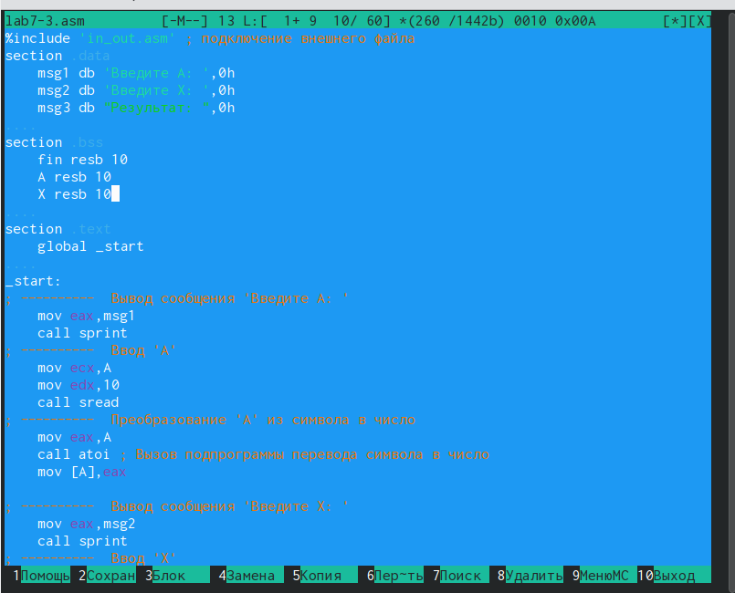{#fig:028 width=70%}

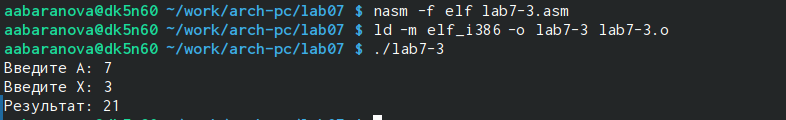{#fig:029 width=70%}

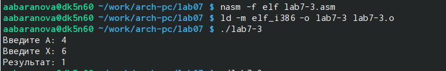{#fig:030 width=70%}

# Выводы

В ходе выполнения данной лабораторной работы были изучены команды условного и безусловного переходов, приобретены навыки написания программ с использованием переходов и познакомились с назначением и структурой файла листинга.

