---
## Front matter
title: "Отчёт по лабораторной работе №8"
subtitle: "дисциплина: Архитектура компьютера"
author: "Баранова Анна Андреевна"

## Generic otions
lang: ru-RU
toc-title: "Содержание"

## Bibliography
bibliography: bib/cite.bib
csl: pandoc/csl/gost-r-7-0-5-2008-numeric.csl

## Pdf output format
toc: true # Table of contents
toc-depth: 2
lof: true # List of figures
fontsize: 12pt
linestretch: 1.5
papersize: a4
documentclass: scrreprt
## I18n polyglossia
polyglossia-lang:
  name: russian
  options:
	- spelling=modern
	- babelshorthands=true
polyglossia-otherlangs:
  name: english
## I18n babel
babel-lang: russian
babel-otherlangs: english
## Fonts
mainfont: IBM Plex Serif
romanfont: IBM Plex Serif
sansfont: IBM Plex Sans
monofont: IBM Plex Mono
mathfont: STIX Two Math
mainfontoptions: Ligatures=Common,Ligatures=TeX,Scale=0.94
romanfontoptions: Ligatures=Common,Ligatures=TeX,Scale=0.94
sansfontoptions: Ligatures=Common,Ligatures=TeX,Scale=MatchLowercase,Scale=0.94
monofontoptions: Scale=MatchLowercase,Scale=0.94,FakeStretch=0.9
mathfontoptions:
## Biblatex
biblatex: true
biblio-style: "gost-numeric"
biblatexoptions:
  - parentracker=true
  - backend=biber
  - hyperref=auto
  - language=auto
  - autolang=other*
  - citestyle=gost-numeric
## Pandoc-crossref LaTeX customization
figureTitle: "Рис."

## Misc options
indent: true
header-includes:
  - \usepackage{indentfirst}
  - \usepackage{float} # keep figures where there are in the text
  - \floatplacement{figure}{H} # keep figures where there are in the text
---

# Цель работы

Приобрести навыки написания программ с использованием циклов и обработкой аргументов командной строки.

# Задание

В ходе выполнения данной лабораторной работы необходимо изучить:

* Организацию стека;

* реализацию циклов в NASM;

* обработку аргументов командной строки.

Выполнив эту работу, мы приобретём навыки написания программ с использованием циклов и обработкой аргументов командной строки.

# Теоретическое введение

Стек — это структура данных, организованная по принципу LIFO («Last In — First Out» или «последним пришёл — первым ушёл»). Стек является частью архитектуры процессора и реализован на аппаратном уровне. Для работы со стеком в процессоре есть специальные регистры (ss, bp, sp) и команды.

Основной функцией стека является функция сохранения адресов возврата и передачи аргументов при вызове процедур. Кроме того, в нём выделяется память для локальных переменных и могут временно храниться значения регистров.

Для организации циклов существуют специальные инструкции. Для всех инструкций максимальное количество проходов задаётся в регистре ecx. Наиболее простой является инструкция loop. Она позволяет организовать безусловный цикл.

Иструкция loop выполняется в два этапа. Сначала из регистра ecx вычитается единица и его значение сравнивается с нулём. Если регистр не равен нулю, то выполняется переход к указанной метке. Иначе переход не выполняется и управление передаётся команде, которая следует сразу после команды loop.

При разработке программ иногда встает необходимость указывать аргументы, которые будут использоваться в программе, непосредственно из командной строки при запуске программы.

При запуске программы в NASM аргументы командной строки загружаются в стек в обратном порядке, кроме того в стек записывается имя программы и общее количество аргументов. Последние два элемента стека для программы, скомпилированной NASM, – это всегда имя программы и количество переданных аргументов.

Таким образом, для того чтобы использовать аргументы в программе, их просто нужно извлечь из стека. Обработку аргументов нужно проводить в цикле. Т.е. сначала нужно извлечь из стека количество аргументов, а затем циклично для каждого аргумента выполнить логику программы. 

# Выполнение лабораторной работы

## Реализация циклов в NASM

Создадим каталог для программ лабораторной работы № 8, перейдём в него и создадим файл lab8-1.asm и также создадим копию файла in_out.asm (рис. [-@fig:001]), (рис. [-@fig:002]).

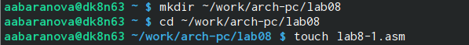{#fig:001 width=70%}

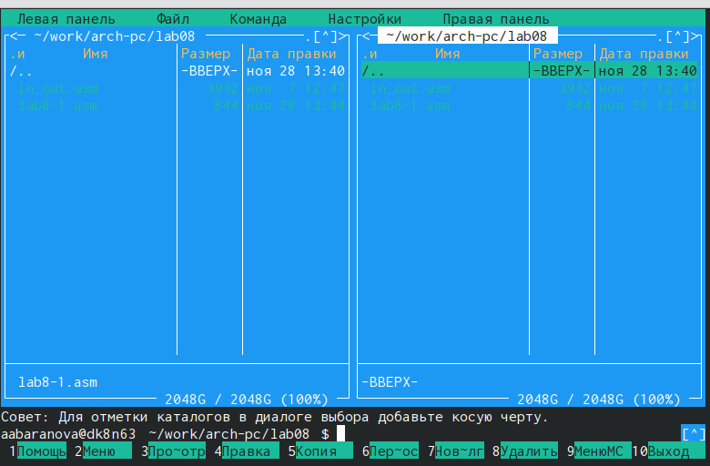{#fig:002 width=70%}

Введём в файл lab8-1.asm текст программы (рис. [-@fig:003]).

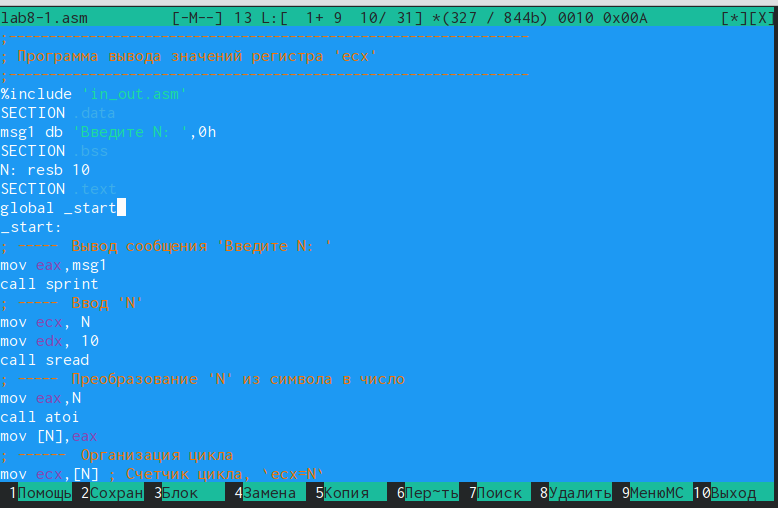{#fig:003 width=70%}

Создадим исполняемый файл и запустим его (рис. [-@fig:004]), (рис. [-@fig:005]).

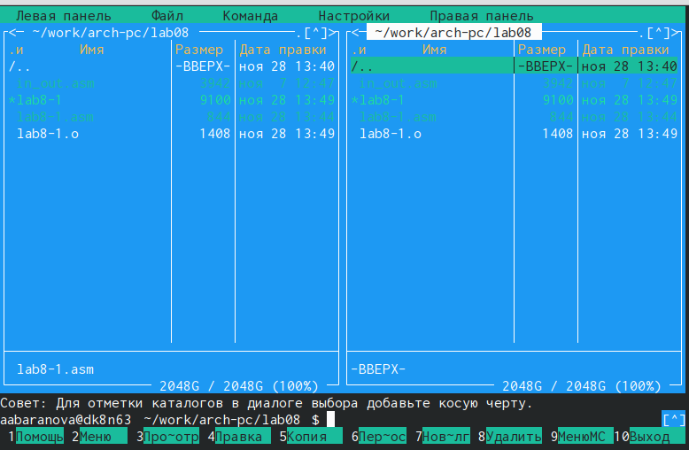{#fig:004 width=70%}

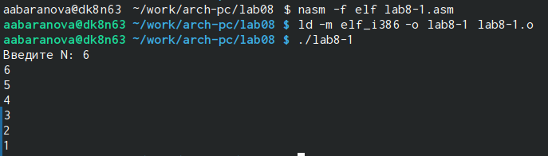{#fig:005 width=70%}

Изменим текст программы файла lab8-1.asm (рис. [-@fig:006]).

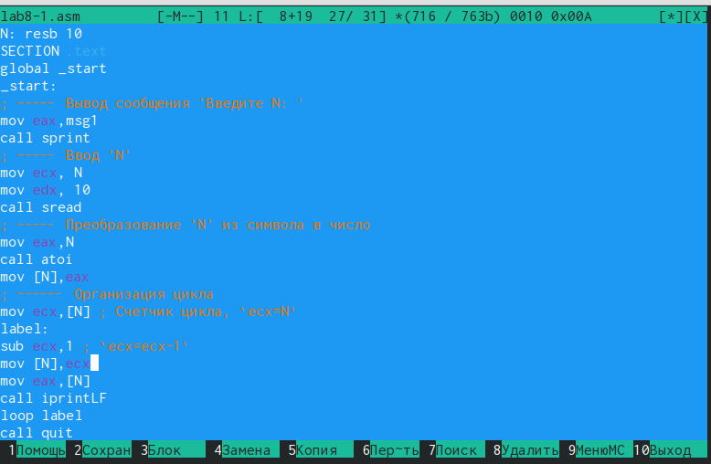{#fig:006 width=70%}

Создадим исполняемый файл и запустим его (рис. [-@fig:007]).

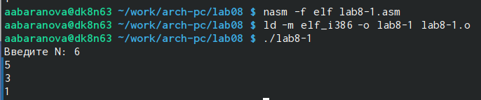{#fig:007 width=70%}

Снова изменим текст программы файла lab8-1.asm, создадим исполняемый файл и запустим его (рис. [-@fig:008]), (рис. [-@fig:009]).

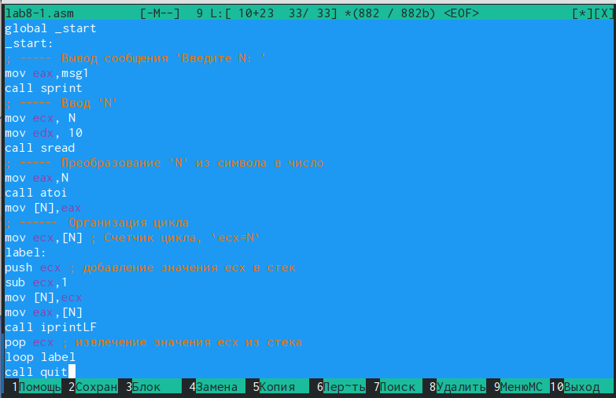{#fig:008 width=70%}

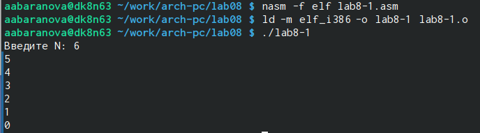{#fig:009 width=70%}

## Обработка аргументов командной строки

Создадим файл lab8-2.asm в каталоге ~/work/arch-pc/lab08 (рис. [-@fig:010]), (рис. [-@fig:011]).

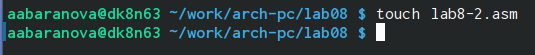{#fig:010 width=70%}

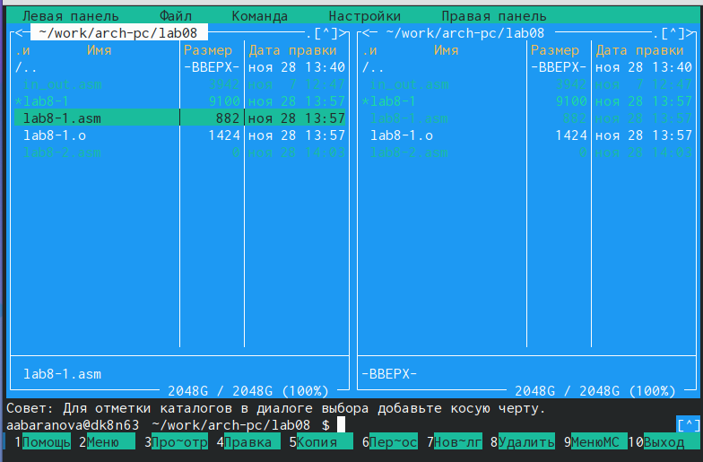{#fig:011 width=70%}

Введём в файл lab8-2.asm текст программы (рис. [-@fig:012]).

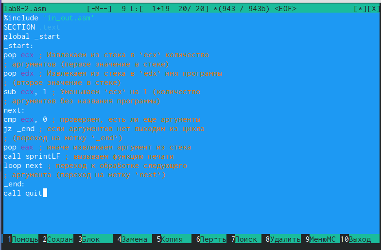{#fig:012 width=70%}

Создадим исполняемый файл и запустим его, указав аргументы (рис. [-@fig:013]), (рис. [-@fig:014]).

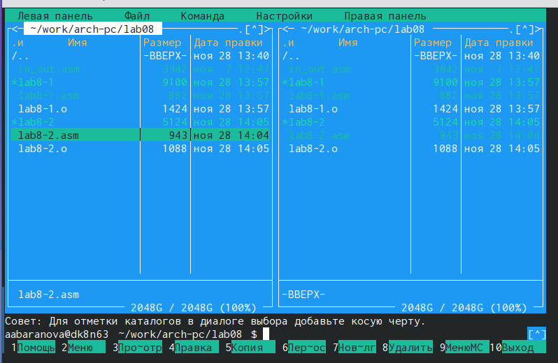{#fig:013 width=70%}

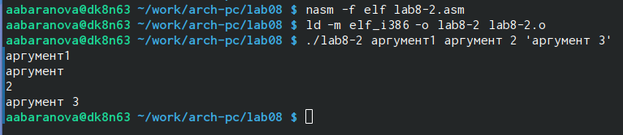{#fig:014 width=70%}

Создадим файл lab8-3.asm в каталоге ~/work/arch-pc/lab08 (рис. [-@fig:015]), (рис. [-@fig:016]).

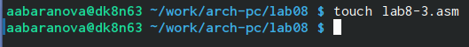{#fig:015 width=70%}

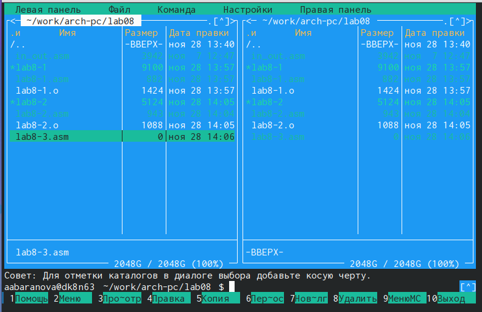{#fig:016 width=70%}

Введём в файл lab8-3.asm текст программы (рис. [-@fig:017]).

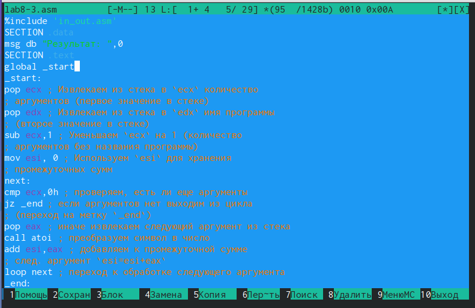{#fig:017 width=70%}

Создадим исполняемый файл и запустим его, указав аргументы (рис. [-@fig:018]), (рис. [-@fig:019]).

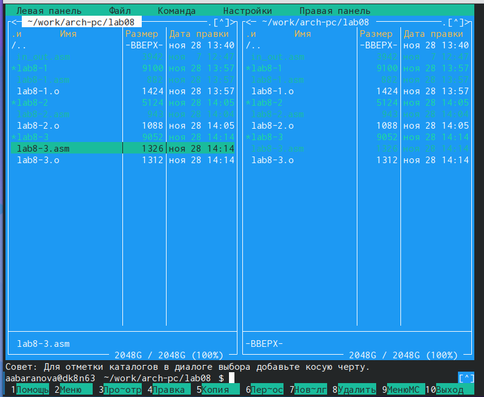{#fig:018 width=70%}

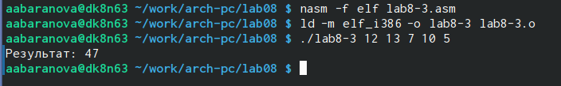{#fig:019 width=70%}

Изменим в файле lab8-3.asm текст программы  для вычисления произведения аргументов командной строки (рис. [-@fig:020]).

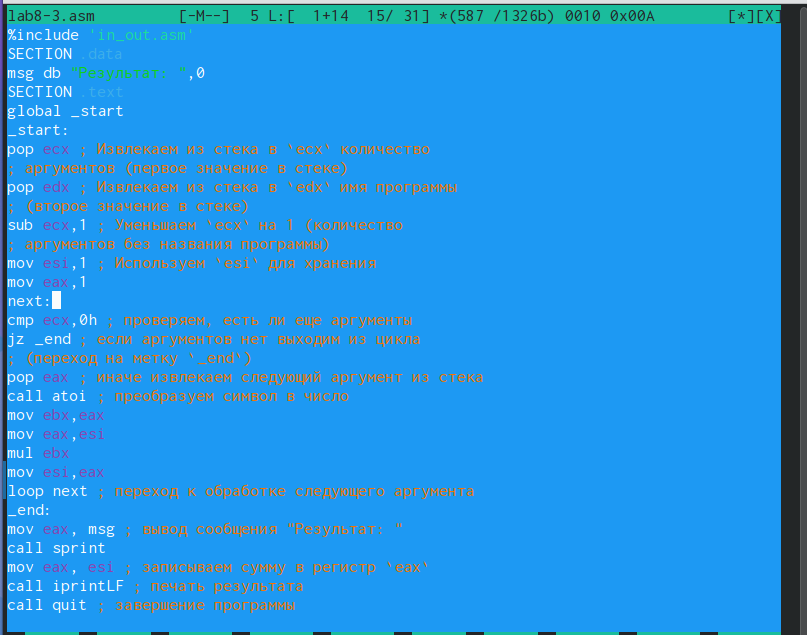{#fig:020 width=70%}

Создадим исполняемый файл и запустим его, указав аргументы (рис. [-@fig:021]).

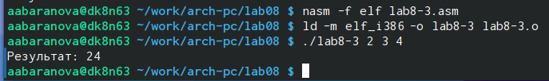{#fig:021 width=70%}

## Задание для самостоятельной работы

Напишем программу, которая находит сумму значений функции f(x) для x = x_1, x_2,..., x_n, т.е. программа должна выводить f(x_1) + f(x_2) + ... + f(x_n). Значения x_i передаются как аргументы. Создадим исполняемый файл и проверим его работу на нескольких наборах x = x_1, x_2,..., x_n. (рис. [-@fig:022]), (рис. [-@fig:023]), (рис. [-@fig:024]), (рис. [-@fig:025]).

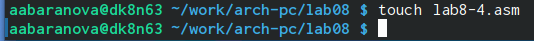{#fig:022 width=70%}

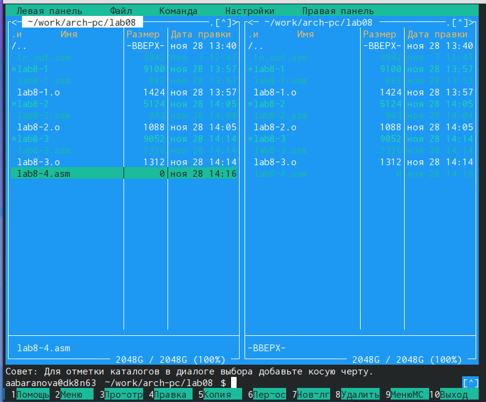{#fig:023 width=70%}

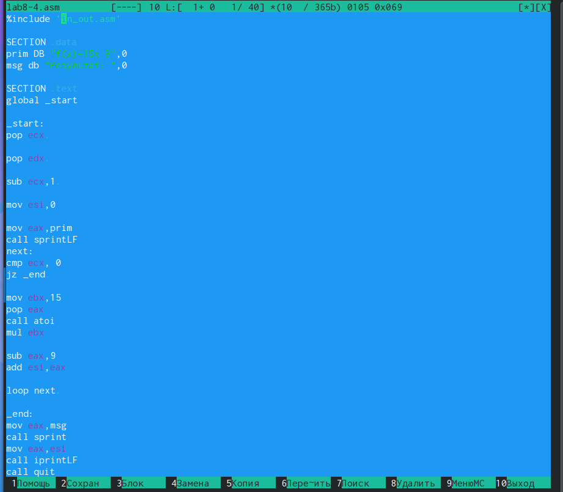{#fig:024 width=70%}

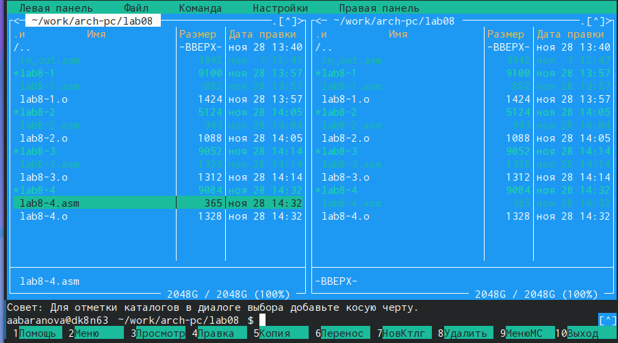{#fig:025 width=70%}

# Выводы

В ходе выполнения данной лабораторной работы были приобретены навыки написания программ с использованием циклов и обработкой аргументов командной строки.

