---
## Front matter
title: "Отчёт по лабораторной работе №9"
subtitle: "дисциплина: Архитектура компьютера"
author: "Баранова Анна Андреевна"

## Generic otions
lang: ru-RU
toc-title: "Содержание"

## Bibliography
bibliography: bib/cite.bib
csl: pandoc/csl/gost-r-7-0-5-2008-numeric.csl

## Pdf output format
toc: true # Table of contents
toc-depth: 2
lof: true # List of figures
fontsize: 12pt
linestretch: 1.5
papersize: a4
documentclass: scrreprt
## I18n polyglossia
polyglossia-lang:
  name: russian
  options:
	- spelling=modern
	- babelshorthands=true
polyglossia-otherlangs:
  name: english
## I18n babel
babel-lang: russian
babel-otherlangs: english
## Fonts
mainfont: IBM Plex Serif
romanfont: IBM Plex Serif
sansfont: IBM Plex Sans
monofont: IBM Plex Mono
mathfont: STIX Two Math
mainfontoptions: Ligatures=Common,Ligatures=TeX,Scale=0.94
romanfontoptions: Ligatures=Common,Ligatures=TeX,Scale=0.94
sansfontoptions: Ligatures=Common,Ligatures=TeX,Scale=MatchLowercase,Scale=0.94
monofontoptions: Scale=MatchLowercase,Scale=0.94,FakeStretch=0.9
mathfontoptions:
## Biblatex
biblatex: true
biblio-style: "gost-numeric"
biblatexoptions:
  - parentracker=true
  - backend=biber
  - hyperref=auto
  - language=auto
  - autolang=other*
  - citestyle=gost-numeric
## Pandoc-crossref LaTeX customization
figureTitle: "Рис."

## Misc options
indent: true
header-includes:
  - \usepackage{indentfirst}
  - \usepackage{float} # keep figures where there are in the text
  - \floatplacement{figure}{H} # keep figures where there are in the text
---

# Цель работы

Приобретение навыков написания программ с использованием подпрограмм. Знакомство с методами отладки при помощи GDB и его основными возможностями.

# Задание

В ходе выполнения данной лабораторной работы необходимо изучить:

* Понятие об отладке;

* методы отладки;

* основные возможности отладчика GDB;

* понятие подпрограммы.

Выполнив эту работу, мы приобретём навыки написания программ с использованием подпрограмм. Познакомимся с методами отладки при помощи GDB и его основными возможностями.

# Теоретическое введение

Отладка — это процесс поиска и исправления ошибок в программе. В общем случае его можно разделить на четыре этапа:

* обнаружение ошибки;

* поиск её местонахождения;

* определение причины ошибки;

* исправление ошибки.

Наиболее часто применяют следующие методы отладки:

* создание точек контроля значений на входе и выходе участка программы (например,
вывод промежуточных значений на экран — так называемые диагностические сообще-
ния);

* использование специальных программ-отладчиков.

Отладчики позволяют управлять ходом выполнения программы, контролировать и изменять данные. Это помогает быстрее найти место ошибки в программе и ускорить её исправление. Наиболее популярные способы работы с отладчиком — это использование точек останова и выполнение программы по шагам.

Пошаговое выполнение — это выполнение программы с остановкой после каждой строчки, чтобы программист мог проверить значения переменных и выполнить другие действия.

Точки останова — это специально отмеченные места в программе, в которых программа-отладчик приостанавливает выполнение программы и ждёт команд. Наиболее популярные виды точек останова:

* Breakpoint — точка останова (остановка происходит, когда выполнение доходит до
определённой строки, адреса или процедуры, отмеченной программистом);

* Watchpoint — точка просмотра (выполнение программы приостанавливается, если программа обратилась к определённой переменной: либо считала её значение, либо изменила его).

Точки останова устанавливаются в отладчике на время сеанса работы с кодом программы, т.е. они сохраняются до выхода из программы-отладчика или до смены отлаживаемой программы.

GDB (GNU Debugger — отладчик проекта GNU) [1] работает на многих UNIX-подобных системах и умеет производить отладку многих языков программирования. GDB предлагает обширные средства для слежения и контроля за выполнением компьютерных программ. Отладчик не содержит собственного графического пользовательского интерфейса и использует стандартный текстовый интерфейс консоли. Однако для GDB существует несколько сторонних графических надстроек, а кроме того, некоторые интегрированные среды разработки используют его в качестве базовой подсистемы отладки.

Отладчик GDB (как и любой другой отладчик) позволяет увидеть, что происходит «внутри» программы в момент её выполнения или что делает программа в момент сбоя.

GDB может выполнять следующие действия:

* начать выполнение программы, задав всё, что может повлиять на её поведение;

* остановить программу при указанных условиях;

* исследовать, что случилось, когда программа остановилась;

* изменить программу так, чтобы можно было поэкспериментировать с устранением эффектов одной ошибки и продолжить выявление других.

Подпрограмма — это, как правило, функционально законченный участок кода, который можно многократно вызывать из разных мест программы. В отличие от простых переходов из подпрограмм существует возврат на команду, следующую за вызовом.

Если в программе встречается одинаковый участок кода, его можно оформить в виде подпрограммы, а во всех нужных местах поставить её вызов. При этом подпрограмма будет содержаться в коде в одном экземпляре, что позволит уменьшить размер кода всей программы.

# Выполнение лабораторной работы

## Реализация подпрограмм в NASM

Создадим каталог для выполнения лабораторной работы № 9, перейдём в него и создадим файл lab09-1.asm и также создадим копию файла in_out.asm (рис. [-@fig:001]), (рис. [-@fig:002]), (рис. [-@fig:003]).

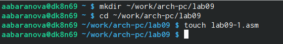{#fig:001 width=70%}

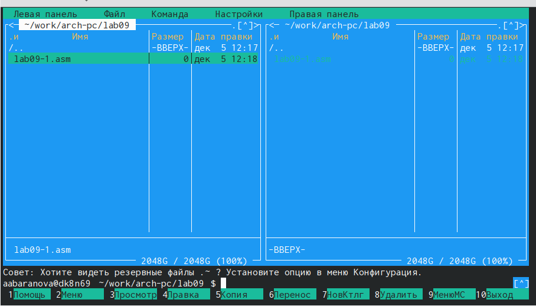{#fig:002 width=70%}

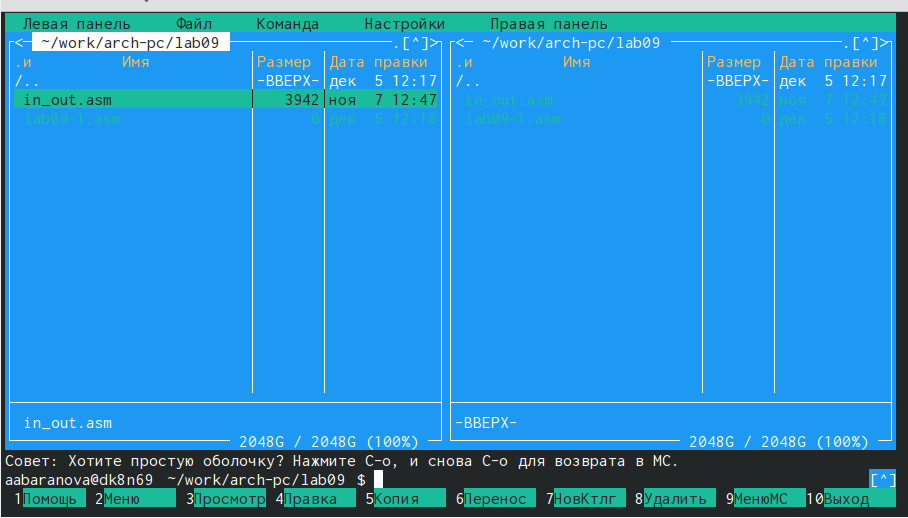{#fig:003 width=70%}

Введём в файл lab09-1.asm текст программы (рис. [-@fig:004]).

{#fig:004 width=70%}

Создадим исполняемый файл и запустим его (рис. [-@fig:005]), (рис. [-@fig:006]).

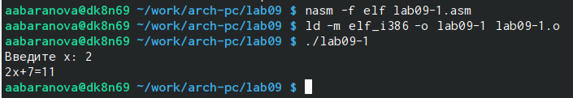{#fig:005 width=70%}

{#fig:006 width=70%}

Изменим текст программы файла lab09-1.asm (рис. [-@fig:007]).

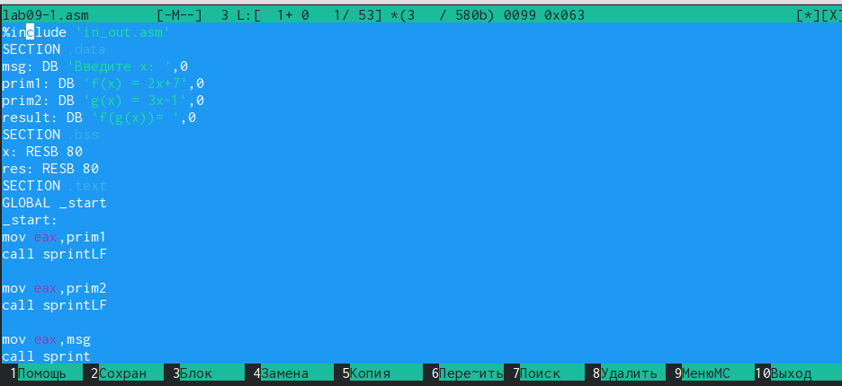{#fig:007 width=70%}

Создадим исполняемый файл и запустим его (рис. [-@fig:008]).

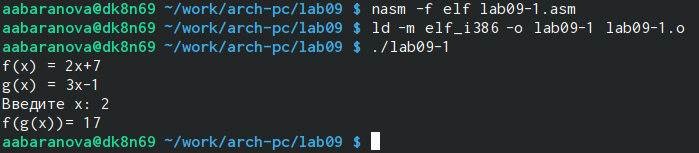{#fig:008 width=70%}

## Отладка программам с помощью GDB

Создадим файл lab09-2.asm в каталоге ~/work/arch-pc/lab09 (рис. [-@fig:009]), (рис. [-@fig:010]).

{#fig:009 width=70%}

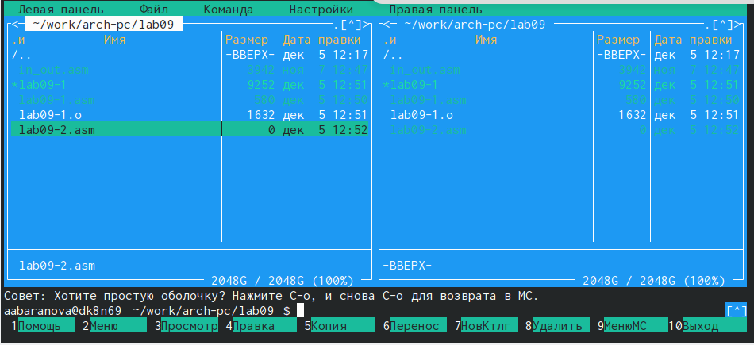{#fig:010 width=70%}

Введём в файл lab09-2.asm текст программы (рис. [-@fig:011]).

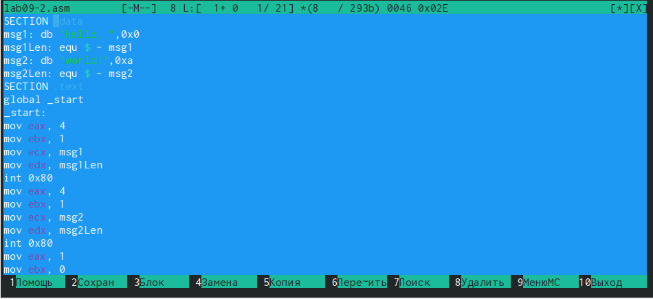{#fig:011 width=70%}

Получим исполняемый файл (рис. [-@fig:012]).

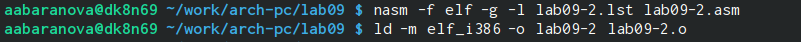{#fig:012 width=70%}

Загрузим исполняемый файл в отладчик gdb, проверим работу программы, запустив её в оболочке GDB с помощью команды run (рис. [-@fig:013]).

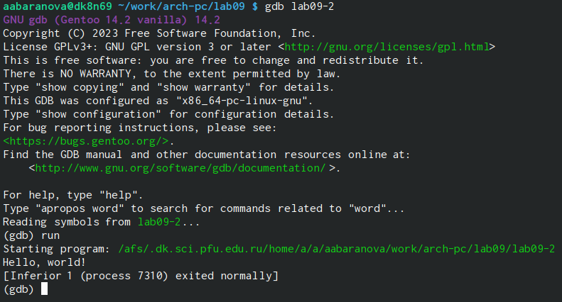{#fig:013 width=70%}

Установим брейкпоинт на метку _start, с которой начинается выполнение любой ассемблерной программы, и запустим её (рис. [-@fig:014]).

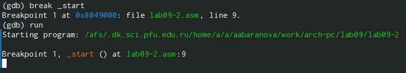{#fig:014 width=70%}

Посмотрим дисассимилированный код программы с помощью команды disassemble начиная с метки _start (рис. [-@fig:015]).

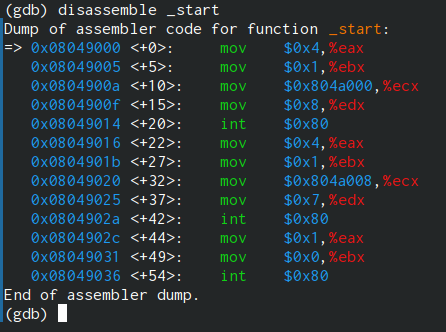{#fig:015 width=70%}

Переключимся на отображение команд с Intel’овским синтаксисом, введя команду set disassembly-flavor intel. Отличие отображения синтаксиса машинных команд в режимах ATT и Intel заключается в командах, в диссамилированном отображении в командах используют % и $, а в Intel отображение эти символы не используются (рис. [-@fig:016]).

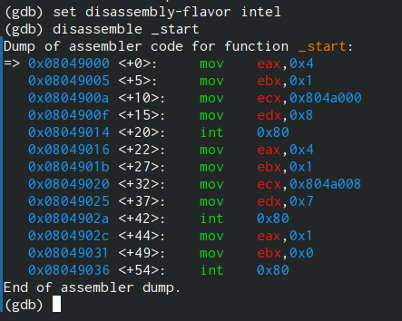{#fig:016 width=70%}

Включим режим псевдографики для более удобного анализа программы (рис. [-@fig:017]).

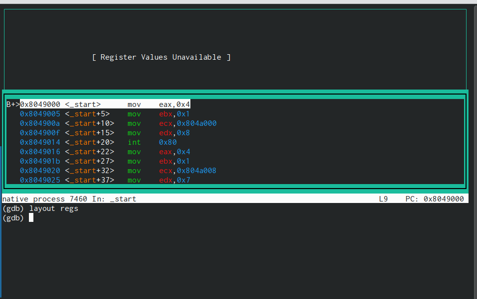{#fig:017 width=70%}

На предыдущих шагах была установлена точка останова по имени метки (_start). Проверим это с помощью команды info breakpoints (кратко i b) (рис. [-@fig:018]).

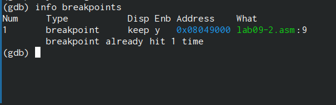{#fig:018 width=70%}

Определим адрес предпоследней инструкции (mov ebx,0x0) и установим точку останова (рис. [-@fig:019]).

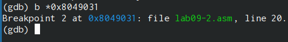{#fig:019 width=70%}

Посмотрим информацию о всех установленных точках останова (рис. [-@fig:020]).

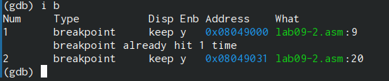{#fig:020 width=70%}

Выполним 5 инструкций с помощью команды stepi (или si) и проследим за изменением значений регистров (рис. [-@fig:021]), (рис. [-@fig:022]), (рис. [-@fig:023]), (рис. [-@fig:024]), (рис. [-@fig:025]).

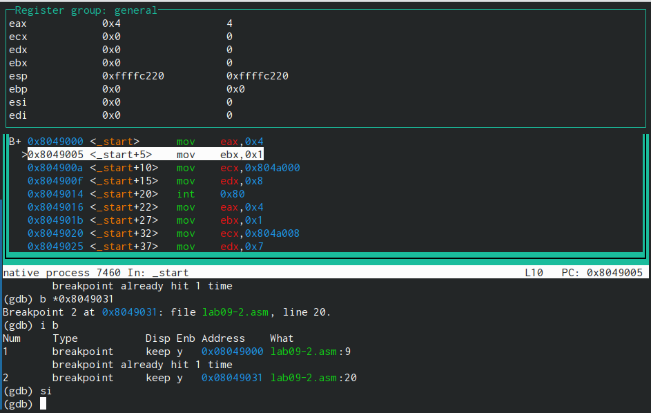{#fig:021 width=70%}

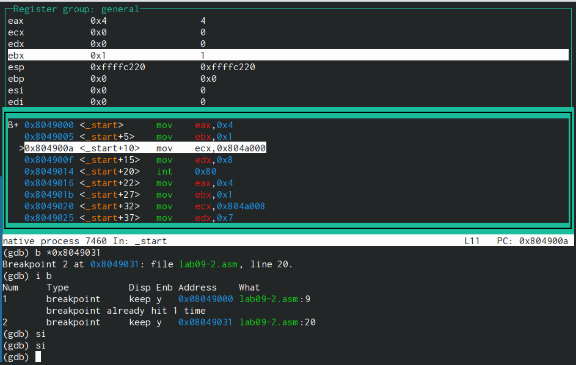{#fig:022 width=70%}

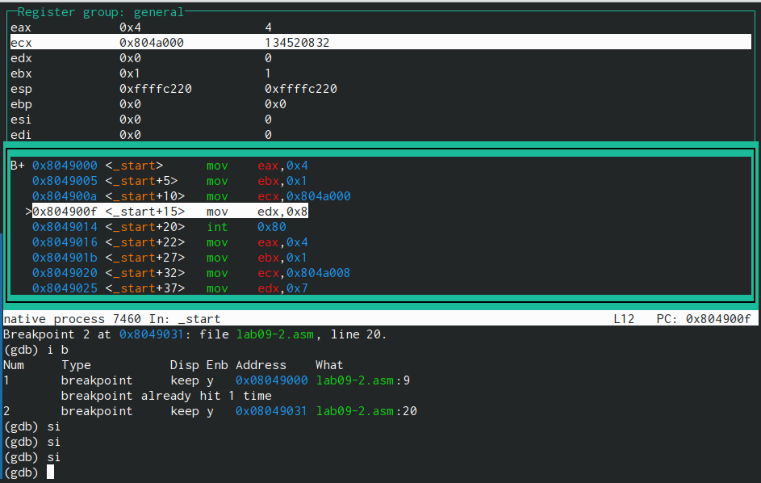{#fig:023 width=70%}

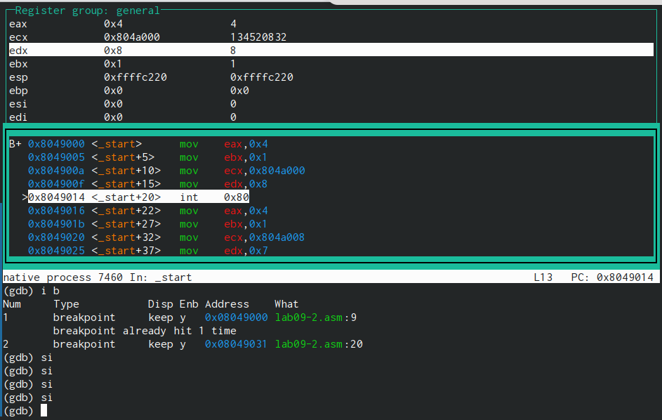{#fig:024 width=70%}

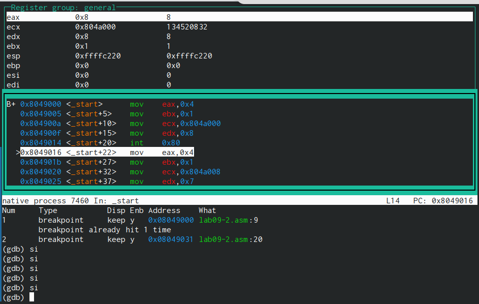{#fig:025 width=70%}

Посмотрим содержимое регистров с помощью команды info registers (или i r) (рис. [-@fig:026]).

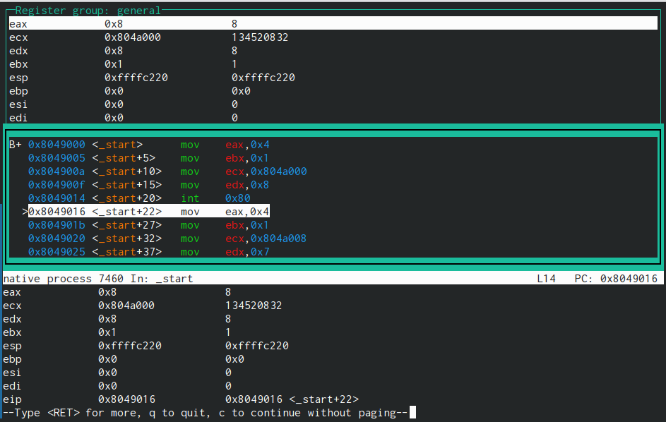{#fig:026 width=70%}

Посмотрим значение переменной msg1 по имени (рис. [-@fig:027]).

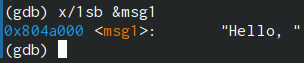{#fig:027 width=70%}

Посмотрим значение переменной msg2 по адресу (рис. [-@fig:028]).

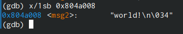{#fig:028 width=70%}

Изменим первый символ переменной msg1 (рис. [-@fig:029]).

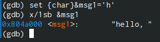{#fig:029 width=70%}

Изменим первый символ переменной msg2 (рис. [-@fig:030]).

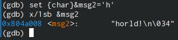{#fig:030 width=70%}

Выведем в шестнадцатеричном формате, в двоичном формате и в символьном виде значение регистра edx (рис. [-@fig:031]).

{#fig:031 width=70%}

С помощью команды set изменим значение регистра ebx. Команда выводит два разных значения так как в первый раз вносим значение 2, а во второй раз регистр равен двум, поэтому и значения разные (рис. [-@fig:032]).

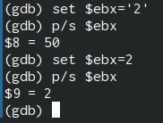{#fig:032 width=70%}

Завершим выполнение программы с помощью команды stepi (сокращенно si) и выйдем из GDB с помощью команды quit (сокращенно q) (рис. [-@fig:033]).

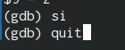{#fig:033 width=70%}

Скопируем файл lab8-2.asm, созданный при выполнении лабораторной работы №8, с программой выводящей на экран аргументы командной строки в файл с именем lab09-3.asm  и создадим исполняемый файл(рис. [-@fig:034]).

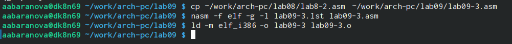{#fig:034 width=70%}

Загрузим исполняемый файл в отладчик, указав аргументы (рис. [-@fig:035]).

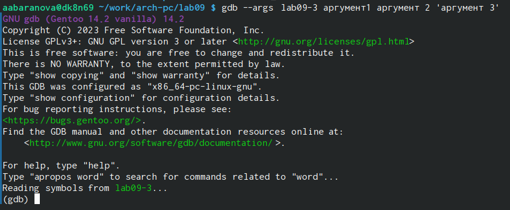{#fig:035 width=70%}

Установим точку останова перед первой инструкцией в программе и запустим её (рис. [-@fig:036]).

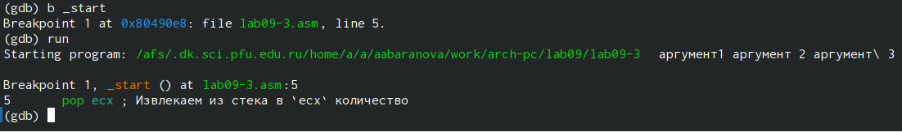{#fig:036 width=70%}

Проверим адрес вершины стека и убедимся, что там хранится 5 элементов (рис. [-@fig:037]).

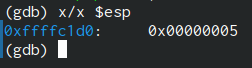{#fig:037 width=70%}

Посмотрим все позиции стека. По первому адрему хранится адрес, в остальных адресах хранятся элементы. Элементы расположены с интервалом в 4 единицы, так как стек может хранить до 4 байт, и для того чтобы данные сохранялись нормально и без помех, компьютер использует новый стек для новой информации (рис. [-@fig:038]).

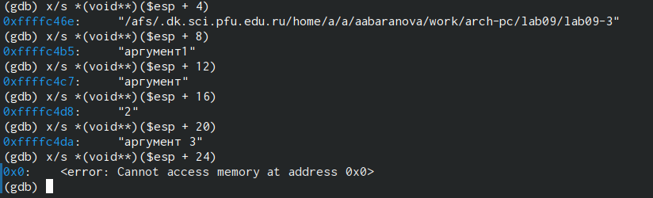{#fig:038 width=70%}

## Задание для самостоятельной работы

Преобразуем программу из лабораторной работы №8 (Задание №1 для самостоятельной работы), реализовав вычисление значения функции f(x) как подпрограмму (рис. [-@fig:039]), (рис. [-@fig:040]), (рис. [-@fig:041]), (рис. [-@fig:042]).

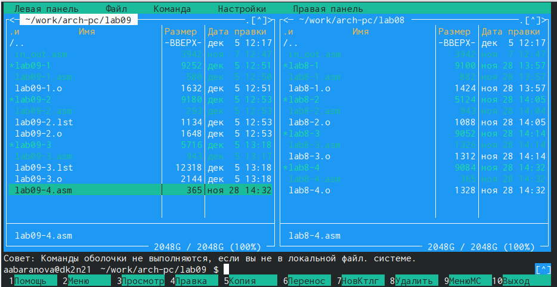{#fig:039 width=70%}

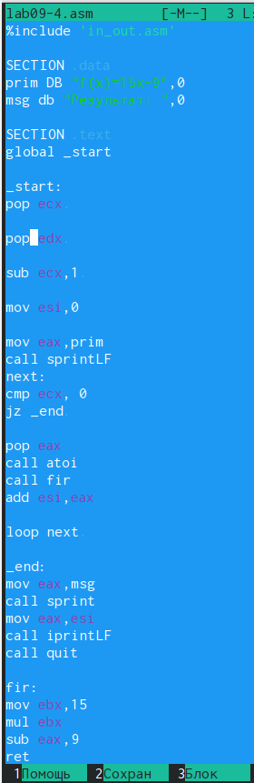{#fig:040 width=70%}

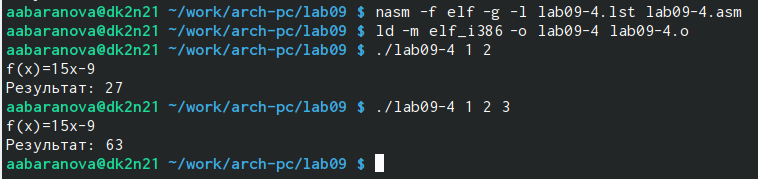{#fig:041 width=70%}

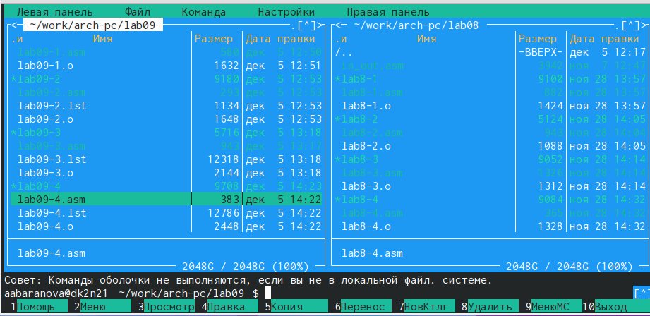{#fig:042 width=70%}

В листинге 9.3 приведена программа вычисления выражения (3 + 2) ∗ 4 + 5. При запуске данная программа даёт неверный результат. Проверим это. С помощью отладчика GDB, анализируя изменения значений регистров, определим ошибку и исправим её (рис. [-@fig:043]), (рис. [-@fig:044]), (рис. [-@fig:045]), (рис. [-@fig:046]), рис. [-@fig:047]), рис. [-@fig:048]), рис. [-@fig:049]), рис. [-@fig:050]), рис. [-@fig:051]), рис. [-@fig:052]).

{#fig:043 width=70%}

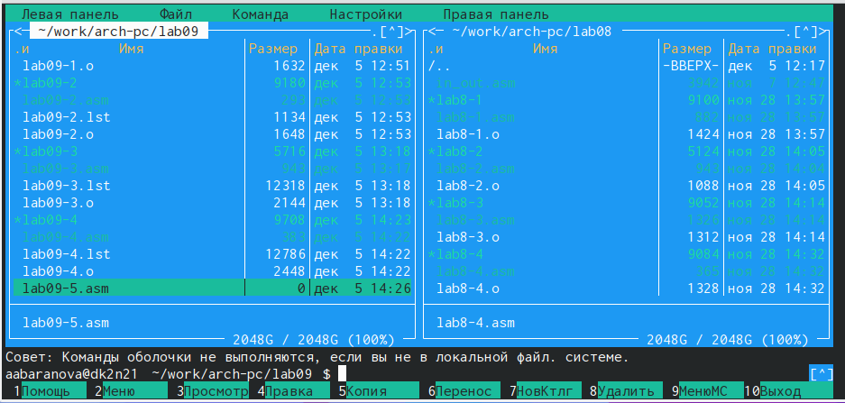{#fig:044 width=70%}

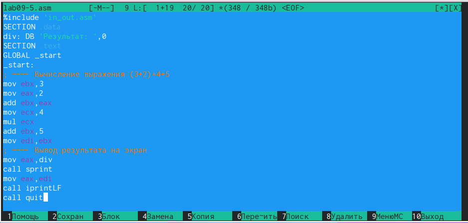{#fig:045 width=70%}

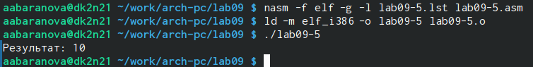{#fig:046 width=70%}

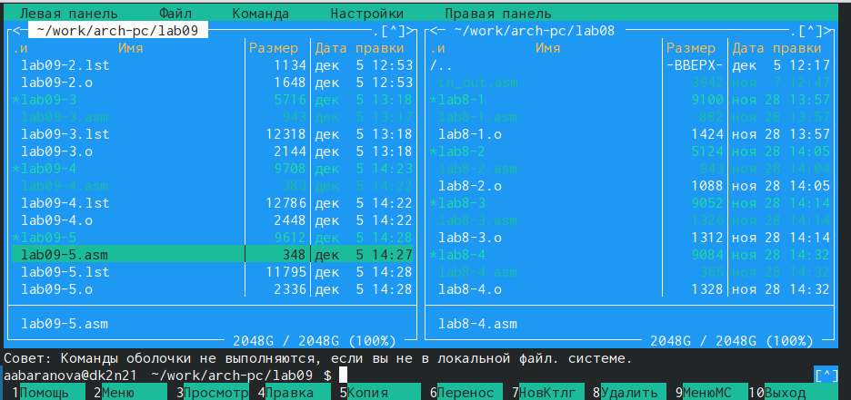{#fig:047 width=70%}

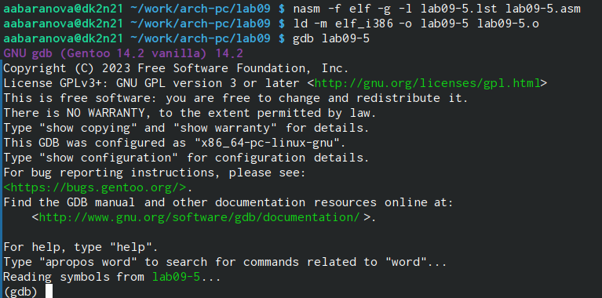{#fig:048 width=70%}

{#fig:049 width=70%}

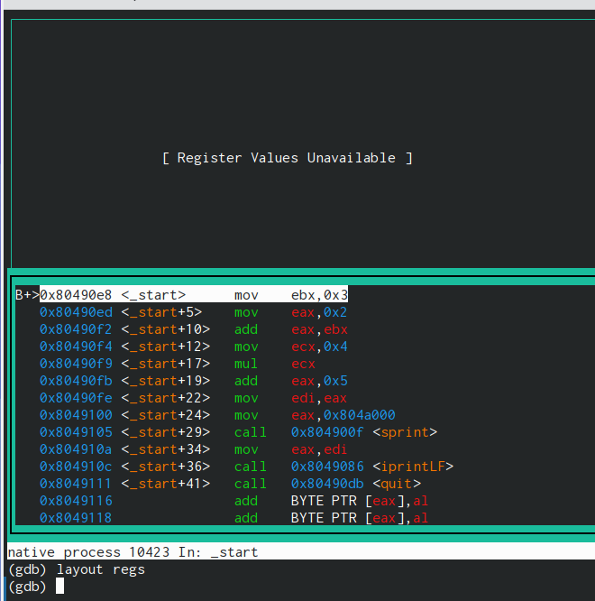{#fig:050 width=70%}

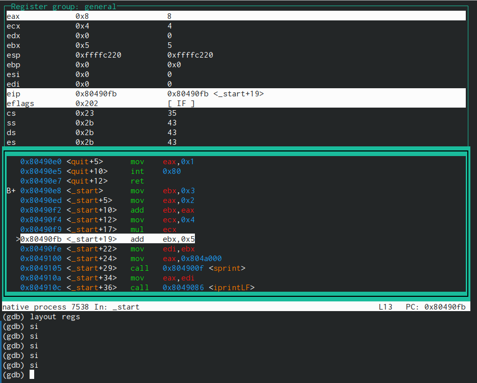{#fig:051 width=70%}

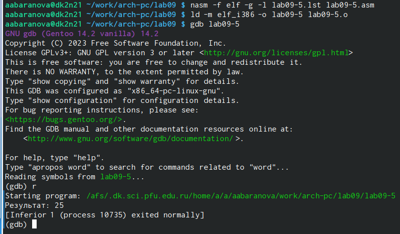{#fig:052 width=70%}

# Выводы

В ходе выполнения данной лабораторной работы были приобретены навыки написания программ с использованием подпрограмм. Также познакомились с методами отладки при помощи GDB и его основными возможностями.

