---
## Front matter
title: "Отчёт по лабораторной работе №10"
subtitle: "дисциплина: Архитектура компьютера"
author: "Баранова Анна Андреевна"

## Generic otions
lang: ru-RU
toc-title: "Содержание"

## Bibliography
bibliography: bib/cite.bib
csl: pandoc/csl/gost-r-7-0-5-2008-numeric.csl

## Pdf output format
toc: true # Table of contents
toc-depth: 2
lof: true # List of figures
fontsize: 12pt
linestretch: 1.5
papersize: a4
documentclass: scrreprt
## I18n polyglossia
polyglossia-lang:
  name: russian
  options:
	- spelling=modern
	- babelshorthands=true
polyglossia-otherlangs:
  name: english
## I18n babel
babel-lang: russian
babel-otherlangs: english
## Fonts
mainfont: IBM Plex Serif
romanfont: IBM Plex Serif
sansfont: IBM Plex Sans
monofont: IBM Plex Mono
mathfont: STIX Two Math
mainfontoptions: Ligatures=Common,Ligatures=TeX,Scale=0.94
romanfontoptions: Ligatures=Common,Ligatures=TeX,Scale=0.94
sansfontoptions: Ligatures=Common,Ligatures=TeX,Scale=MatchLowercase,Scale=0.94
monofontoptions: Scale=MatchLowercase,Scale=0.94,FakeStretch=0.9
mathfontoptions:
## Biblatex
biblatex: true
biblio-style: "gost-numeric"
biblatexoptions:
  - parentracker=true
  - backend=biber
  - hyperref=auto
  - language=auto
  - autolang=other*
  - citestyle=gost-numeric
## Pandoc-crossref LaTeX customization
figureTitle: "Рис."

## Misc options
indent: true
header-includes:
  - \usepackage{indentfirst}
  - \usepackage{float} # keep figures where there are in the text
  - \floatplacement{figure}{H} # keep figures where there are in the text
---

# Цель работы

Приобрести навыки написания программ для работы с файлами.

# Задание

В ходе выполнения данной лабораторной работы необходимо изучить:

* Права доступа к файлам;

* работа с файлами средствами Nasm.

Выполнив эту работу, мы приобретём навыки написания программ для работы с файлами.

# Теоретическое введение

ОС GNU/Linux является многопользовательской операционной системой. И для обеспечения защиты данных одного пользователя от действий других пользователей существуют специальные механизмы разграничения доступа к файлам. Кроме ограничения доступа, данный механизм позволяет разрешить другим пользователям доступ данным для совместной работы.

Права доступа определяют набор действий (чтение, запись, выполнение), разрешённых для выполнения пользователям системы над файлами. Для каждого файла пользователь может входить в одну из трех групп: владелец, член группы владельца, все остальные. Для каждой из этих групп может быть установлен свой набор прав доступа. Владельцем файла является его создатель.

В операционной системе Linux существуют различные методы управления файлами, например, такие как создание и открытие файла, только для чтения или для чтения и записи, добавления в существующий файл, закрытия и удаления файла, предоставление прав доступа.

Обработка файлов в операционной системе Linux осуществляется за счет использования определенных системных вызовов. Для корректной работы и доступа к файлу при его открытии или создании, файлу присваивается уникальный номер (16-битное целое число) – дескриптор файла.

# Выполнение лабораторной работы

Создадим каталог для программам лабораторной работы № 10, перейдём в него и создадим файлы lab10-1.asm, readme-1.txt и readme-2.txt (рис. [-@fig:001]), (рис. [-@fig:002]).

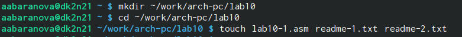{#fig:001 width=70%}

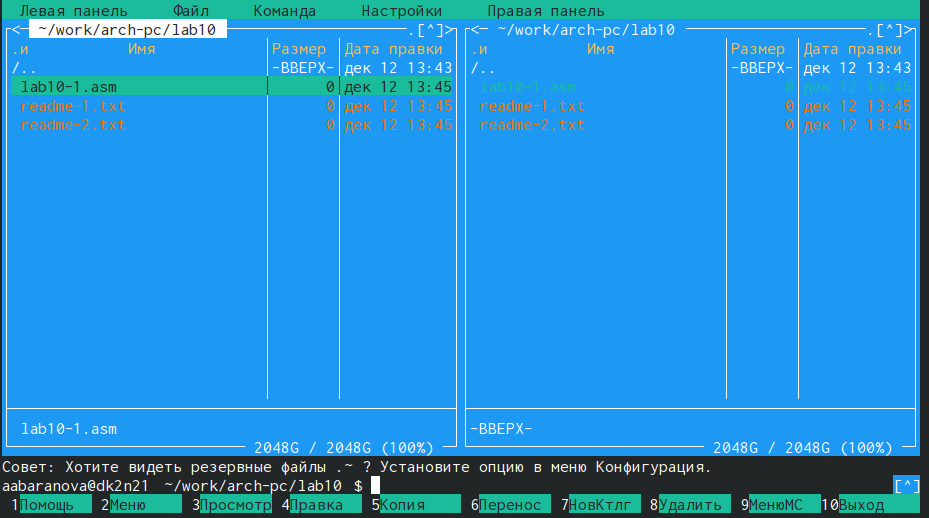{#fig:002 width=70%}

Введём в файл lab10-1.asm текст программы (рис. [-@fig:003]).

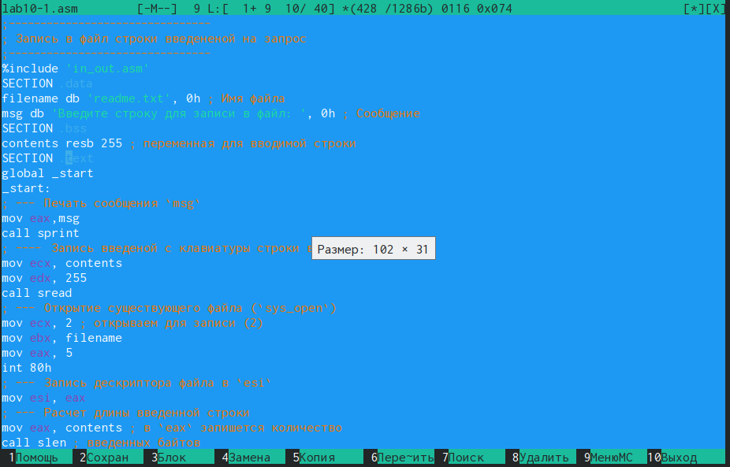{#fig:003 width=70%}

Создадим исполняемый файл и запустим его, создадим файл readme.txt и также создадим копию файла in_out.asm (рис. [-@fig:004]), (рис. [-@fig:005]).

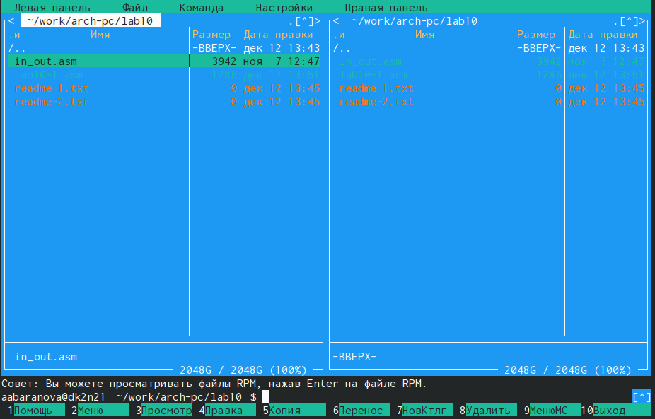{#fig:004 width=70%}

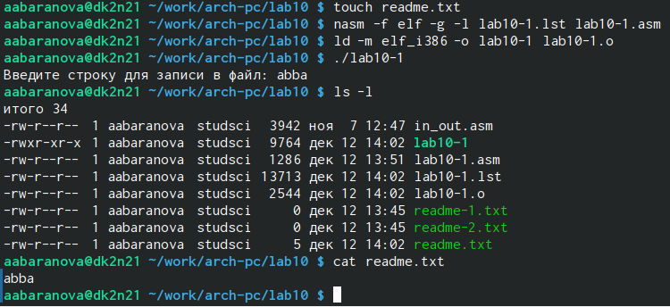{#fig:005 width=70%}

С помощью команды chmod изменим права доступа к исполняемому файлу lab10-1, запретив его выполнение. Попытаемся выполнить файл. Выдало отказ в доступе, как и следовало ожидать, так как мы просто запретили запускать программу для всех категорий пользователей (рис. [-@fig:006]).

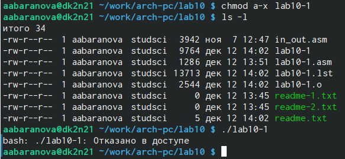{#fig:006 width=70%}

С помощью команды chmod изменим права доступа к файлу lab10-1.asm с исходным текстом программы, добавив права на исполнение. Попытаемся выполнить его. Файл lab10-1.asm не запустится, нам выдаст ошибку. Заново создадим исполняемый файл и запустим его. Всё запустилось, так как файл был со всеми разрешениями и до этого мы запретили выполняться уже готовой программе, а это фактически новая программа которая обладает другими разрешениями (рис. [-@fig:007]), (рис. [-@fig:008]).

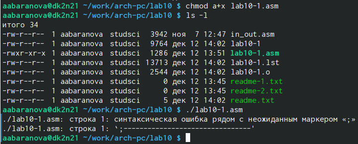{#fig:007 width=70%}

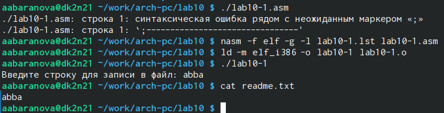{#fig:008 width=70%}

Предоставим права доступа к файлу readme-1.txt представленные в символьном виде, а для файла readme-2.txt – в двочном виде. Проверим правильность выполнения с помощью команды ls -l (рис. [-@fig:009]), (рис. [-@fig:010]).

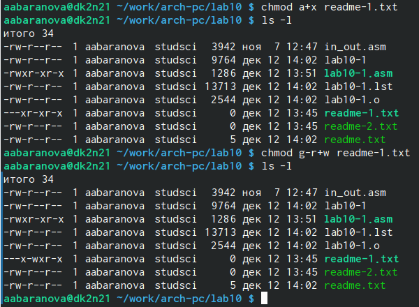{#fig:009 width=70%}

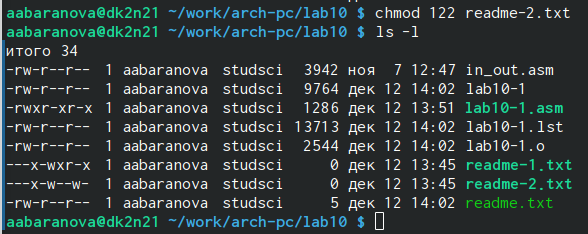{#fig:010 width=70%}

## Задание для самостоятельной работы

Напишем программу работающую по следующему алгоритму:

* Вывод приглашения “Как Вас зовут?”;

* ввести с клавиатуры свои фамилию и имя;

* создать файл с именем name.txt;

* записать в файл сообщение “Меня зовут”;

* дописать в файл строку введенную с клавиатуры;

* закрыть файл.

Создадим исполняемый файл и проверим его работу. Проверим наличие файла и его содержимое с помощью команд ls и cat (рис. [-@fig:011]), (рис. [-@fig:012]), (рис. [-@fig:013]), (рис. [-@fig:014]), (рис. [-@fig:015]).

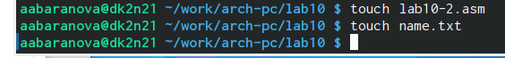{#fig:011 width=70%}

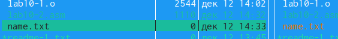{#fig:012 width=70%}

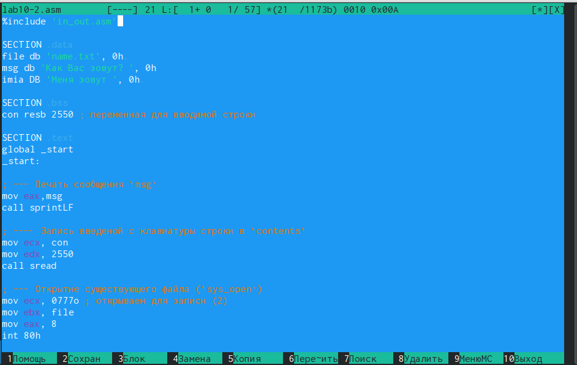{#fig:013 width=70%}

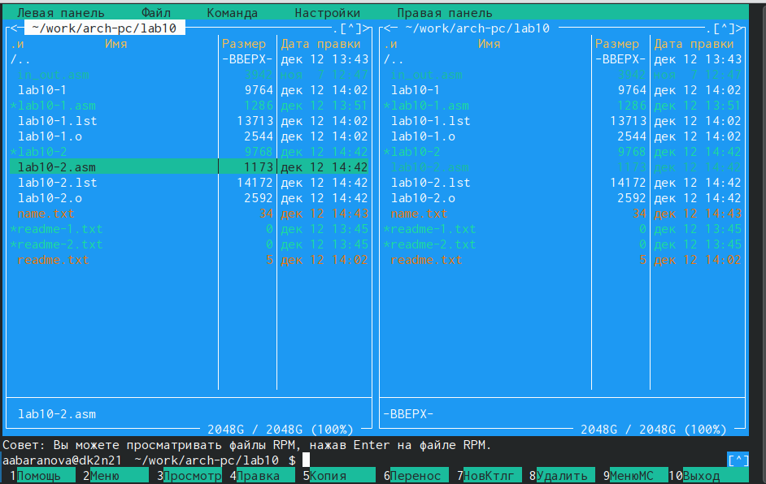{#fig:014 width=70%}

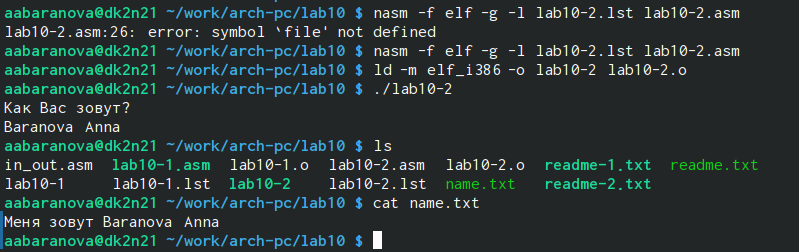{#fig:015 width=70%}

# Выводы

В ходе выполнения данной лабораторной работы были приобретены навыки написания программ для работы с файлами.

