---
# Front matter
lang: ru-RU
title: "Отчёт по лабораторной работе №2"
subtitle: "ДИАГНОСТИКА СЕТЕВОГО ПОДКЛЮЧЕНИЯ С ПОМОЩЬЮ ВСТРОЕННЫХ УТИЛИТ"
author: "Анна Баранова"

# Formatting
toc-title: "Содержание"
toc: true # Table of contents
toc_depth: 2
lof: true # List of figures
fontsize: 12pt
linestretch: 1.5
papersize: a4paper
documentclass: scrreprt
polyglossia-lang: russian
polyglossia-otherlangs: english
mainfont: PT Serif
romanfont: PT Serif
sansfont: PT Sans
monofont: PT Mono
mainfontoptions: Ligatures=TeX
romanfontoptions: Ligatures=TeX
sansfontoptions: Ligatures=TeX,Scale=MatchLowercase
monofontoptions: Scale=MatchLowercase
indent: true
pdf-engine: lualatex
header-includes:
  - \linepenalty=10 # the penalty added to the badness of each line within a paragraph (no associated penalty node) Increasing the value makes tex try to have fewer lines in the paragraph.
  - \interlinepenalty=0 # value of the penalty (node) added after each line of a paragraph.
  - \hyphenpenalty=50 # the penalty for line breaking at an automatically inserted hyphen
  - \exhyphenpenalty=50 # the penalty for line breaking at an explicit hyphen
  - \binoppenalty=700 # the penalty for breaking a line at a binary operator
  - \relpenalty=500 # the penalty for breaking a line at a relation
  - \clubpenalty=150 # extra penalty for breaking after first line of a paragraph
  - \widowpenalty=150 # extra penalty for breaking before last line of a paragraph
  - \displaywidowpenalty=50 # extra penalty for breaking before last line before a display math
  - \brokenpenalty=100 # extra penalty for page breaking after a hyphenated line
  - \predisplaypenalty=10000 # penalty for breaking before a display
  - \postdisplaypenalty=0 # penalty for breaking after a display
  - \floatingpenalty = 20000 # penalty for splitting an insertion (can only be split footnote in standard LaTeX)
  - \raggedbottom # or \flushbottom
  - \usepackage{float} # keep figures where there are in the text
  - \floatplacement{figure}{H} # keep figures where there are in the text
---

# Цель работы

Научиться диагностировать компьютерную сеть, используя встроенные утилиты операционной системы.

# Оборудование

IBM PC совместимый компьютер с установленной ОС семейства Windows.

# Выполнение лабораторной работы

1. Через Пуск → Выполнить → cmd запущен интерпретатор командной строки.

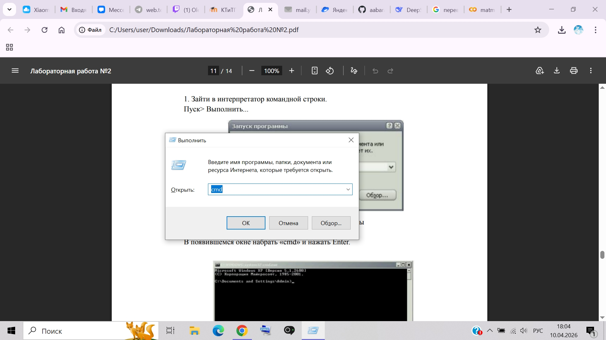{ #fig:002 width=70% height=70% }

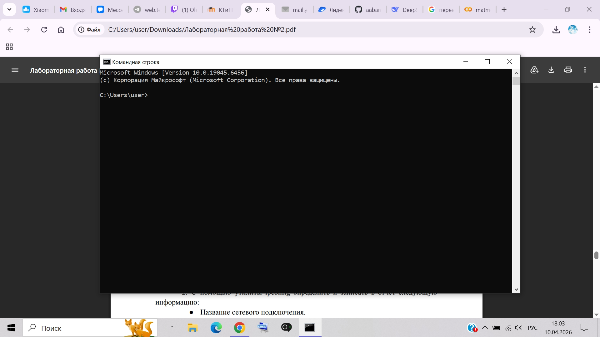{ #fig:001 width=70% height=70% }

2. С помощью утилиты ipconfig определили следующую информацию:

Название подключения:	Беспроводная сеть
MAC-адрес:	D4-6A-6A-87-62-ED
IPv4-адрес:	10.25.78.91
Маска подсети:	255.255.248.0
Основной шлюз:	10.25.72.1
DHCP-сервер:	10.25.72.2
DNS-серверы:	192.168.150.36, 192.168.150.37

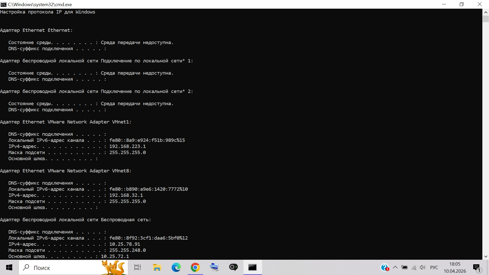{ #fig:003 width=70% height=70% }

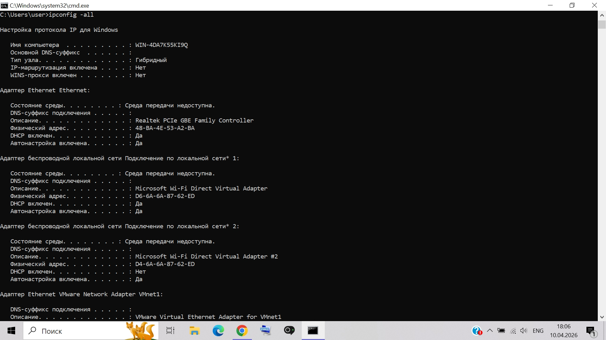{ #fig:004 width=70% height=70% }

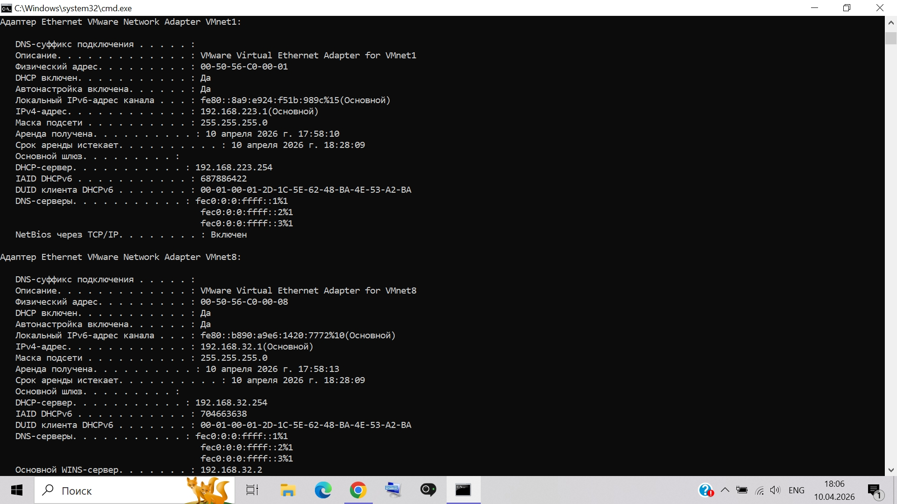{ #fig:005 width=70% height=70% }

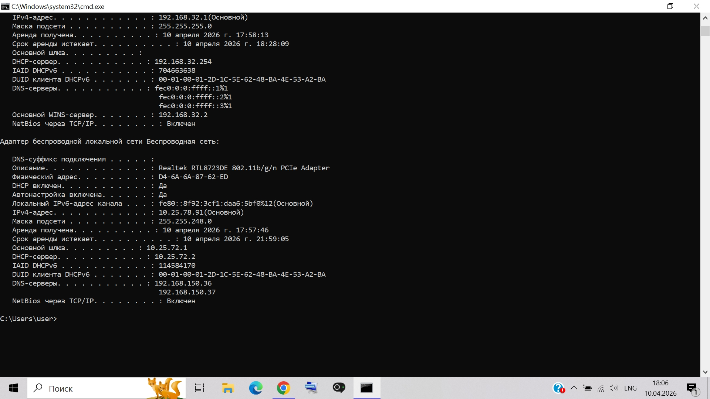{ #fig:006 width=70% height=70% }

3. С помощью утилиты ping проверитли доступность следующих устройств:

* Основой шлюз.

* Сервер DHSP

* Сервер DNS

* Сайт vk.com

* Информационный ресурс ru.wikipedia.org.

Используя дополнительные ключи, сделали так, чтобы количество посылаемых эхо-запросов равнялось номеру компьютера (=5) +10.

Статистика Ping для 10.25.72.1:

    Пакетов: отправлено = 15, получено = 15, потеряно = 0 (0% потерь)

Приблизительное время приема-передачи в мс:

    Минимальное = 1мсек, Максимальное = 7 мсек, Среднее = 3 мсек

Статистика Ping для 10.25.72.2:

    Пакетов: отправлено = 15, получено = 15, потеряно = 0 (0% потерь)

Приблизительное время приема-передачи в мс:

    Минимальное = 1мсек, Максимальное = 40 мсек, Среднее = 8 мсек

Статистика Ping для 192.168.150.36:

    Пакетов: отправлено = 15, получено = 15, потеряно = 0 (0% потерь)

Приблизительное время приема-передачи в мс:

    Минимальное = 2мсек, Максимальное = 4 мсек, Среднее = 2 мсек

Статистика Ping для 87.240.132.78:

    Пакетов: отправлено = 15, получено = 15, потеряно = 0 (0% потерь)

Приблизительное время приема-передачи в мс:

    Минимальное = 10мсек, Максимальное = 50 мсек, Среднее = 14 мсек

Статистика Ping для 185.15.59.224:

    Пакетов: отправлено = 15, получено = 15, потеряно = 0 (0% потерь)

Приблизительное время приема-передачи в мс:

    Минимальное = 46мсек, Максимальное = 170 мсек, Среднее = 68 мсек

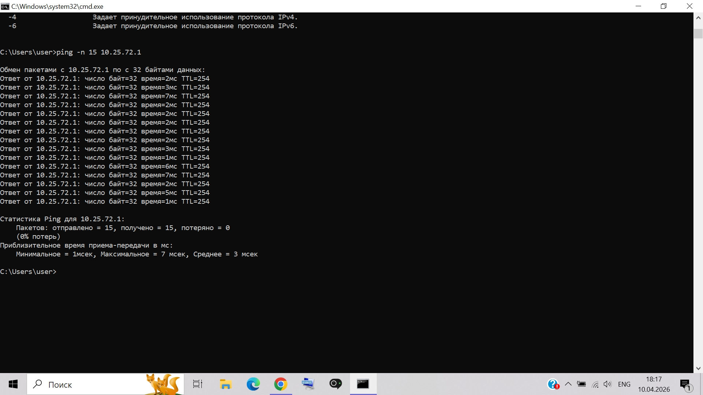{ #fig:007 width=70% height=70% }

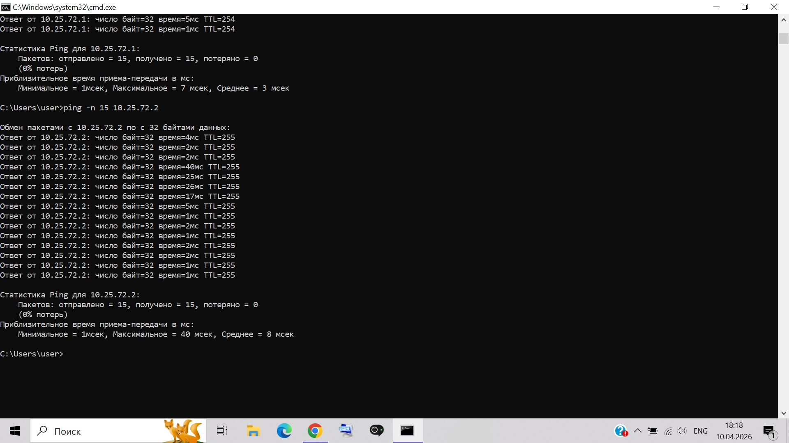{ #fig:008 width=70% height=70% }

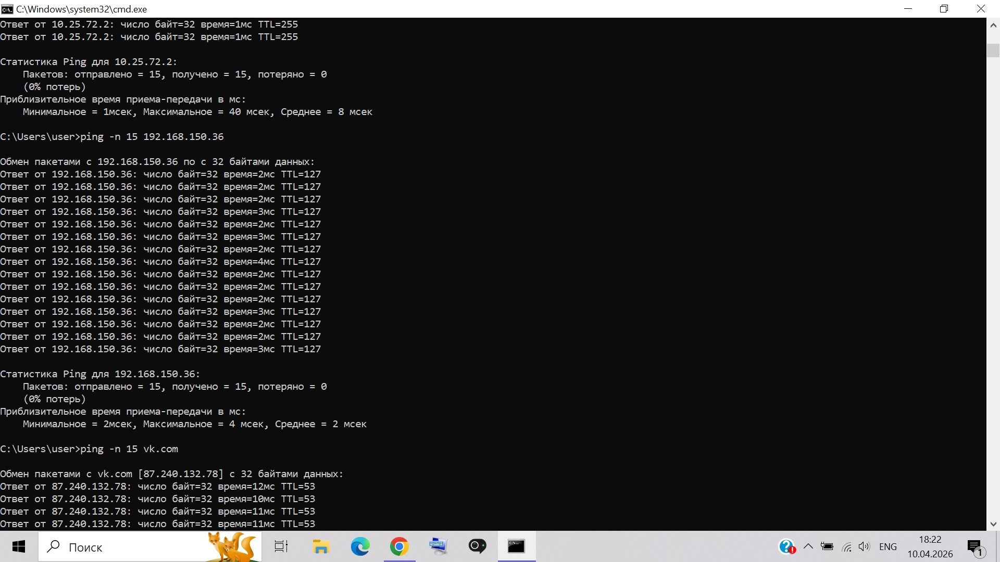{ #fig:009 width=70% height=70% }

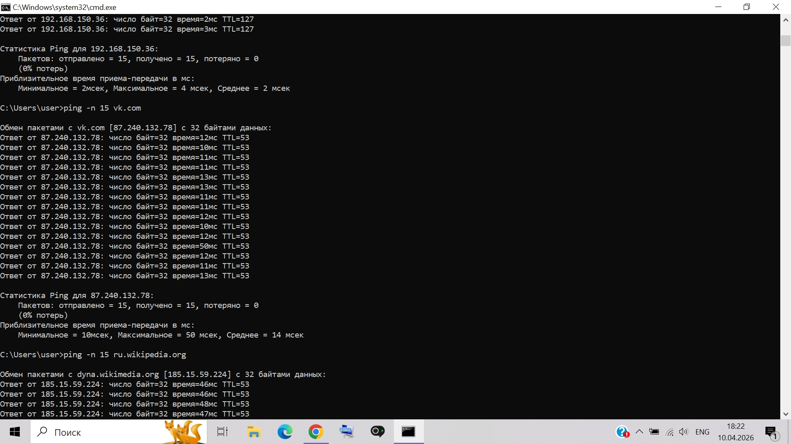{ #fig:010 width=70% height=70% }

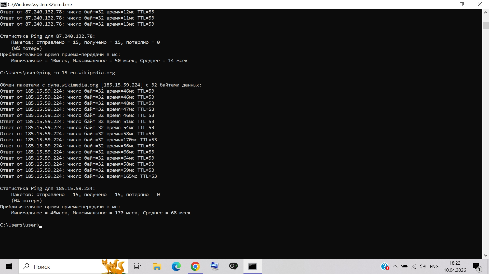{ #fig:011 width=70% height=70% }

4. С помощью утилиты tracert проверили доступность следующих устройств:

* Основой шлюз.

* Сайт vk.com

* Информационный ресурс ru.wikipedia.org.

Используя дополнительные ключи, сделали так, чтобы утилита не определяла DNS имена промежуточных устройств.

tracert -d 10.25.72.1

Трассировка маршрута к 10.25.72.1 с максимальным числом прыжков 30

  1     2 ms     4 ms     1 ms  10.25.72.1

* Промежуточных узлов: 0

tracert -d vk.com

Трассировка маршрута к vk.com [87.240.132.78] с максимальным числом прыжков 30:

  1     2 ms     2 ms     2 ms  10.25.72.1

  2     *        *        *     Превышен интервал ожидания для запроса.

  3     2 ms     1 ms     1 ms  37.18.93.2

  4     3 ms     2 ms     6 ms  194.190.255.221

  5    11 ms    11 ms    15 ms  194.85.43.129

  6    10 ms    10 ms    11 ms  194.85.42.131

  7    11 ms    12 ms    10 ms  194.190.254.122

  8     *        *        *     Превышен интервал ожидания для запроса.

  9     *        *        *     Превышен интервал ожидания для запроса.

 10     *        *        *     Превышен интервал ожидания для запроса.

 11     *        *        *     Превышен интервал ожидания для запроса.

 12    11 ms    13 ms    10 ms  87.240.132.78

* Промежуточных узлов: 7

tracert -d ru.wikipedia.org

Трассировка маршрута к dyna.wikimedia.org [185.15.59.224] с максимальным числом прыжков 30:

  1     2 ms     1 ms     2 ms  10.25.72.1

  2     *        *        *     Превышен интервал ожидания для запроса.

  3     2 ms     3 ms     1 ms  37.18.93.2

  4     4 ms     2 ms     1 ms  194.190.255.221

  5     3 ms     6 ms     2 ms  62.231.31.101

  6     *        *        *     Превышен интервал ожидания для запроса.

  7     *        *        *     Превышен интервал ожидания для запроса.

  8    52 ms    53 ms    55 ms  185.15.59.157

  9    48 ms    46 ms    46 ms  185.15.59.224

* Промежуточных узлов: 6

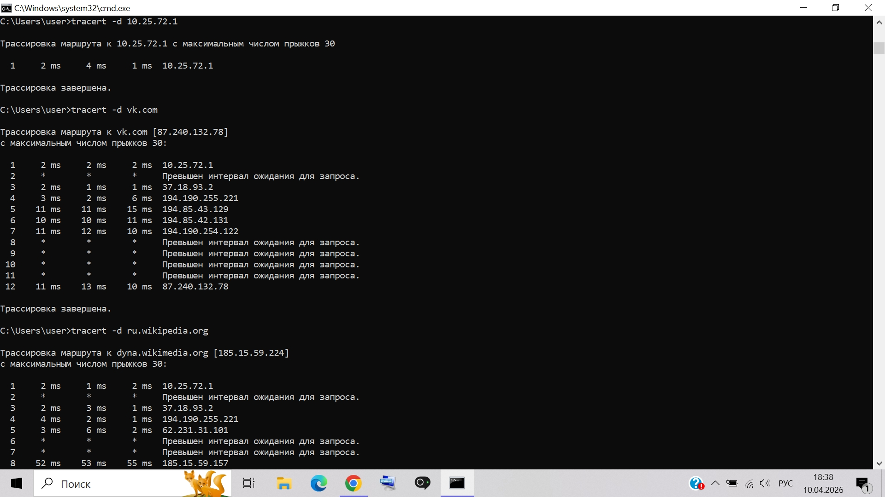{ #fig:012 width=70% height=70% }

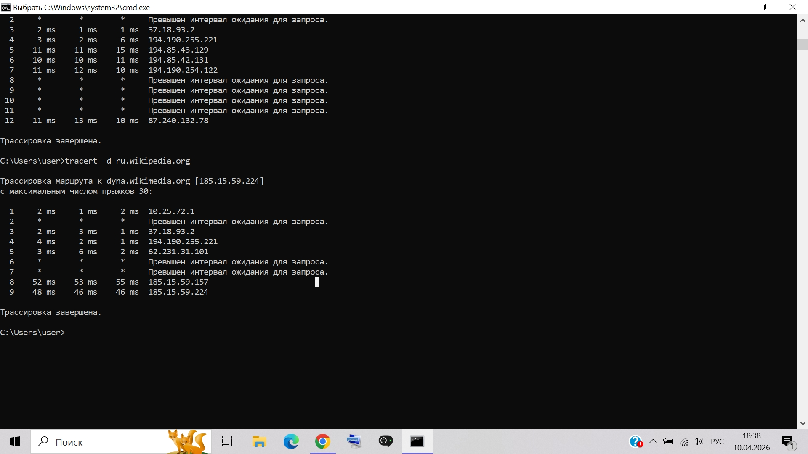{ #fig:013 width=70% height=70% }

5. Определили сетевой адрес и маршрут до прокси-сервера.

Через Параметры → Сеть и Интернет → Прокси-сервер проверены настройки:

Автоматическое определение параметров: Вкл.

Использовать сценарий настройки: Выкл.

Использовать прокси-сервер: Выкл.

Вывод: Прокси-сервер в сети не используется.

6. С помощью утилиты nslookup (используя команду ls) получили сетевые адреса устройств, зарегистрированных в сети в данный момент.

С помощью утилиты ping определили доступность выбранных 3 компьютеров.

Команда ls в nslookup не выполнена из-за запрета сервером.

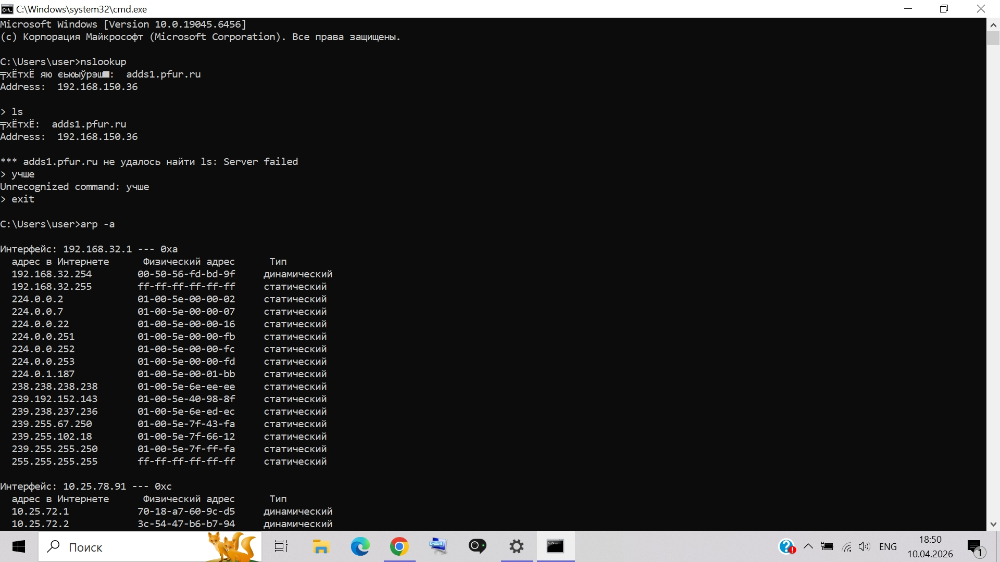{ #fig:014 width=70% height=70% }

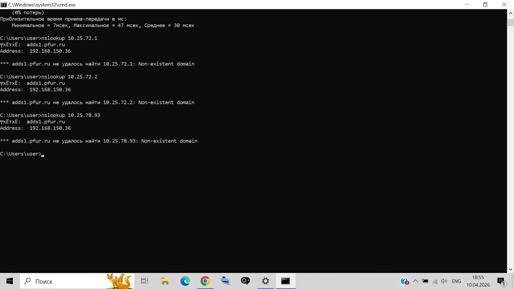{ #fig:018 width=70% height=70% }

7. С помощью команды arp определили MAC-адреса следующих устройств:

* Основной шлюз.

* Компьютеры, выбранные в п.6.

IP-адрес: 10.25.72.1, MAC-адрес: 70-18-a7-60-9c-d5, Доступность (ping): 0% потерь, 3 мс

IP-адрес: 10.25.72.2, MAC-адрес: 3c-54-47-b6-b7-94, Доступность (ping): 0% потерь, 8 мс

IP-адрес: 10.25.78.93, MAC-адрес: 6a-54-e4-7c-9d-38, Доступность (ping): 0% потерь, 30 мс

{ #fig:014 width=70% height=70% }

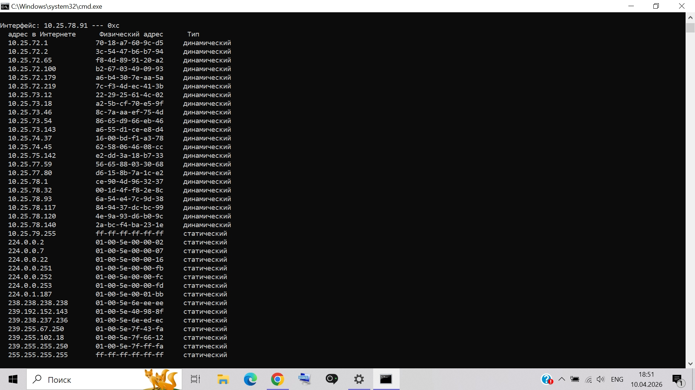{ #fig:015 width=70% height=70% }

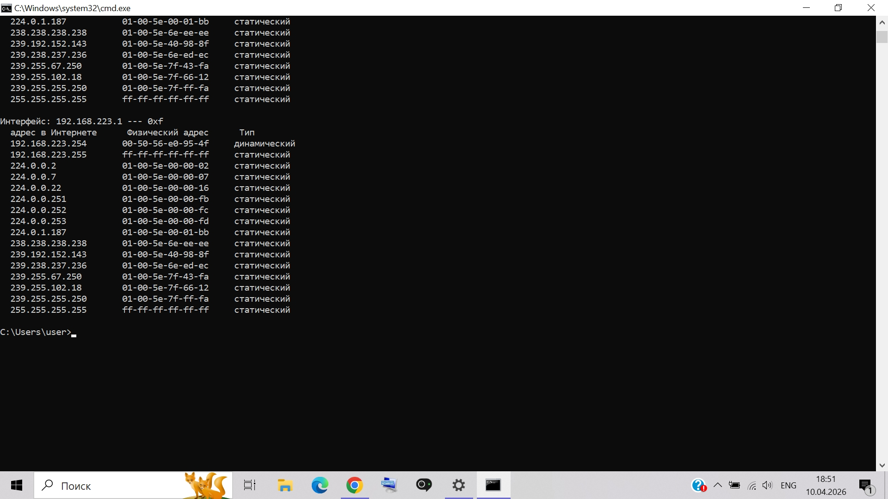{ #fig:016 width=70% height=70% }

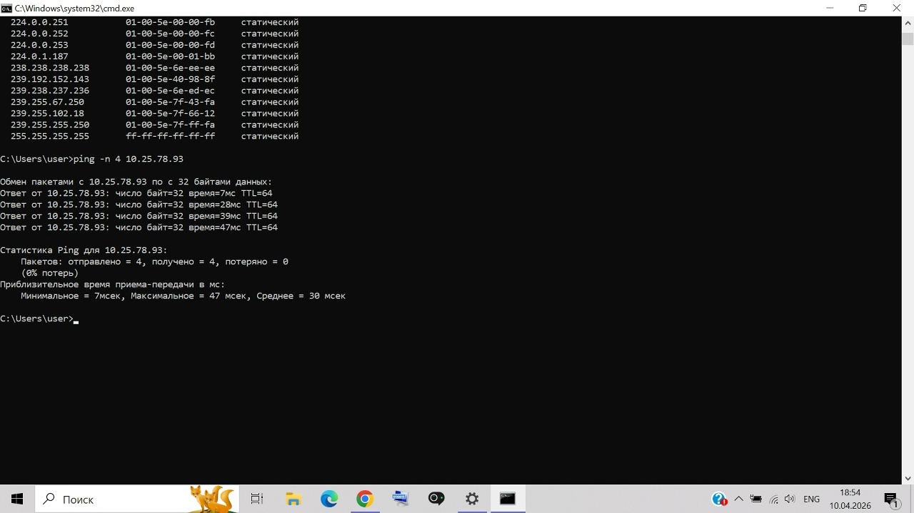{ #fig:017 width=70% height=70% }

8. С помощью сервиса Smart-Whois (http://www.who.is) определили регистрационные данные для сайта vk.com.

Домен	vk.com

Регистратор	RU-CENTER

Дата регистрации	24 июня 1997 г.

Окончание	22 июня 2026 г.

NS-серверы	ns1.vk.com (87.240.131.131) и др.

{ #fig:019 width=70% height=70% }

# Вывод

Мы научились диагностировать компьютерную сеть, используя встроенные утилиты операционной системы.

