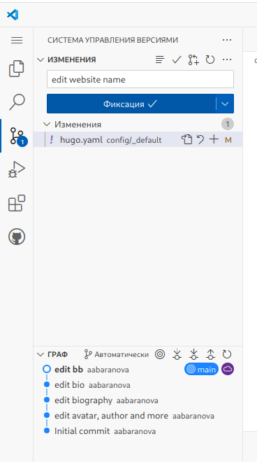

---
## Front matter
lang: ru-RU
title: 1 этап индивидуального проекта
subtitle: дисциплина Операционные системы
author:
  - Баранова А. А.
institute:
  - Российский университет дружбы народов, Москва, Россия
  - Кулябов Д. С. - д.ф.-м.н., профессор
date: 20 февраля 2025

## i18n babel
babel-lang: russian
babel-otherlangs: english

## Formatting pdf
toc: false
toc-title: Содержание
slide_level: 2
aspectratio: 169
section-titles: true
theme: metropolis
header-includes:
 - \metroset{progressbar=frametitle,sectionpage=progressbar,numbering=fraction}
---

# Информация

## Докладчик

:::::::::::::: {.columns align=center}
::: {.column width="70%"}

  * Баранова Анна Андреевна
  * Студент группы НММбд-01-24
  * Российский университет дружбы народов
  * [1132246811@pfur.ru](mailto:132246811@pfur.ru)

:::
::: {.column width="30%"}

:::
::::::::::::::

# Вводная часть

## Цели и задачи

* Создать персональный сайт научного работника.
- Установить необходимое программное обеспечение
- Скачать шаблон темы сайта
- Разместить его на хостинге git
- Установить параметр для URLs сайта
- Разместить заготовку сайта на Github pages

## Техническая реализация проекта

:::::::::::::: {.columns align=center}
::: {.column width="5%"}

:::
::: {.column width="95%"}

:::
::::::::::::::

# Выполнение проекта

## 1 этап

:::::::::::::: {.columns align=center}
::: {.column width="45%"}

- Переход в данный репозиторий
- Клонирование репозитория
- Создание codespase

:::
::: {.column width="55%"}

:::
::::::::::::::

## 2 этап

:::::::::::::: {.columns align=center}
::: {.column width="35%"}

- Открываем content>authors>admin>_index.md и редактируем данные
- Добавление своей фотографии
- Добавление названия сайта

:::
::: {.column width="65%"}

:::
::::::::::::::

## 3 этап

:::::::::::::: {.columns align=center}
::: {.column width="40%"}

- Добавление описание изменений и фиксация этого
- Синхронизация изменений к нашему github repository

:::
::: {.column width="60%"}

:::
::::::::::::::

## 4 этап

:::::::::::::: {.columns align=center}
::: {.column width="40%"}

- Переход в репозиторий aabarnova.github.io
- Публикация сайта

:::
::: {.column width="60%"}

:::
::::::::::::::

# Заключение

## Краткие выводы

В ходе выполнения 1 этапа индивидуального проекта:
- было установлено необходимое программное обеспечение
- скачан шаблон темы сайта
- установлен параметр для URLs сайта
- размещена заготовка сайта на Github pages

