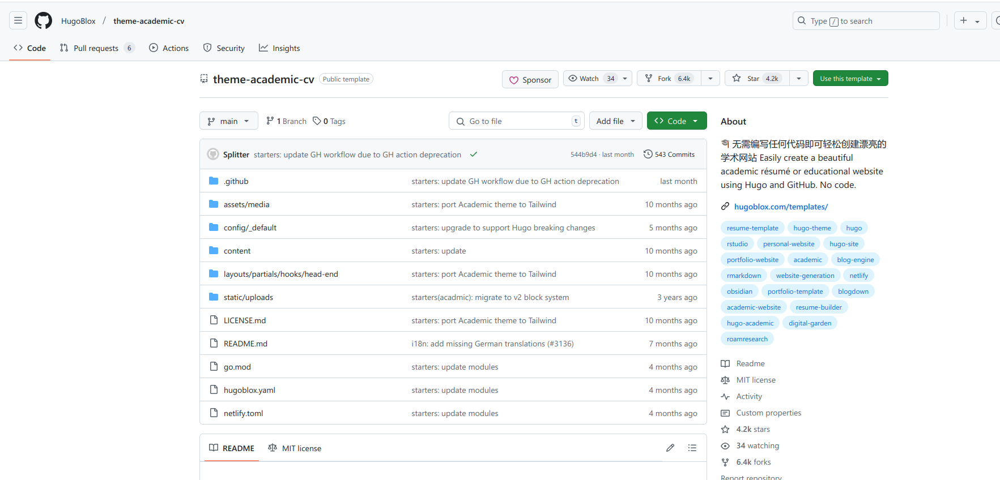
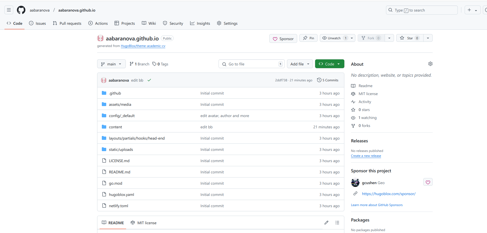

---
## Front matter
title: "Отчёт по 1 этапу индивидуального проекта"
subtitle: "дисциплина: Операционные системы"
author: "Баранова Анна Андреевна"

## Generic otions
lang: ru-RU
toc-title: "Содержание"

## Bibliography
bibliography: bib/cite.bib
csl: pandoc/csl/gost-r-7-0-5-2008-numeric.csl

## Pdf output format
toc: true # Table of contents
toc-depth: 2
lof: true # List of figures
fontsize: 12pt
linestretch: 1.5
papersize: a4
documentclass: scrreprt
## I18n polyglossia
polyglossia-lang:
  name: russian
  options:
	- spelling=modern
	- babelshorthands=true
polyglossia-otherlangs:
  name: english
## I18n babel
babel-lang: russian
babel-otherlangs: english
## Fonts
mainfont: IBM Plex Serif
romanfont: IBM Plex Serif
sansfont: IBM Plex Sans
monofont: IBM Plex Mono
mathfont: STIX Two Math
mainfontoptions: Ligatures=Common,Ligatures=TeX,Scale=0.94
romanfontoptions: Ligatures=Common,Ligatures=TeX,Scale=0.94
sansfontoptions: Ligatures=Common,Ligatures=TeX,Scale=MatchLowercase,Scale=0.94
monofontoptions: Scale=MatchLowercase,Scale=0.94,FakeStretch=0.9
mathfontoptions:
## Biblatex
biblatex: true
biblio-style: "gost-numeric"
biblatexoptions:
  - parentracker=true
  - backend=biber
  - hyperref=auto
  - language=auto
  - autolang=other*
  - citestyle=gost-numeric
## Pandoc-crossref LaTeX customization
figureTitle: "Рис."

## Misc options
indent: true
header-includes:
  - \usepackage{indentfirst}
  - \usepackage{float} # keep figures where there are in the text
  - \floatplacement{figure}{H} # keep figures where there are in the text
---

# Цель работы

Создать персональный сайт научного работника.

# Задание

На 1 этапе необходимо выполнить:

* Установить необходимое программное обеспечение.

* Скачать шаблон темы сайта.

* Разместить его на хостинге git.

* Установить параметр для URLs сайта.

* Разместить заготовку сайта на Github pages.

# Техническая реализация проекта

* Для реализации сайта используется генератор статических сайтов Hugo.

* **Общие файлы для тем Wowchemy:**
 
  * Репозиторий: <https://github.com/wowchemy/wowchemy-hugo-themes>

* В качестве шаблона индивидуального сайта используется шаблон Hugo Academic Theme.

  * Демо-сайт: <https://academic-demo.netlify.app/>
 
  * Репозиторий: <https://github.com/wowchemy/starter-hugo-academic>

# Выполнение проекта

1. Перейдём в нужный репозиторий и клонируем его с именем aabarnova.github.io, потом создадим codespase (рис. [-@fig:001]), (рис. [-@fig:002]), (рис. [-@fig:003]), (рис. [-@fig:004]), (рис. [-@fig:005]), (рис. [-@fig:006]).

{#fig:001 width=70%}

{#fig:002 width=70%}

{#fig:003 width=70%}

{#fig:004 width=70%}

{#fig:005 width=70%}

{#fig:006 width=70%}

2. Дальше открываем content>authors>admin>_index.md и редактируем display name, full name, role, organizations, social network links, interests, education, skills, биографию. Сохраняем эти изменения (файл>сохранить). Добавляем свою фотографию: удаляем старый файл avatar.jpg и переносим на его место свою фото в файле с именем avatar.jpg. Добавляем название сайта: переходим в config/_default>hugo.yaml и изменяем title. Также сохраняем все изменения (файл>сохранить) (рис. [-@fig:007]), (рис. [-@fig:008]), (рис. [-@fig:009]), (рис. [-@fig:010]).

{#fig:007 width=70%}

{#fig:008 width=70%}

{#fig:009 width=70%}

{#fig:010 width=70%}

3. Дальше добавляем описание изменений и фиксируем это, потом синхронизироем их к нашему github repository (рис. [-@fig:011]), (рис. [-@fig:012]).

{#fig:011 width=70%}

{#fig:012 width=70%}

4. Переходим в репозиторий aabarnova.github.io, потом переходим в settings>pages>source и выбираем github action, дальше переходим к actions>deploy website>run workflow и публикуем сайт. Открываем наш сайт, переходя по ссылке под deploy (рис. [-@fig:013]), (рис. [-@fig:014]), (рис. [-@fig:015]), (рис. [-@fig:016]), (рис. [-@fig:017]), (рис. [-@fig:018]).

{#fig:013 width=70%}

{#fig:014 width=70%}

{#fig:015 width=70%}

{#fig:016 width=70%}

{#fig:017 width=70%}

{#fig:018 width=70%}

# Заключение

В ходе выполнения 1 этапа индивидуального проекта было установлено необходимое программное обеспечение, скачан шаблон темы сайта, установлен параметр для URLs сайта и размещена заготовка сайта на Github pages.

