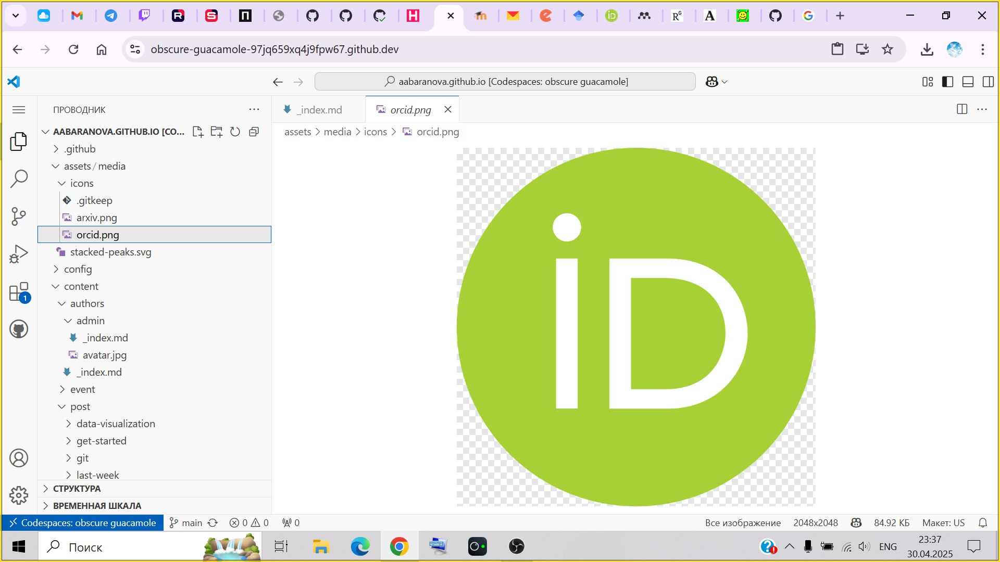

---
## Front matter
title: "Отчёт по 4 этапу индивидуального проекта"
subtitle: "дисциплина: Операционные системы"
author: "Баранова Анна Андреевна"

## Generic otions
lang: ru-RU
toc-title: "Содержание"

## Bibliography
bibliography: bib/cite.bib
csl: pandoc/csl/gost-r-7-0-5-2008-numeric.csl

## Pdf output format
toc: true # Table of contents
toc-depth: 2
lof: true # List of figures
fontsize: 12pt
linestretch: 1.5
papersize: a4
documentclass: scrreprt
## I18n polyglossia
polyglossia-lang:
  name: russian
  options:
	- spelling=modern
	- babelshorthands=true
polyglossia-otherlangs:
  name: english
## I18n babel
babel-lang: russian
babel-otherlangs: english
## Fonts
mainfont: IBM Plex Serif
romanfont: IBM Plex Serif
sansfont: IBM Plex Sans
monofont: IBM Plex Mono
mathfont: STIX Two Math
mainfontoptions: Ligatures=Common,Ligatures=TeX,Scale=0.94
romanfontoptions: Ligatures=Common,Ligatures=TeX,Scale=0.94
sansfontoptions: Ligatures=Common,Ligatures=TeX,Scale=MatchLowercase,Scale=0.94
monofontoptions: Scale=MatchLowercase,Scale=0.94,FakeStretch=0.9
mathfontoptions:
## Biblatex
biblatex: true
biblio-style: "gost-numeric"
biblatexoptions:
  - parentracker=true
  - backend=biber
  - hyperref=auto
  - language=auto
  - autolang=other*
  - citestyle=gost-numeric
## Pandoc-crossref LaTeX customization
figureTitle: "Рис."

## Misc options
indent: true
header-includes:
  - \usepackage{indentfirst}
  - \usepackage{float} # keep figures where there are in the text
  - \floatplacement{figure}{H} # keep figures where there are in the text
---

# Цель работы

Добавить к сайту ссылки на научные и библиометрические ресурсы.

# Задание

На 4 этапе необходимо выполнить:

* Зарегистрироваться на соответствующих ресурсах и разместить на них ссылки на сайте.

* Сделать пост по прошедшей неделе.

* Добавить пост на тему по выбору:

 * Оформление отчёта.

 * Создание презентаций.

 * Работа с библиографией.

# Техническая реализация проекта

* Для реализации сайта используется генератор статических сайтов Hugo.

* **Общие файлы для тем Wowchemy:**
 
  * Репозиторий: <https://github.com/wowchemy/wowchemy-hugo-themes>

* В качестве шаблона индивидуального сайта используется шаблон Hugo Academic Theme.

  * Демо-сайт: <https://academic-demo.netlify.app/>
 
  * Репозиторий: <https://github.com/wowchemy/starter-hugo-academic>

# Выполнение проекта

1. Перейдём в наш репозиторий и потом перейдём в codespase (рис. [-@fig:007]).

{#fig:007 width=70%}

2. Дальше открываем content>authors>admin>_index.md и добавляем ссылки на сайты, на которых регистрировались, также добавляем к ним иконки (assets/media>icons). Сохраняем эти изменения (файл>сохранить) (рис. [-@fig:001]), (рис. [-@fig:005]).

{#fig:001 width=70%}

{#fig:005 width=70%}

3. Дальше открываем content>post и создаём новую папку, а в ней создаём файл index.md. Добавляем в файл title, date, authors, tags и основной текст нашего поста по прошедшей неделе. Сохраняем эти изменения (файл>сохранить). Повторяем прошлые действия для поста на тему: Оформление отчёта, и также добавляем фото для него, перенося в его папку файлы featured4.png. Также сохраняем эти изменения (файл>сохранить) (рис. [-@fig:002]), (рис. [-@fig:003]), (рис. [-@fig:004]).

{#fig:002 width=70%}

{#fig:003 width=70%}

{#fig:004 width=70%}

4. Дальше добавляем описание изменений и фиксируем это, потом синхронизироем их к нашему github repository. Переходим в репозиторий aabarnova.github.io, потом переходим в settings>pages>source и выбираем github action, дальше переходим к actions>deploy website>run workflow и публикуем сайт. Открываем наш сайт, переходя по ссылке под deploy (рис. [-@fig:007]), (рис. [-@fig:008]).

{#fig:006 width=70%}

{#fig:008 width=70%}

{#fig:009 width=70%}

{#fig:010 width=70%}

# Заключение

В ходе выполнения 4 этапа индивидуального проекта я зарегистрировалась на соответствующих ресурсах и разместить на них ссылки на сайте, сделала пост по прошедшей неделе и добавлен пост на тему: Оформление отчёта.

