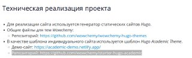
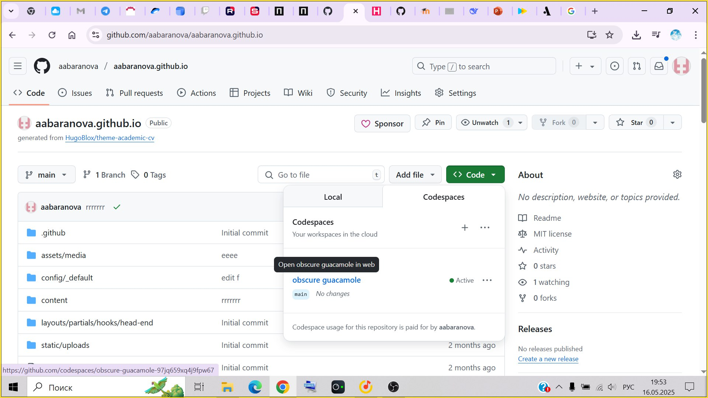
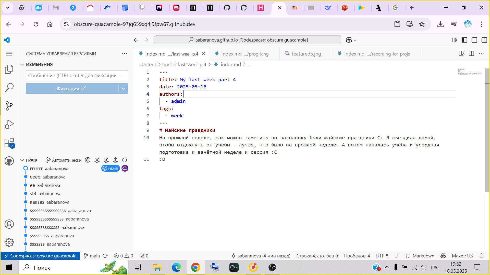
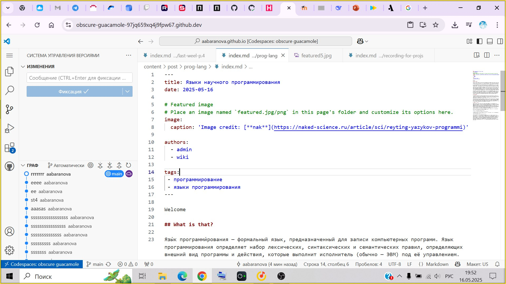
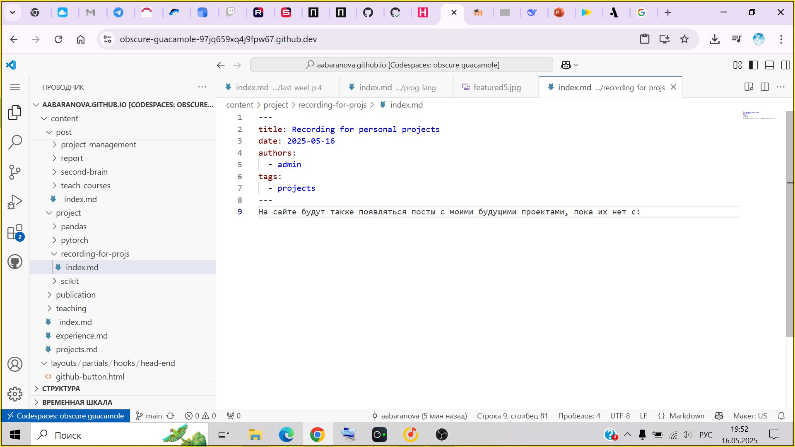
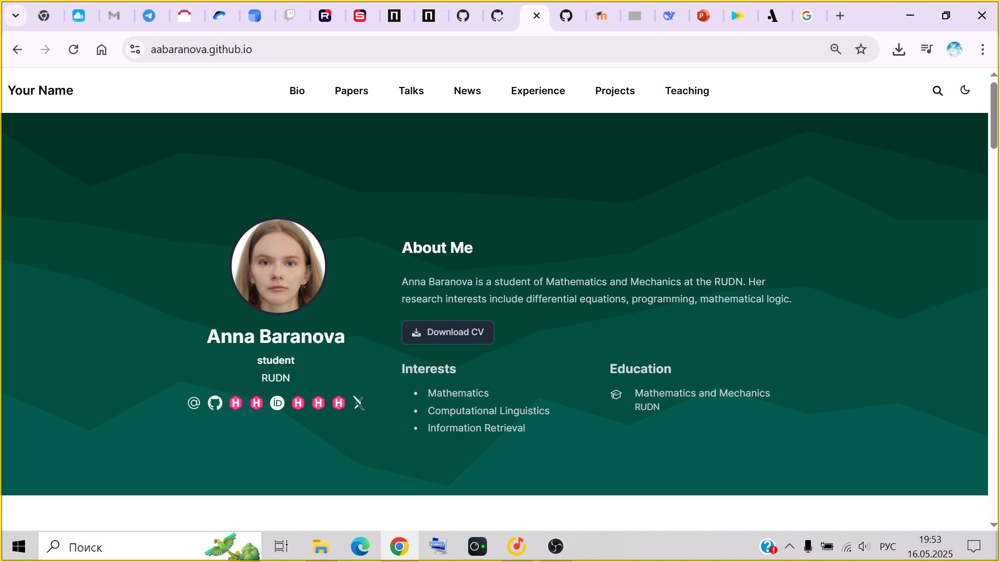

---
## Front matter
lang: ru-RU
title: 5 этап индивидуального проекта
subtitle: дисциплина Операционные системы
author:
  - Баранова А. А.
institute:
  - Российский университет дружбы народов, Москва, Россия
  - Кулябов Д. С. - д.ф.-м.н., профессор
date: 16 мая 2025

## i18n babel
babel-lang: russian
babel-otherlangs: english

## Formatting pdf
toc: false
toc-title: Содержание
slide_level: 2
aspectratio: 169
section-titles: true
theme: metropolis
header-includes:
 - \metroset{progressbar=frametitle,sectionpage=progressbar,numbering=fraction}
---

# Информация

## Докладчик

:::::::::::::: {.columns align=center}
::: {.column width="70%"}

  * Баранова Анна Андреевна
  * Студент группы НММбд-01-24
  * Российский университет дружбы народов
  * [1132246811@pfur.ru](mailto:132246811@pfur.ru)

:::
::: {.column width="30%"}

:::
::::::::::::::

# Вводная часть

## Цели и задачи

* Добавить с сайту все остальные элементы
1. Сделать записи для персональных проектов.
2. делать пост по прошедшей неделе.
3. Добавить пост по теме: Языки научного программирования.

## Техническая реализация проекта

:::::::::::::: {.columns align=center}
::: {.column width="5%"}

:::
::: {.column width="95%"}

:::
::::::::::::::

# Выполнение проекта

## 1 этап

:::::::::::::: {.columns align=center}
::: {.column width="45%"}

- Переход в мой репозиторий
- Переход в codespase

:::
::: {.column width="55%"}

:::
::::::::::::::

## 2 этап 1 часть

:::::::::::::: {.columns align=center}
::: {.column width="40%"}

- Открываем content>post и создаём новую папку, а в ней создаём файл index.md
- Добавляем в файл title, date, authors, tags и основной текст нашего поста по прошедшей неделе

:::
::: {.column width="60%"}

:::
::::::::::::::

## 2 этап 2 часть

:::::::::::::: {.columns align=center}
::: {.column width="40%"}

- Повторяем прошлые действия для поста на тему: Языки научного программирования
- Добавление фотографий к посту

:::
::: {.column width="60%"}

:::
::::::::::::::

## 3 этап

:::::::::::::: {.columns align=center}
::: {.column width="40%"}

- Открываем project и создаём новую папку, а в ней создаём файл index.md
- Добавляем в файл title, date, authors, tags и основной текст нашей записи для персональных проектов

:::
::: {.column width="60%"}

:::
::::::::::::::

## 4 этап

:::::::::::::: {.columns align=center}
::: {.column width="40%"}

- Переход в репозиторий aabarnova.github.io
- Публикация сайта

:::
::: {.column width="60%"}

:::
::::::::::::::

# Заключение

## Краткие выводы

В ходе выполнения 5 этапа индивидуального проекта:
1. сделаны записи для персональных проектов
2. сделан пост по прошедшей неделе
3. сделан пост на тему: Языки научного программирования

